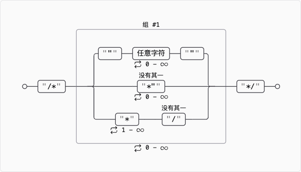

# 编译原理第一次作业

<center>
  2110306206 卓致用
</center>
## Ex 3.3.2

试描述下列正则表达式定义的语言：

1. `a(a|b)*a`
2. `((ε|a)b*)*`
3. `(a|b)*a(a|b)(a|b)`
4. `a*ba*ba*ba*`
5. `(aa|bb)*((ab|ba)(aa|bb)*(ab|ba)(aa|bb)*)*`

### 解答

1. $a(a|b)*a$

    以 1 个 $a$ 开头，1 个 $a$ 结尾，中间任意个 $a$ 或 $b$。

2. $((\varepsilon|a)b*)*$

    由 $a$ 和 $b$ 组成的任意串，也可以是空串。化简如下：

    $$
    ((\varepsilon|a)b*)* = ((b* | ab*)* \\
    显然此式可表示的语言 s \supseteq L\left((a|b)*\right) \\
    同时显然 s \subseteq L((a|b)*)\\
    从而 s = (a|b)* \\
    或直接 ((\varepsilon|a)b*)* = ((b* | ab*)* = ((b* | a)* = ((b | a)* \\
    $$

3. $(a|b)*a(a|b)(a|b)$

    倒数第三个字符是 $a$ 的由 $a$ 和 $b$ 组成的字符串。

4. $a*ba*ba*ba*$

    有且仅有 3 个 $b$ 的由 $a$ 和 $b$ 组成的字符串。

5. $(aa|bb)*((ab|ba)(aa|bb)*(ab|ba)(aa|bb)*)*$

    直观：拥有偶数个对 $ab$ 或者 $ba$、且长度也为偶数的由 $a$ 和 $b$ 组成的字符串。

    进一步推导：拥有偶数个 $a$ 和偶数个 $b$ 的由 $a$ 和 $b$ 组成的字符串。

    证明：使用构造性证明。首先取一个拥有偶数个 $a$ 的串 $s$，显然其可被原式描述。我们证明它可以通过符合原式的替换得到拥有偶数个 $a$ 和偶数个 $b$ 的由 $a$ 和 $b$ 组成的字符串。

    1. 由定义，我们需要两两地将 $a$ 替换为 $b$。
    2. 若这两个 $b$ 相连，且首个 $b$ 在一个奇数位 $2k-1$，那么我们只需要将 $2k-1 \sim 2k$ 的串替换为可被原式表述的 $bb$。
    3. 对于其他情况，替换的两个 $b$ 及其之间的串形如 $(ab|ba)(aa)*(ab|ba)$，显然此式可被原式描述。
    4. 进行任一上述替换后，我们将替换过后的两边分治处理，递归地进行类似的替换，足以衍生出所有可能的有偶数个 $a$ 和偶数个 $b$ 的由 $a$ 和 $b$ 组成的字符串。

## Ex 3.3.3

试说明在一个长度为 `n` 的字符串中，分别有多少个：

1. 前缀
2. 后缀
3. 真前缀
4. 子串
5. 子序列

### 解答

1. 前缀：$n+1$ 个，显然
2. 后缀：$n+1$ 个，显然
3. 真前缀：$n-1$ 个
4. 子串：只需考虑始末位置 $i,j$ 满足 $1\leq i\leq j\leq n$，以及空串的情况，故有 $\frac{n(n+1)}{2} + 1$
5. 子序列：只需要考虑每个字符是要还是不要，故有 $2^n$

## Ex 3.3.5

试写出下列语言的正则定义。

### 解答

1. 包含 5 个元音的所有小写字母串，这些串中的元音按顺序出现

    ```
    not_vowel -> [bcdfghjklmnpqrstvwxyz]
    ans -> (not_vowel)*a(a|not_vowel)*e(e|not_vowel)*i(i|not_vowel)*o(o|not_vowel)*u(u|not_vowel)*
    ```

2. 所有由按词典递增排列的小写字母组成的串

    ```
    ans -> a*b*c*d*e*f*g*h*i*j*k*l*m*n*o*p*q*r*s*t*u*v*w*x*y*z*
    ```

3. 注释，即 `/*` 和 `*/` 之间的串，且串中没有不在双引号 ("") 中的 `*/`

    ```
    \/\*(".*"|[^\*"]*|\*+[^\/])*\*\/
    ```

    

4. 所有由偶数个 a 和奇数个 b 构成的串：[可视化](https://regex-vis.com/?r=%28aa%7Cbb%29*%28%28ab%7Cba%29%28aa%7Cbb%29*%28ab%7Cba%29%28aa%7Cbb%29*%29*b%28aa%7Cbb%29*%28%28ab%7Cba%29%28aa%7Cbb%29*%28ab%7Cba%29%28aa%7Cbb%29*%29*)

    ```
    (aa|bb)*((ab|ba)(aa|bb)*(ab|ba)(aa|bb)*)*b(aa|bb)*((ab|ba)(aa|bb)*(ab|ba)(aa|bb)*)*
    ```

    第一题第五问复制两遍，中间单走一个 b

5. 所有由 a 和 b 组成且不含子序列 abb 的串

    ```
    b*a*b?
    ```

    注意这里是子序列不是子串
