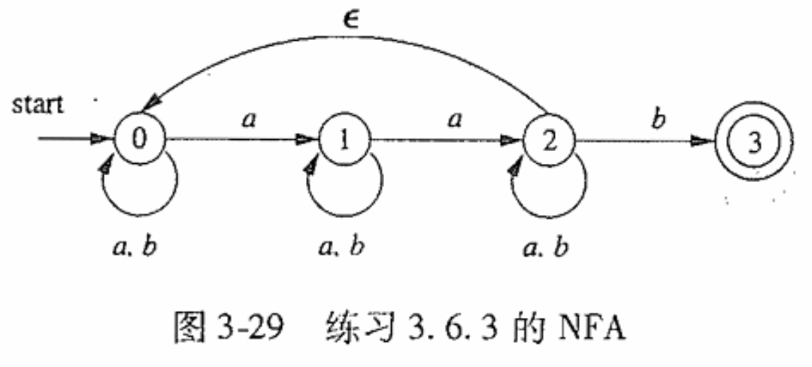
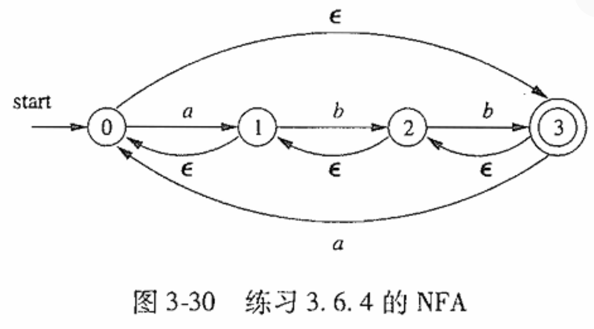

# 编译原理第三次作业

  2110306206 卓致用

## Ex 3.7.1

将下列图中的 NFA 转换为 DFA。

### 解答

#### 第 2 问

NFA：

答案：

#### 第 3 问

NFA：

答案：

## Ex3.7.3

使用算法 3.23 和 3.20 将下列正则表达式转换成 DFA。

### 第三问

$$
((ε|a)b*)*
$$

#### 解答

##### NFA

##### DFA

##### DFA 化简

### 第 4 问

$$
(a|b)*abb(a|b)*
$$

#### 解答

##### NFA

##### DFA

注：由于状态太多，略去集合括号、逗号，并以“-”标记序号相连的多个状态

##### DFA 化简

