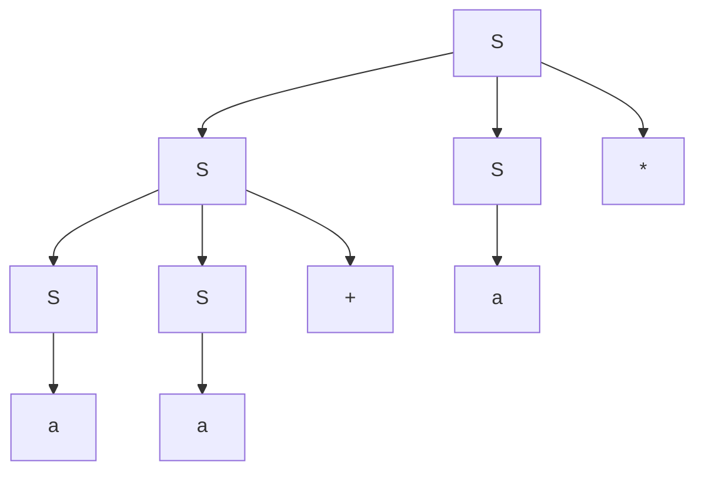

# 编译原理第四次作业

  2110306206 卓致用

## Ex 2.2.1

考虑下面的上下文无关文法：

$$
S \rightarrow SS + \mid SS \ast \mid a
$$

1. 试说明如何使用该文法生成串 \( aa + a \)。
2. 试为这个串构造一棵语法分析树。
3. 该文法生成的语言是什么？证明你的答案。

### 解答

#### 第 1 问

$$
\begin{aligned}
S 
& \Rightarrow SS* \\
& \Rightarrow SS+S* \\
& \Rightarrow aS+S* \\
& \Rightarrow aa+S* \\
& \Rightarrow aa+a* \\
\end{aligned}
$$

#### 第 2 问

#### 第 3 问

$L(G) = a+$

充分性：$L(G) \subset L$：由于只有 $a$ 是终止状态，且显然不接受空串

必要性：$L \subset L(G)$：只需证明可以生成 $a+$ 即可：

$$
\begin{aligned}
S 
& \Rightarrow SS* \\
& \Rightarrow aa* \\
& = a+ \\
\end{aligned}
$$

## Ex 4.2.1

考虑上下文无关文法：

$$
S \rightarrow SS + \mid SS \ast \mid a
$$

以及串 $ aa + a \ast $。

1. 给出这个串的一个最左推导。
2. 给出这个串的一个最右推导。
3. 给出这个串的一棵语法分析树。
4. 这个文法是否为二义性？证明你的回答。
5. 描述这个文法生成的语言。

### 解答

#### 第 1 问

$$
S \Rightarrow_{lm} SS* \Rightarrow_{lm} SS+S* \Rightarrow_{lm} aS+S* \Rightarrow_{lm} aa+S* \Rightarrow_{lm} aa+a*
$$

#### 第 2 问

$$
S \Rightarrow_{rm} SS* \Rightarrow_{rm} Sa* \Rightarrow_{rm} SS+a* \Rightarrow_{rm} Sa+a* \Rightarrow_{rm} aa+a*
$$

#### 第 3 问

见前。

#### 第 4 问

不是。自底向上分析即可知道只有此一颗分析树，从而不具有二义性。

#### 第 5 问

$L(G)$：只包含 $a$ 作为操作数的加法和乘法的后缀表达式

充分性：每次发生 $S \to SS+|SS*$ 时，都相当于执行了一个加法/乘法的压栈，每次发生 $S \to a$ 的时候，都是发生了一个操作数的替换。由此易知 $L(G) \subset L$。

必要性：对任一只包含 $a$ 作为操作数的加法和乘法的后缀表达式，从左到右遍历表达式，遇到操作数时将其压入栈，遇到操作符时从栈中弹出所需数量的操作数进行计算，然后将计算结果重新压入栈。这样即可构建一个语法树，其内部节点都为 $+$ 或者 $*$，叶子节点都为 $a$，对此语法树从根节点从上至下，遇到 $+$，即发生一次 $S \to SS+$，遇到 $*$，则发生 $S \to SS*$，遇到叶子节点 $a$，则发生 $S \to a$。由此即可证明 $L \subset L(G)$。

## Ex 4.2.3

为下面的语言设计文法：

1) 所有由 0 和 1 组成的并且每个 0 之后都至少跟着一个 1 的串的集合。

2) 所有由 0 和 1 组成的回文（palindrome）的集合，也就是从前面和后面读结果都相同的串的集合。

3) 所有由 0 和 1 组成的具有相同多个 0 和 1 的串的集合。

4) 所有由 0 和 1 组成的并且 0 的个数和 1 的个数不同的串的集合。

5) 所有由 0 和 1 组成的且其中不包含子串 011 的串的集合。

6) 所有由 0 和 1 组成的形如 $xy$ 的串的集合，其中 $x \neq y$ 且 $x$ 和 $y$ 等长。

### 解答

#### 第 1 问

$$
S\to ST|\varepsilon \\
T\to 01|1
$$

#### 第 2 问

$$
S\to 1S1 | 0S0 | 0|1|\varepsilon
$$

#### 第 3 问

$$
S\to 01S | 0S1 | 10S | 1S0 | S01 | S10 | \varepsilon
$$

或者
$$
S \to 0S1 | 10S | SS | \varepsilon
$$

#### 第 4 问

$$
S \rightarrow A0A | B1B \\
A \rightarrow 0 | 0A1 | 1A0 | AA | \varepsilon  \\
B \rightarrow 1 | 0B1 | 1B0 | BB | \varepsilon
$$

#### 第 5 问

$$
S \to 1*(0+1?)*
$$

#### 第 6 问

$$
S\to X^n0X^mX^n1X^m|X^n1X^mX^n0X^m {~}{~}(n,m>0)\\
X\to 0|1
$$

这个表达式可以理解为，左右两个子串至少有一个相应位是不同的，但是他们的长度又是相同的。
