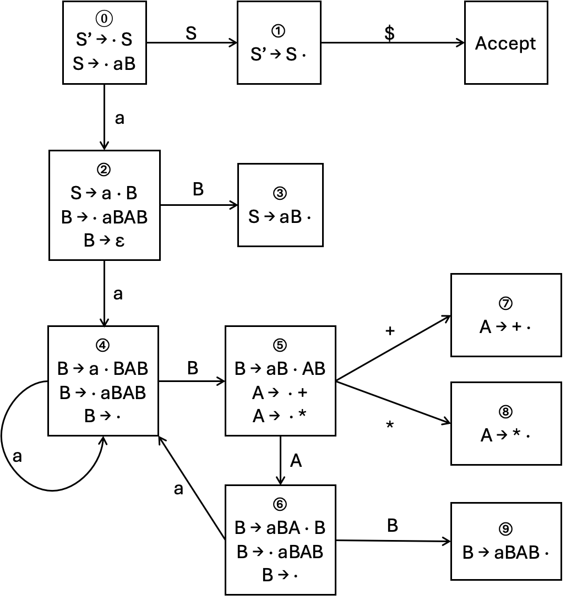

# 编译原理第六次作业

  2110306206 卓致用

## Ex 4.5.1

对于文法 $S \rightarrow 0S1 \mid 01$，指出下面各个最右句型的句柄。

1. $000111$
2. $00S11$

### 解答

#### 第一问

$$
000111 \Rightarrow 01
$$

#### 第二问

$$
000111 \Rightarrow 0S1
$$

## Ex 4.5.2

对于文法 $S \rightarrow SS + \mid SS * \mid a$ 和下面各个最右句型，指出下面各个最右句型的句柄。

1. $SSS + a * +$
2. $SS + a * a +$
3. $aaa * a ++$

### 解答

#### 第一问

$$
SSS + a * + \Rightarrow SS +
$$

#### 第二问

$$
SS + a * a + \Rightarrow SS +
$$

#### 第三问

$$
aaa * a ++ \Rightarrow a
$$

## Ex 4.6.2

为（增广）文法构造 SLR 项集。计算这些项集的 GOTO 函数。给出这个文法的语法分析表。这个文法是 SLR 文法吗？

$$
S \rightarrow S S + \mid S S * \mid a
$$

### 解答

添加 $S' \rightarrow S$、提取左公因子、消除左递归：

$$
S' \rightarrow S\\
S \rightarrow a B\\
B \rightarrow a B A B\\
B \rightarrow \varepsilon\\
A \rightarrow +\\
A \rightarrow *
$$

LR(0) 自动机：

  

$$
\begin{aligned}
\text{Follow}(S) &= [\$]\\
\text{Follow}(A) &= [a, \$]\\
\text{Follow}(B) &= [+, * ,\$]
\end{aligned}
$$

<table>
    <thead>
        <tr>
            <th rowspan="2">状态</th>
            <th colspan="4">ACTION</th>
            <th colspan="3">GOTO</th>
        </tr>
        <tr>
            <th>a</th>
            <th>+</th>
            <th>*</th>
            <th>$</th>
            <th>S</th>
            <th>A</th>
            <th>B</th>
        </tr>
    </thead>
    <tbody>
        <tr>
            <td>0</td>
            <td>s2</td>
            <td></td>
            <td></td>
            <td></td>
            <td>s1</td>
            <td></td>
            <td></td>
        </tr>
        <tr>
            <td>1</td>
            <td></td>
            <td></td>
            <td></td>
            <td>acc</td>
            <td></td>
            <td></td>
            <td></td>
        </tr>
        <tr>
            <td>2</td>
            <td>s4</td>
            <td>r3</td>
            <td>r3</td>
            <td>r3</td>
            <td></td>
            <td></td>
            <td>s3</td>
        </tr>
        <tr>
            <td>3</td>
            <td></td>
            <td></td>
            <td></td>
            <td>r1</td>
            <td></td>
            <td></td>
            <td></td>
        </tr>
        <tr>
            <td>4</td>
            <td>s4</td>
            <td>r3</td>
            <td>r3</td>
            <td>r3</td>
            <td></td>
            <td></td>
            <td>s5</td>
        </tr>
        <tr>
            <td>5</td>
            <td></td>
            <td>s7</td>
            <td>s8</td>
            <td></td>
            <td></td>
            <td>s6</td>
            <td></td>
        </tr>
        <tr>
            <td>6</td>
            <td>s4</td>
            <td>r3</td>
            <td>r3</td>
            <td>r3</td>
            <td></td>
            <td></td>
            <td>s9</td>
        </tr>
        <tr>
            <td>7</td>
            <td>r4</td>
            <td></td>
            <td></td>
            <td>r4</td>
            <td></td>
            <td></td>
            <td></td>
        </tr>
        <tr>
            <td>8</td>
            <td>r5</td>
            <td></td>
            <td></td>
            <td>r5</td>
            <td></td>
            <td></td>
            <td></td>
        </tr>
        <tr>
            <td>9</td>
            <td></td>
            <td>r2</td>
            <td>r2</td>
            <td>r2</td>
            <td></td>
            <td></td>
            <td></td>
        </tr>
    </tbody>
</table>
## Ex 4.6.3

利用练习 4.6.2 得到的语法分析表，给出处理输入 `aa * a +` 时的各个动作。

### 解答

<table>
    <thead>
        <tr>
            <th></th>
            <th>栈</th>
            <th>符号</th>
            <th>输入</th>
            <th>动作</th>
        </tr>
    </thead>
    <tbody>
        <tr>
            <td>(1)</td>
            <td>0</td>
            <td></td>
            <td>aa*a+$</td>
            <td>移入</td>
        </tr>
        <tr>
            <td>(2)</td>
            <td>02</td>
            <td>a</td>
            <td>a*a+$</td>
            <td>移入</td>
        </tr>
        <tr>
            <td>(3)</td>
            <td>024</td>
            <td>aa</td>
            <td>*a+$</td>
            <td>根据 B → ε 规约（* in Follow(B)）</td>
        </tr>
        <tr>
            <td>(4)</td>
            <td>0245</td>
            <td>aaB</td>
            <td>*a+$</td>
            <td>移入</td>
        </tr>
        <tr>
            <td>(5)</td>
            <td>02458</td>
            <td>aaB*</td>
            <td>a+$</td>
            <td>根据 A → * 规约（a in Follow(A)）</td>
        </tr>
        <tr>
            <td>(6)</td>
            <td>02456</td>
            <td>aaBA</td>
            <td>a+$</td>
            <td>移入</td>
        </tr>
        <tr>
            <td>(7)</td>
            <td>024564</td>
            <td>aaBAa</td>
            <td>+$</td>
            <td>根据 B → ε 规约（+ in Follow(B)）</td>
        </tr>
        <tr>
            <td>(8)</td>
            <td>0245645</td>
            <td>aaBAaB</td>
            <td>+$</td>
            <td>移入</td>
        </tr>
        <tr>
            <td>(9)</td>
            <td>02456457</td>
            <td>aaBAaB+</td>
            <td>$</td>
            <td>根据 A → + 规约（$ in Follow(A)）</td>
        </tr>
        <tr>
            <td>(10)</td>
            <td>02456456</td>
            <td>aaBAaBA</td>
            <td>$</td>
            <td>根据 B → ε 规约（$ in Follow(B)）</td>
        </tr>
        <tr>
            <td>(11)</td>
            <td>024564569</td>
            <td>aaBAaBAB</td>
            <td>$</td>
            <td>根据 B → aBAB 规约（$ in Follow(B)）</td>
        </tr>
        <tr>
            <td>(12)</td>
            <td>024569</td>
            <td>aaBAB</td>
            <td>$</td>
            <td>根据 B → aBAB 规约（$ in Follow(B)）</td>
        </tr>
        <tr>
            <td>(13)</td>
            <td>023</td>
            <td>aB</td>
            <td>$</td>
            <td>根据 S → aB 规约（$ in Follow(B)）</td>
        </tr>
        <tr>
            <td>(14)</td>
            <td>01</td>
            <td>S</td>
            <td>$</td>
            <td>接受</td>
        </tr>
    </tbody>
</table>
## Ex 4.6.5

说明下面的文法是 LL（1）的，但不是 SLR（1）的。

$$
S \rightarrow AaAb \mid BbBa\\
A \rightarrow \varepsilon\\
B \rightarrow \varepsilon
$$

### 解答

1. 证明：该文法是 LL(1) 的

    该文法的两个生成式 `S -> AaAb` 和 `S -> BbBa` 分别只能推导出 `ab` 和 `ba` ，所以：

    1. 不存在终结符号 $a$ 使得 $\alpha$ 和 $\beta$ 都可以推导出以 $a$ 开头的串。
    2. $\alpha$ 和 $\beta$ 都不可以推导出空串。

    因此，只有一颗语法分析树，即该文法是 LL(1) 的

2. 证明：该文法不是 SLR(1) 的

    显然，

    $$
    \text{Follow}(A) = \{a, b\}\\
    \text{Follow}(B) = \{a, b\}
    $$

    考虑该文法的首个闭包（即 LR(0) 自动机的一个状态 $I_0$）

    $$
    \begin{aligned}
    S' &\rightarrow \cdot S\\
    S &\rightarrow \cdot AaAb\\
    S &\rightarrow \cdot BbBa\\
    A &\rightarrow \varepsilon\\
    B &\rightarrow \varepsilon
    \end{aligned}
    $$

    由于 $\text{Follow}(A) = \text{Follow}(B)$，所以当 $I_0$ 后输入 $a$ 或 $b$ 时，无法确定规约到 A 还是到 B，即存在规约-规约冲突，所以该文法不是 SLR(1) 的。
