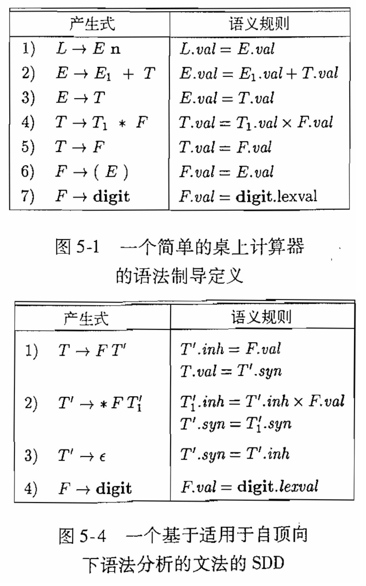
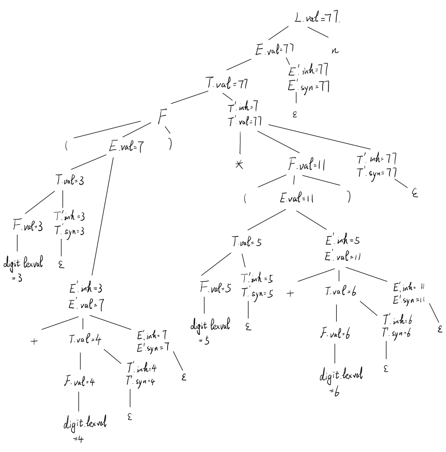

# 编译原理第八次作业

  2110306206 卓致用

## Ex 5.1.2

扩展图 5-4 中的 SDD，使它可以像图 5-1 所示的那样处理表达式。

### 解答

$$
\begin{array}{|c|l|l|}
\hline
& \text{产生式} & \text{语义规则} \\
\hline
1 & L \to E \, n & L.\text{val} = E.\text{val} \\
\hline
2 & E \to T \, E' & E'.\text{inh} = T.\text{val} \\
& & E.\text{val} = E'.\text{syn} \\
\hline
3 & E' \to + \, T \, E'_1 & E'_1.\text{inh} = E'.\text{inh} + T.\text{val} \\
& & E'.\text{syn} = E'_1.\text{syn} \\
\hline
4 & E' \to \varepsilon & E'.\text{syn} = E'.\text{inh} \\
\hline
5 & T \to F \, T' & T'.\text{inh} = F.\text{val} \\
& & T.\text{val} = T'.\text{syn} \\
\hline
6 & T' \to * \, F \, T'_1 & T'_1.\text{inh} = T'.\text{inh} \times F.\text{val} \\
& & T'.\text{syn} = T'_1.\text{syn} \\
\hline
7 & T' \to \varepsilon & T'.\text{syn} = T'.\text{inh} \\
\hline
8 & F \to (E) & F.\text{val} = E.\text{val} \\
\hline
9 & F \to \text{digit} & F.\text{val} = \text{digit}.\text{lexval} \\
\hline
\end{array}
$$

## Ex 5.1.3(1)

练习 5.1.1: 对于图 5-1 中的 SDD，给出下列表达式对应的注释语法分析树: $(3+4) \times (5+6)$

使用你在练习 5.1.2 中得到的 SDD，重复练习 5.1.1。

### 解答

## Ex 5.2.3

假设我们有一个产生式 $A \to BCD$。$A$、$B$、$C$、$D$ 这四个非终结符号都有两个属性：$s$ 是一个综合属性，而 $i$ 是一个继承属性。对于下面的每组规则，指出：

1. 这些规则是否满足 $S$ 属性定义的要求。
2. 这些规则是否满足 $L$ 属性定义的要求。
3. 是否存在和这些规则一致的求值过程？

    1. $A.s = B.i + C.s$
    1. $A.s = B.i + C.s$ 和 $D.i = A.i + B.s$
    1. $A.s = B.s + D.s$
    1. $A.s = D.i, B.i = A.s + C.s, C.i = B.s$ 和 $D.i = B.i + C.i$

### 解答

1. 不满足 S 属性，满足 L 属性，存在。
2. 不满足 S 属性，满足 L 属性，存在。
3. 满足 S 属性，满足 L 属性，存在。
4. 不满足 S 属性，不满足 L 属性，不存在。

## Ex 5.2.4 & Ex 5.2.5

这个文法生成了含“小数点”的二进制数：

$$
S \to L.L \ | \ L \\
L \to LB \ | \ B \\
B \to 0 \ | \ 1
$$

- 5.2.4：设计一个 $L$ 属性的 SDD 来计算 $S.val$，即输入串的十进制数值。例如，串 101.11 应该被翻译为十进制数 5.635。提示：使用一个继承属性 $L.side$ 来指明一个二进制位在小数点的哪一边。
- 5.2.5：为练习5.2.4 中描述的文法和翻译设计一个 $S$ 属性的 SDD。

### 解答

这个 SDD 同时是 S 属性和 L 属性的（全是综合属性，没有继承属性）。

$$
\begin{array}{|c|l|l|}
\hline
& \text{产生式} & \text{语义规则} \\
\hline
1 & S \to L_1 \cdot L_2 & S.\text{val} = L_1.\text{val} + L_2.\text{val} / (2 ^ {L_2.\text{len}}) \\
\hline
2 & S \to L & S.\text{val} = L.\text{val} \\
\hline
3 & L \to L_1 \ B & L.\text{val} = 2 \cdot L_1.\text{val} + B.\text{val}, \ L.\text{len} = L_1.\text{len} + 1 \\
\hline
4 & L \to B & L.\text{val} = B.\text{val}, \ L.\text{len} = 1 \\
\hline
5 & B \to 0 & B.\text{val} = 0 \\
\hline
6 & B \to 1 & B.\text{val} = 1 \\
\hline
\end{array}
$$
