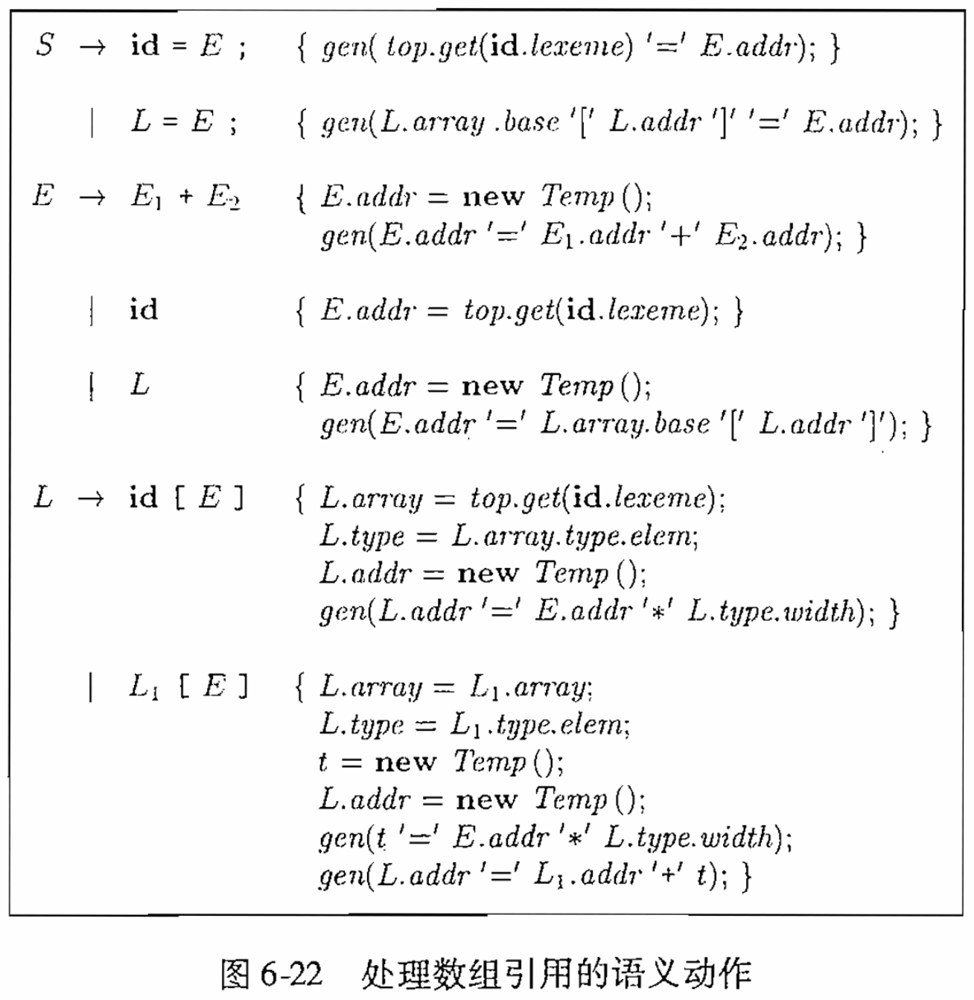
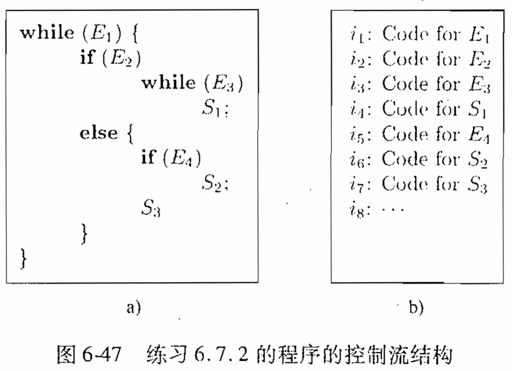

# 编译原理第十二次作业

<center>
  2110306206 卓致用
</center>
## Ex. 6.4.3(2)

使用图 6-22 所示的翻译方案来翻译下列赋值语句：

$$
x = a[i][j] + b[i][j]
$$



### 解答

推导的时候是个左递归，所以应当是先处理 `[i]` 再处理 `[j]`。

设 `aw_r` 是矩阵 `a` 的每行的宽度，`aw_e` 是矩阵 `a` 每个元素的宽度。对于 `b` 同理。

```cpp
t0 = i * aw_r
t1 = j * aw_e
t2 = t0 + t1
t3 = a[t2]
t4 = i * bw_r
t5 = j * bw_e
t6 = t4 + t5
t7 = b[t6]
t8 = t3 + t7
x = t8
```

## Ex. 6.4.6(2)

一个按行存放的整数数组 $A[i, j]$ 的行下标 $i$ 的范围为 1~10，列下标 $j$ 的范围为 1~20。每个整数占4个字节。假设数组 $A$ 从 0 字节开始存放，请给出下列元素的位置：

$$
A[10, 8]
$$

### 解答

$$
\begin{aligned}
A[10, 8] =& ADDR(A) + ((10 - 1) * 20 + (8 - 1)) * 4 \\
  =& ADDR(A) + 748 \\
  =& 748
\end{aligned}
$$

## Ex. 6.4.8(2)

一个按行存放的实数型数组 $A[i, j, k]$ 的下标的范围为 1~4，下标 $j$ 的范围为 0~4，且下标 $k$ 的范围为 5~10。每个实数占 8 个字节。假设数组 $A$ 从 0 字节开始存放。计算下列元素的位置。

$$
A[1, 2, 7]
$$

### 解答

$$
\begin{aligned}
A[1, 2, 7] =& ADDR(A) + ((1 - 1) * (5 * 6) + (2 - 0) * 6 + (7 - 5)) * 8 \\
  =& ADDR(A) + 112 \\
  =& 112
\end{aligned}
$$

## Ex. 6.5.2

像 Ada 中那样，我们假设每个表达式必须具有唯一的类型，但是我们根据一个子表达式本身只能推导出一个可能类型的集合。也就是说，将函数 $E_1$ 应用于参数 $E_2$（其文法产生式为 $E \rightarrow E_1(E_2)$）有如下规则：

$$
E.\text{type} = \{ t \mid \text{对 } E_2.\text{type} \text{ 中的某个 } s, \ s \rightarrow t \text{ 在 } E_1.\text{type} \text{ 中} \}
$$

描述一个可以确定每个子表达式的唯一类型的语法制导定义（SDD）。它首先使用属性 $\text{type}$，按照自底向上的方式综合得到一个可能类型的集合。在确定了整个表达式的唯一类型之后，自顶向下地确定属性 $\text{unique}$ 的值，这个属性性表示各个子表达式的类型。

本题文法：

$$
\begin{aligned}
S \rightarrow& id = E \\
E \rightarrow& E_1 + E_2 \\
  &| -E_1 \\
  &| (E_1) \\
  &| id \\
  &| E_1(E_2)
\end{aligned}
$$

### 解答

$$
\begin{array}{|l|l|}
\hline
\text{产生式} & \text{语义规则} \\
\hline
S \to id = E
  & E.\text{unique} = \textbf{if } id.\text{type} \in E.\text{type} \textbf{ then } id.\text{type} \textbf{ else } \text{error()} \\
\hline
E \to E_1 + E_2
  & E.\text{type} = E_1.\text{type} \cap E_2.\text{type} \\
  & E_1.\text{unique} = E.\text{unique} \\
  & E_2.\text{unique} = E.\text{unique} \\
\hline
E \to - E_1
  & E.\text{type} = E_1.\text{type} \\
  & E_1.\text{unique} = E.\text{unique} \\
\hline
E \to ( E_1 )
  & E.\text{type} = E_1.\text{type} \\
  & E_1.\text{unique} = E.\text{unique} \\
\hline
E \to id
  & E.\text{type} = \{ id.\text{type} \} \\
\hline
E \to E_1 ( E_2 )
  & E.\text{type} = \{ t \mid s \in E_2.\text{type} \land s \to t \in E_1.\text{type} \} \\
  & E_2.\text{unique} = \textbf{if } (|\{ s \in E_2.\text{type} \mid s \to E.\text{unique} \in E_1.\text{type} \}| == 1) \textbf{ then } s \textbf{ else } \text{error()} \\
  & E_1.\text{unique} = E_2.\text{unique} \to E.\text{unique} \\
\hline
\end{array}
$$

## Ex. 6.6.1

在图 6-36 的语法制导定义中添加处理下列控制流构造的规则：

1. 一个 `repeat` 语句，形式为 `repeat S while B`。
2. 一个 `for` 循环语句，形式为 `for (S_1; B; S_2) S_3`。


### 解答

#### repeat

$$
\begin{array}{|l|l|}
\hline
\text{产生式} & \text{语义规则} \\
\hline
S \to \text{repeat} \, S_1 \text{while} \, B
  & \text{begin} = \text{newlabel()} \\
  & S_1.\text{next} = \text{newlabel()} \\
  & B.\text{true} = \text{begin} \\
  & B.\text{false} = S.\text{next} \\
  & S.\text{code} = \text{label(begin)} || S_1.\text{code} || \text{label}(S.\text{next}) || B.\text{code} \\
\hline
\end{array}
$$

#### for

$$
\begin{array}{|l|l|}
\hline
\text{产生式} & \text{语义规则} \\
\hline
S \to \text{for} \, (S_1; B; S_2) \, S_3
  & \text{begin} = \text{newlabel()} \\
  & \text{end} = \text{newlabel()} \\
  & S_1.\text{next} = \text{end} \\
  & S_2.\text{next} = \text{end} \\
  & B.\text{true} = \text{begin} \\
  & B.\text{false} = S.\text{next} \\
  & S_3.\text{next} = \text{newlabel()} \\
  & S.\text{code} = S_1.\text{code} || \text{label(end)} || B.\text{code} || \text{label(begin)}\\
  & \quad \quad \quad \quad || S_3.\text{code} || \text{label}(S_3.\text{next}) || S_2.\text{code} || \text{gen(“goto” end)} \\
\hline
\end{array}
$$

## Ex. 6.7.3

当使用图 6-46 中的翻译方案对图 6-47 进行翻译时，我们为每条语句创建 $S.\text{next}$ 列表。开始是赋值语句 $S_1, S_2, S_3$，然后逐步处理越来越大的 `if` 语句、`if-else` 语句、`while` 语句和语句块。在图 6-47 中有 5 个这种类型的结构语句：

- $S_4$: $\text{while} (E_3) S_1$。
- $S_5$: $\text{if} (E_4) S_2$。
- $S_6$: 包含 $S_5$ 和 $S_3$ 的语句块。
- $S_7$: $\text{if} (E_2) S_4 \text{ else } S_6$。
- $S_8$: 整个程序。




对于这些结构语句，我们可以通过一个规则用其他的 $S_j.\text{nextlist}$ 列表以及程序中的表达式的列表 $E_k.\text{truelist}$ 和 $E_k.\text{falselist}$ 构造出 $S_i.\text{nextlist}$。给出计算下列 $\text{nextlist}$ 列表的规则：

1. $S_4.\text{nextlist}$
2. $S_5.\text{nextlist}$
3. $S_6.\text{nextlist}$
4. $S_7.\text{nextlist}$
5. $S_8.\text{nextlist}$

### 解答

$$
\begin{array}{|ll|}
\hline
S_4.\text{nextlist} &= E_3.\text{falselist} \\
S_5.\text{nextlist} &= \text{merge}(E_4.\text{falselist}, S_2.\text{nextlist}) \\
S_6.\text{nextlist} &= S_3.\text{nextlist} \\
S_7.\text{nextlist} &= \text{merge}(S_4.\text{nextlist}, S_6.\text{nextlist}) \\
S_8.\text{nextlist} &= E_1.\text{falselist} \\
\hline
\end{array}
$$
