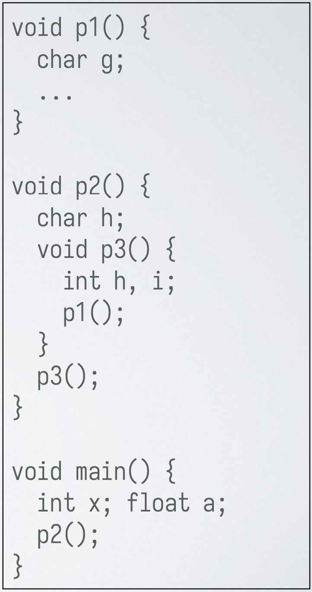
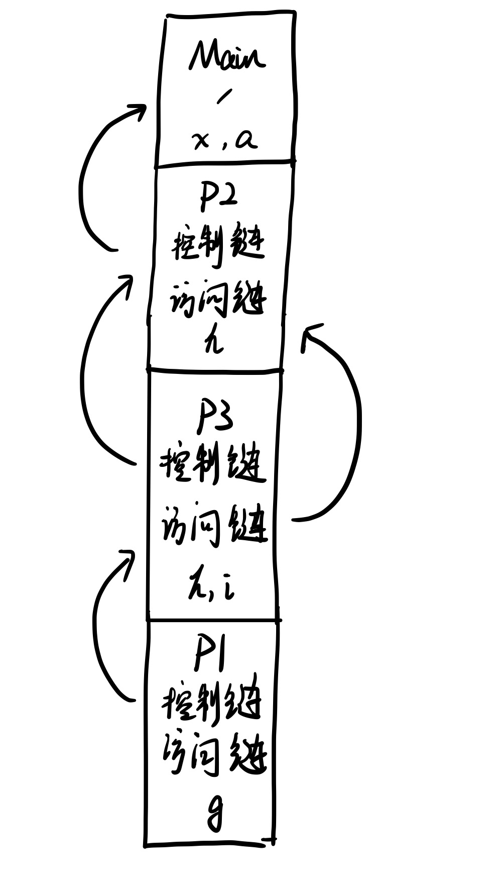
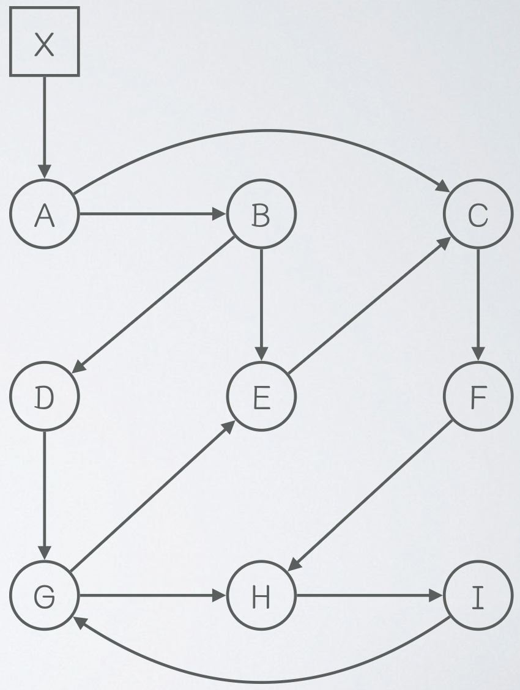
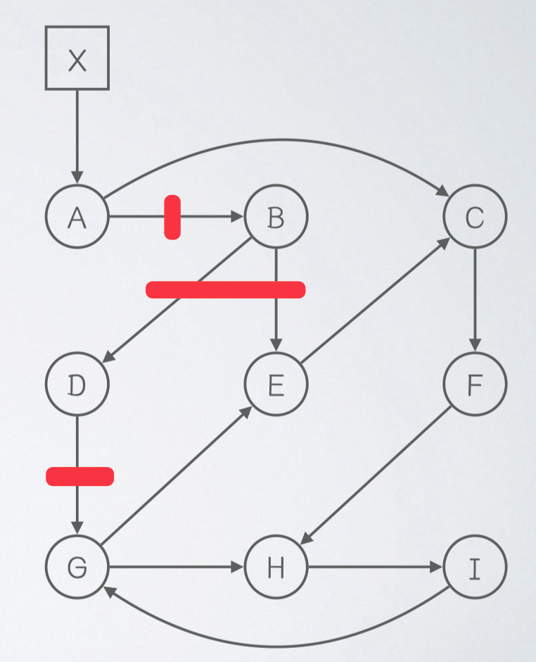
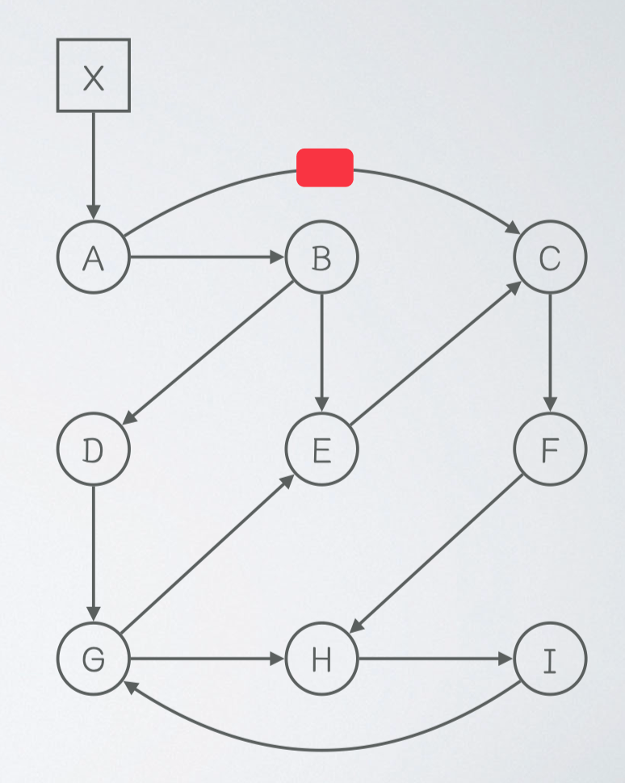

# 编译原理第十三次作业

  2110306206 卓致用

## Part A

考虑一种基于栈的中间表示，它的所有指令都隐式地操作一个全局的栈：

以下是这种栈式中间表示的一些示例：

填写以下生成短路求值代码的 SDT。

### 解答

$$
\begin{array}{|l|l|}
\hline
\text{产生规则} & \text{语义动作} \\
\hline
S \to ID = E; &
\{ S.\text{code} = E.\text{code} \parallel \text{“SET\_VAR(\{genvar(ID.lexeme)\})”;} \} \\
\hline
E \to E_1 + E_2 &
\{ E.\text{code} = E_1.\text{code} \parallel E_2.\text{code} \parallel \text{“ADD”;} \} \\
\hline
E \to -E_1 &
\{ E.\text{code} = 0 \parallel E_1.\text{code} \parallel \text{“SUB”;} \} \\
\hline
E \to ID &
\{ E.\text{code} = \text{“GET\_VAR(\{genvar(ID.lexeme)\})”;} \} \\
\hline
B \to true & \{ B.\text{code} = \text{“GOTO(\{B.true\})”;} \} \\
\hline
B \to E_1 == E_2 &
\{ B.\text{code} = E_1.\text{code} \parallel E_2.\text{code} \parallel \text{“SUB”;} \parallel\\
& \text{“GOTO\_IF\_ZERO(\{B.true\})”;} \parallel \text{“GOTO(\{B.false\})”;} \} \\
\hline
B \to B_1 \parallel B_2 &
\{ B_1.\text{true} = B.\text{true}; B_1.\text{false} = \text{genlabel()};\\
&B_2.\text{true} = B.\text{true}; B_2.\text{false} = B.\text{false}; \} \\
& \{ B.\text{code} = B_1.\text{code} \parallel \text{“}B_1.\text{false:”} \parallel B_2.\text{code} \} \\
\hline
S \to if(B)\, S_1\, else\, S_2 &
\{ B.\text{true} = \text{genlabel()}; \} \\
& \{ B.\text{false} = \text{genlabel()}; \} \\
& \{ S.\text{code} = B.\text{code} \parallel \text{“} B.\text{true:”} \parallel S_1.\text{code} \parallel \text{“GOTO(\{S.next\})”;} \parallel\\
& \text{“} B.\text{false:”} \parallel S_2.\text{code}; \} \\
\hline
S \to while(B)\, S_1 &
\{ S.\text{begin} = \text{genlabel()}; \} \\
& \{ B.\text{true} = \text{genlabel()}; \} \\
& \{ B.\text{false} = \text{genlabel()}; \} \\
& \{ S.\text{code} = \text{“} S.\text{begin:”} \parallel B.\text{code} \parallel \text{“} B.\text{true:”} \parallel S_1.\text{code}\\
& \parallel \text{“GOTO(\{S.begin\})”;} \parallel \text{“} B.\text{false:”} \} \\
\hline
L \to L_1 S & \{ L_1.\text{next} = \text{genlabel()}; \} \\
            & \{ S.\text{next} = L.\text{next}; \} \\
            & \{ L.\text{code} = L_1.\text{code} \parallel \text{“} L_1.\text{next:}” \parallel S.\text{code}; \} \\
\hline
\end{array}
$$

## Part B

考虑右侧的带有嵌套过程定义的程序，其中 $p_3$ 嵌套定义在 $p_2$ 中。考虑从 $main$ 开始执行，已经执行到 $p_1$ 中的 ... 位置。画出此时所有的活动记录。需要标明每个活动记录对应哪个过程，中间有哪些局部变量，以及它们之间的控制链、访问链关系。

### 解答

## Part C

考虑右侧的指向关系图，其中方形表示根集元素，圆形表示堆中对象。回答以下问题：

-   从 A 指向 B 的指针被删除，堆中对象的引用计数会发生哪些变化？

-   从 X 指向 A 的指针被删除，堆中对象的引用计数会发生哪些变化？

-   从 A 指向 B 的指针被删除，标记-清扫回收会如何进行标记和清扫？

-   从 A 指向 C 的指针被删除，标记-清扫回收会如何进行标记和清扫？

### 解答

#### 第一问

B 的引用计数会减 1

#### 第二问

A~I 的引用计数都会减 1

#### 第三问

-   标记阶段：从根节点 X 开始遍历，标记所有可达对象

    可达对象包括：A, C, F, H, I, G, E

-   清扫：检查所有对象，删除未被标记的对象

    回收对象包括：B, D

#### 第四问

-   标记阶段：从根节点 X 开始遍历，标记所有可达对象

    可达对象包括：A~I

-   清扫：检查所有对象，删除未被标记的对象

    回收对象包括：无
