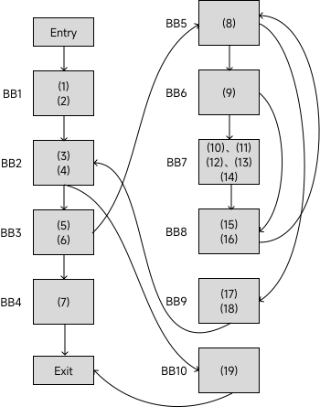
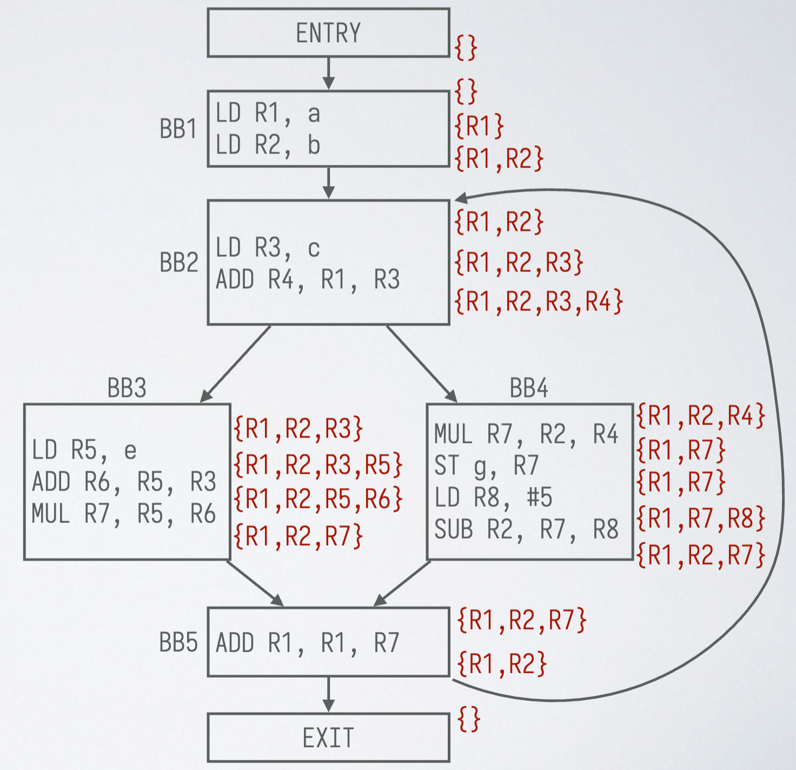
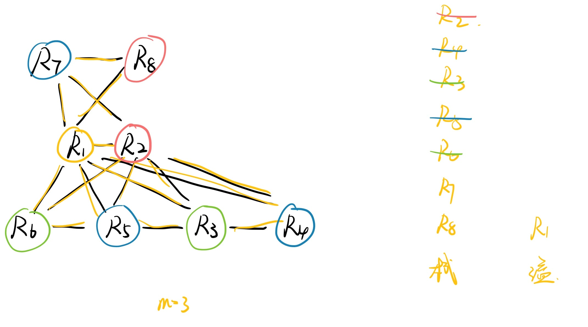

# 编译原理第十四次作业

<center>
  2110306206 卓致用
</center>
## T1

考虑右边的三地址代码：

1. 把这段代码序列划分为基本块
2. 为这段代码构造控制流图，并额外添加入口结点 `ENTRY` 和出口结点 `EXIT`
3. 找出控制流图中的所有循环


### 解答



循环：

-   $\{BB_2, BB_3, BB_5, BB_9\}$
-   $\{BB_5, BB_6, BB_8\}$
-   $\{BB_5, BB_6, BB_7, BB_8\}$

## T2

考虑语句 $x = \frac{a}{b+c} - d*(e+f)$, 变量都是 int 型

1. 为其生成三地址代码。
2. 把上面的三地址代码转换为课上使用的目标机器代码。假设可以使用任意多个寄存器。
3. 重复上一小题，但假设有三个可用寄存器。给出每条三地址语句转换后的寄存器和地址描述符。
4. 重复上一小题，但假设有两个可用寄存器。给出目标机器代码即可。

### 解答

#### 第一问

```assembly
t1 = b + c
t2 = a / t1
t3 = e + f
t4 = d * t3
t5 = t2 - t4
x = t5
```

#### 第二问

```asm
LD  R1, b
LD  R2, c
ADD R3, R1, R2
LD  R4, a
DIV R5, R4, R3
LD  R6, e
LD  R7, f
ADD R8, R6, R7
LD  R9, d
MUL R10, R8, R9
SUB R11, R5, R10
ST  X, R11
```

#### 第三问

<table border="1">
    <tr>
        <th>序号</th>
        <th>三地址表达式</th>
        <th>指令</th>
        <th colspan="3">寄存器</th>
        <th colspan="12">地址描述符</th>
    </tr>
    <tr>
        <td rowspan="3">1</td>
        <td rowspan="3">t₁ = b+c</td>
        <td>LD R₁,b</td>
        <td>R₁</td>
        <td>R₂</td>
        <td>R₃</td>
        <td>x</td>
        <td>a</td>
        <td>b</td>
        <td>c</td>
        <td>d</td>
        <td>e</td>
        <td>f</td>
        <td>t₁</td>
        <td>t₂</td>
        <td>t₃</td>
        <td>t₄</td>
        <td>t₅</td>
    </tr>
    <tr>
        <td>LD R₂,c</td>
        <td>b</td>
        <td>c</td>
        <td>t₁</td>
        <td></td>
        <td>a</td>
        <td>b,R₁</td>
        <td>c,R₂</td>
        <td>d</td>
        <td>e</td>
        <td>f</td>
        <td>R₃</td>
        <td></td>
        <td></td>
        <td></td>
        <td></td>
    </tr>
    <tr>
        <td>ADD R₃,R₁,R₂</td>
        <td colspan="3"></td>
        <td colspan="12"></td>
    </tr>
    <tr>
        <td rowspan="2">2</td>
        <td rowspan="2">t₂ = a/t₁</td>
        <td>LD R₁,a</td>
        <td>R₁</td>
        <td>R₂</td>
        <td>R₃</td>
        <td>x</td>
        <td>a</td>
        <td>b</td>
        <td>c</td>
        <td>d</td>
        <td>e</td>
        <td>f</td>
        <td>t₁</td>
        <td>t₂</td>
        <td>t₃</td>
        <td>t₄</td>
        <td>t₅</td>
    </tr>
    <tr>
        <td>DIV R₁,R₁,R₃</td>
        <td>t₂</td>
        <td>c</td>
        <td>t₀</td>
        <td></td>
        <td>a</td>
        <td>b</td>
        <td>c,R₂</td>
        <td>d</td>
        <td>e</td>
        <td>f</td>
        <td>R₃</td>
        <td>R₁</td>
        <td></td>
        <td></td>
        <td></td>
    </tr>
    <tr>
        <td rowspan="3">3</td>
        <td rowspan="3">t₃ = e+f</td>
        <td>LD R₂,e</td>
        <td>R₁</td>
        <td>R₂</td>
        <td>R₃</td>
        <td>x</td>
        <td>a</td>
        <td>b</td>
        <td>c</td>
        <td>d</td>
        <td>e</td>
        <td>f</td>
        <td>t₁</td>
        <td>t₂</td>
        <td>t₃</td>
        <td>t₄</td>
        <td>t₅</td>
    </tr>
    <tr>
        <td>LD R₃,f</td>
        <td>t₂</td>
        <td>t₃</td>
        <td>f</td>
        <td></td>
        <td>a</td>
        <td>b</td>
        <td>c</td>
        <td>d</td>
        <td>e</td>
        <td>f,R₃</td>
        <td></td>
        <td>R₁</td>
        <td>R₂</td>
        <td></td>
        <td></td>
    </tr>
    <tr>
        <td>ADD R₂,R₂,R₃</td>
        <td colspan="3"></td>
        <td colspan="12"></td>
    </tr>
    <tr>
        <td rowspan="2">4</td>
        <td rowspan="2">t₄ = d*t₃</td>
        <td>LD R₃,d</td>
        <td>R₁</td>
        <td>R₂</td>
        <td>R₃</td>
        <td>x</td>
        <td>a</td>
        <td>b</td>
        <td>c</td>
        <td>d</td>
        <td>e</td>
        <td>f</td>
        <td>t₁</td>
        <td>t₂</td>
        <td>t₃</td>
        <td>t₄</td>
        <td>t₅</td>
    </tr>
    <tr>
        <td>MUL R₃,R₃,R₂</td>
        <td>t₂</td>
        <td>t₃</td>
        <td>t₄</td>
        <td></td>
        <td>a</td>
        <td>b</td>
        <td>c</td>
        <td>d</td>
        <td>e</td>
        <td>f</td>
        <td></td>
        <td>R₁</td>
        <td>R₂</td>
        <td>R₃</td>
        <td></td>
    </tr>
    <tr>
        <td rowspan="2">5</td>
        <td rowspan="2">t₅ = t₂-t₄</td>
        <td rowspan="2">SUB R₂,R₁,R₃</td>
        <td>R₁</td>
        <td>R₂</td>
        <td>R₃</td>
        <td>x</td>
        <td>a</td>
        <td>b</td>
        <td>c</td>
        <td>d</td>
        <td>e</td>
        <td>f</td>
        <td>t₁</td>
        <td>t₂</td>
        <td>t₃</td>
        <td>t₄</td>
        <td>t₅</td>
    </tr>
    <tr>
        <td>t₂</td>
        <td>t₅</td>
        <td>t₄</td>
        <td></td>
        <td>a</td>
        <td>b</td>
        <td>c</td>
        <td>d</td>
        <td>e</td>
        <td>f</td>
        <td></td>
        <td>R₁</td>
        <td></td>
        <td>R₃</td>
        <td>R₂</td>
    </tr>
    <tr>
        <td rowspan="2">6</td>
        <td rowspan="2">x = t₅</td>
        <td rowspan="2">LD x,R₂</td>
        <td>R₁</td>
        <td>R₂</td>
        <td>R₃</td>
        <td>x</td>
        <td>a</td>
        <td>b</td>
        <td>c</td>
        <td>d</td>
        <td>e</td>
        <td>f</td>
        <td>t₁</td>
        <td>t₂</td>
        <td>t₃</td>
        <td>t₄</td>
        <td>t₅</td>
    </tr>
    <tr>
        <td>t₂</td>
        <td>x,t₅</td>
        <td>t₄</td>
        <td>x,R₂</td>
        <td>a</td>
        <td>b</td>
        <td>c</td>
        <td>d</td>
        <td>e</td>
        <td>f</td>
        <td></td>
        <td>R₁</td>
        <td></td>
        <td>R₃</td>
        <td>R₂</td>
    </tr>
</table>

#### 第四问

```asm
LD  R1,b            
LD  R2,c            
ADD R1,R1,R2    
LD  R2,a         
DIV R1,R2,R1    
ST  x,R1         
LD  R1,e      
LD  R2,f      
ADD R1,R1,R2
LD  R2,d
MUL R1,R2,R1
LD  R2,x
SUB R1,R2,R1
ST  x,R1  
```

## T3

寄存器分配与指派：

1. 基于右边的流图和活跃信息，给出 R1~R8 每个符号寄存器与哪些符号寄存器冲突
2. 假设有3个物理寄存器，使用图着色法进行分配，给出溢出和分配的方案即可
3. 至少要几个物理寄存器才能避免溢出？



### 解答

| 基本块 | def | use | IN | OUT |
|---------|-----|-----|----|----|
| BB1 | ${R_1,R_2}$ | $\varnothing$ | $\varnothing$ | ${R_1,R_2}$ |
| BB2 | ${R_3,R_4}$ | ${R_1}$ | ${R_2,R_3}$ | ${R_1,R_2,R_3,R_4}$ |
| BB3 | ${R_5,R_6,R_7}$ | ${R_3}$ | ${R_1,R_2,R_3}$ | ${R_1,R_2,R_7}$ |
| BB4 | ${R_7,R_8,R_2}$ | ${R_2,R_4}$ | ${R_1,R_2,R_4}$ | ${R_1,R_2,R_7}$ |
| BB5 | ${R_1}$ | ${R_1,R_7}$ | ${R_1,R_2,R_7}$ | ${R_1,R_2}$ |

#### 第一问


#### 第二问



- R7，R5，R4 分配 1
- R8，R2 分配 2
- R6，R3 分配 3
- R1 溢出


#### 第三问

至少需要 4 个才能避免溢出。
