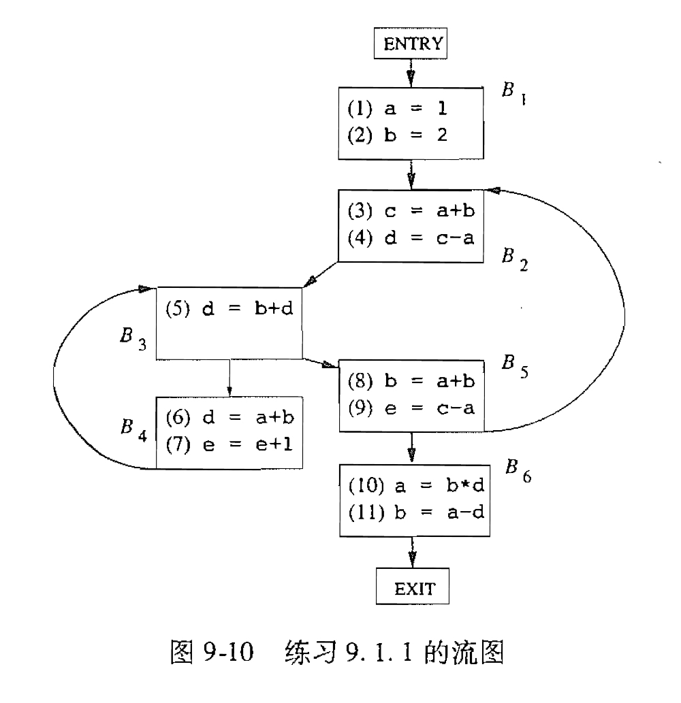
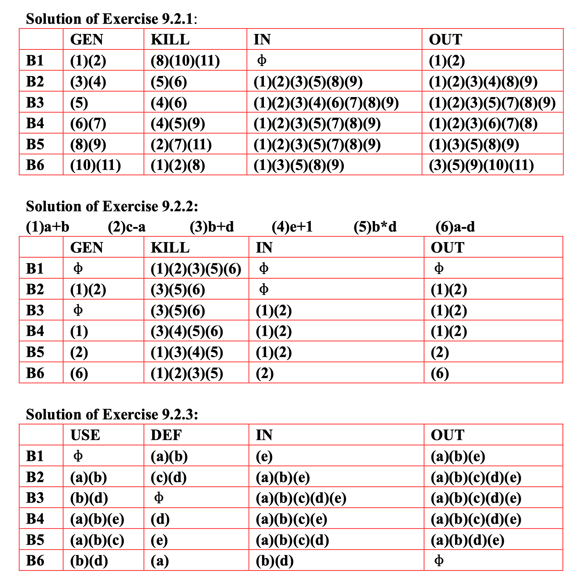

# 编译原理第十次作业

  2110306206 卓致用

## 数据流分析

1. 对图中的流图，计算下列值：
    1. 每个基本块的 $\text{gen}$ 和 $\text{kill}$ 集合。
    1. 每个基本块的 $\text{IN}$ 和 $\text{OUT}$ 集合。
1. 对图中的流图，计算可用表达式问题中的 $\text{e\_gen}$、$\text{e\_kill}$、$\text{IN}$ 和 $\text{OUT}$ 集合。
1. 对图中的流图，计算活跃变量分析中的 $\text{def}$、$\text{use}$、$\text{IN}$ 和 $\text{OUT}$ 集合。

### 解答

