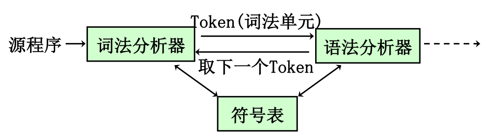

# 01 词法分析 I

<center>
  by <a href="https://github.com/zhuozhiyongde">Arthals</a>
  <br/>
  blog：<a href="https://arthals.ink">Arthals' ink</a>
</center>

## 词法分析器

-   读入源程序字符流，输出 token 序列
-   过滤空白 / 换行 / 制表符 / 注释
-   将 token 信息添加到符号表
-   逻辑上独立于语法分析，但是通常和语法分析器在同一 Pass



### 基础概念

#### 词法单元 token

结构：`<词法单元名, 属性值(可选)>`

-   单元名：表明该词法单位的种类，是表示词法单位种类的抽象符号，词法分析器通过各 token 的单元名即可确定词法单元序列的结构
-   属性值：可选，用于语义分析之后的阶段

#### 模式 pattern

描述一类词法单元的词素可能具有的形式

#### 词素 lexeme

-   源程序中的字符序列
-   如果一个词素和某个 token 的模式相匹配，它会被词法分析器识别为该 token 的实例

### 词法分析器的功能

-   **识别词法单元 token**
-   去除注释 / 空白 / 空行 / 制表符
-   将编译器生成的错误信息关联到源文件
-   可能要进行一些 **预处理**：识别宏 macro；宏的扩展

#### token 的类别

-   关键字 Keyword：if, else, while, return，没有属性值
-   标识符 Identifier：变量名等
-   字面常数 Literal：12，true，1e+3
-   运算符 Operator：+ - \* /
-   分界符 Delimiter：逗号 / 分号 / 冒号 /etc

### 词法分析器的输出

Token 的基本输出格式：`<类别编码, 词法单元自身的属性值>`

**在词法分析过程中，有时候需要无限长的向前看**

### 词法分析的设计

-   可以实现为单独的一个扫描（pass）
-   也可以作为语法分析 / 语义分析的子程序，即每调用一次 `getToken()` 函数即获得一个 token

## 语言和正则表达式

**规约（Specification）**：用正则表达式来描述处理词法单元时用到的模式类型

### 字母表 Alphabet

**字母表**：符号的非空有穷集合

每一程序语言都有自己的字母表

-   机器语言：符号 `0` 和 `1`
-   ASCII 字符集

### 符号串 String / 字 word

已知字母表 $\Sigma$

1. $ε$ 是 $\Sigma$ 上的一个 **符号串** （空串）
2. 若 $\alpha$ 是 $\Sigma$ 上的符号串，而 $a$ 是 $\Sigma$ 的元素，则 $\alpha a$ 是 $\Sigma$ 上的符号串。
3. $\beta$ 是 $\Sigma$ 上的符号串，当且仅当它由 1 和 / 或 2 导出（递归定义）。

**定义**：由字母表中的符号所组成的 **任意有穷序列** 被称为该字母表上的 **符号串（String）**，也称作 **字（Word）** 。

#### **通常约定**

-   靠前的小写字母表示 **符号**：$a, b, c$
-   小写希腊字母或靠后的小写英文字母表示 **符号串**：$α, β, γ, x ,y ,z$
-   $ε$ 通常表示 **空串**
-   大写字母表示 **符号串集合**：$A,B,C$

#### 相关概念

设 $x$ 是一个符号串，定义如下概念：

-   **前缀（prefix）**：移走 $x$ 尾部的 **零个** 或多个连续的符号。
-   **后缀（suffix）**：移走 $x$ 头部的 **零个** 或多个连续的符号。
-   **子串（substring）**：从 $x$ 中删去一个前缀和一个后缀。
-   **真前缀 / 真后缀 / 真子串**：首先要非空（和集图不同），而且不等，即 $y\neq x\mathrm{~}\&\mathrm{~}y\neq\mathbf{\varepsilon}$
-   **子序列（subsequence）**：从 $x$ 中删去 **零个或多个** 符号（这些符号 **不要求是连续的** ）。
-   **逆转（reverse）** ：或称转置，用 $x^R$ 表示。将 $x$ 中的符号按相反次序写出而得到的符号串。
-   **长度（length）** ：符号串中的符号的数目。如 $|aab| = 3$，$|\varepsilon| = 0$

#### 符号串的运算

1. 连接 (concatenation)

    设 $x$ 和 $y$ 是符号串，它们的连接 $xy$ 是把 $y$ 的符号写在 $x$ 的符号之后得到的符号串。

    例如，$x = ba,{~}y = nana\Rightarrow{~}xy = banana$

2. 方幂 (exponentiation)
    - $x^0 = \varepsilon$
    - $x^1 = x$
    - $x^2 = xx$
    - $x^n = x^{n-1}x$

### 语言（符号串集合）

**语言（language）**：某个给定字母表上的一个任意的可数的符号串集合。

#### 语言的例子

-   空集 $\varnothing$
-   只包含空串的集合 $\{\varepsilon\}$
-   所有符合规范的 C 语言标识符的集合
-   所有语法正确的 C 语言程序的集合
-   所有语法正确的英语句子的集合

#### 语言的运算

设 $L$ 和 $M$ 是两个符号串集合，则：

1. 合并 (union)
    $$
    L \cup M = \{s | s \in L \text{ 或 } s \in M\}
    $$
2. 连接 (concatenation)
    $$
    LM = \{st | s \in L \text{ 且 } t \in M\}
    $$
3. 方幂 (exponentiation)
    - $L^0 = \{\varepsilon\}$
    - $L^1 = L$
    - $L^2 = LL$
    - $L^n = L^{n-1}L$
4. 语言 $L$ 的 Kleene 闭包（closure）

    记作 $L^*$：

    $$
    L^* = \bigcup_{i \geq 0} L^i = L^0 \cup L^1 \cup L^2 \cup L^3 \cup \ldots
    $$

5. 语言 $L$ 的正闭包（positive closure）

    记作 $L^+$：

    $$
    L^+ = L \cdot L^*
    $$

    $$
    L^+ = \bigcup_{i \geq 1} L^i = L^1 \cup L^2 \cup L^3 \cup L^4 \cup \ldots
    $$

#### 辨析

1. **空集 $\varnothing$**：空集是一个不包含任何元素的集合。
2. **只包含空串的集合 $\{\varepsilon\}$**：这个集合包含一个元素，即空串 $\varepsilon$。空串是长度为零的字符串。

运算性质：

-   **空集 $\varnothing$**：没有元素。

    因此，对于任何集合 $M$，有：

    $$
    \varnothing M = M \varnothing = \varnothing
    $$

    因为空集与任何集合的笛卡尔积仍然是空集

-   **集合 $\{\varepsilon\}$**：只包含空串。

    这个集合包含一个元素 $\varepsilon$。对于任何集合 $M$，有：

    $$
    \{\varepsilon\} M = M \{\varepsilon\} = M
    $$

    因为空串与任何字符串的连接操作不会改变字符串

### 正则表达式与正则语言 Regular Expression

定义：某个字母表 $\Sigma$ 上的正则表达式及其对应的正则集合（正则语言），满足以下条件：

1. $\varepsilon$ 是一个正则表达式，表示的语言 $L(\varepsilon) = \{\varepsilon\}$。
2. 若 $a \in \Sigma$，$a$ 是一个正则表达式，$L(a) = \{a\}$。
3. 归纳步骤：设 $r$ 和 $s$ 是 $\Sigma$ 上的正则表达式：
    - $(r) | (s)$ 是一个正则表达式，表示语言 $L(r) \cup L(s)$，即或
    - $(r)(s)$ 是一个正则表达式，表示语言 $L(r) L(s)$，即连接在一起
    - $(r)^*$ 是一个正则表达式，表示语言 $(L(r))^*$，即重复
    - $(r)$ 是一个正则表达式，表示语言 $L(r)$

**注意**：去掉一个正则表达式中的冗余括号之后，它表示的正则语言不变（注意运算的优先级）。

#### 正则表达式示例

例：$\Sigma = \{a, b\}$

-   $a | b$：$\{a, b\}$
-   $(a | b)(a | b)$：$\{aa, ab, ba, bb\}$
-   $a^*$：$\{\varepsilon, a, aa, aaa, aaaa, \dots\}$
-   $(a | b)^*$ 或 $(a^*b^*)^*$：$\{\varepsilon, a, b, aa, ab, ba, bb, aaa, \dots\}$
-   $a^*b$：$\{b, ab, aab, aaab, \dots\}$

**C 语言标识符**：[可视化](https://regex-vis.com/?r=%5BA-Z_%5D%5BA-Za-z0-9_%5D*)

```
(A|B|...|Z|a|b|...|z|_)((A|B|...|Z|a|b|...|z|_ |0|1|...|9))*
// [A-Z_][A-Za-z0-9_]*
```

**有符号整数**：[可视化](https://regex-vis.com/?r=%5B%2B-%5D%3F%5B0-9%5D%5B0-9%5D*)

```
(+|-|ε)(0|1|...|9)(0|1|...|9)*
// [+-]?[0-9][0-9]*
```

#### 正则表达式的性质

设 $e_1, e_2, e_3$ 均为某字母表上的正则表达式，则有：

-   单位正则表达式 $\varepsilon$：$\varepsilon e = e \varepsilon = e$
-   交换律：$e_1 | e_2 = e_2 | e_1$
-   结合律：$e_1 | (e_2 | e_3) = (e_1 | e_2) | e_3$，$e_1(e_2 e_3) = (e_1 e_2)e_3$
-   分配律：$e_1(e_2 | e_3) = e_1 e_2 | e_1 e_3$，$(e_1 | e_2)e_3 = e_1 e_3 | e_2 e_3$

此外：

-   $r^* = (r\varepsilon)^*$
-   $r^{**} = r^*$
-   $(r|s)^* = (r^* s^*)^*$

#### 正则定义（Regular Definition）

正则定义是如下形式的定义序列：

$$
D_1 \rightarrow R_1 \\
D_2 \rightarrow R_2 \\
\vdots \\
D_n \rightarrow R_n
$$

其中：

-   $R_1, R_2, \ldots, R_n$ 为正则表达式。
-   $D_1, D_2, \ldots, D_n$ 为正则表达式名字。

**限定**：在 $R_i$ 中只能出现字母表 $\Sigma$ 中的字符，**以及前面已定义的正则表达式名字**，即 $D_1, D_2, \ldots, D_{i-1}$。

我们用这种辅助定义式（相当于规则）来定义程序语言的单词符号。

#### 正则表达式的扩展形式

为了表达的方便，通常可以对正则表达式做如下的扩展：

-   **1 次或多次出现**：$(r)+$ 用来表示 $L(r)+$

    $r^* = r+|\varepsilon \quad r+ = rr^* = r^* r$

-   **0 次或 1 次出现**：$r?$ 用来表示 $r | \varepsilon$

    也就是 $L(r) \cup \{\varepsilon\}$

-   **字符类**：$[abc]$ 表示 $a|b|c$；$[a-z]$ 表示 $a|b|c|\ldots|z$

建议看 [RegexLearn](https://regexlearn.com/zh-cn/cheatsheet)。

#### 例题

写出语言 “所有相邻数字都不相同的非空数字串” 的正则定义。

解答：正则定义如下

$$
\begin{aligned} &\text{answer} & \rightarrow &\ (0 \mid \text{no\_0}\ 0)(\text{no\_0}\ 0)^*(\text{no\_0} \mid \varepsilon) \mid \text{no\_0} \\ &\text{no\_0} & \rightarrow &\ (1 \mid \text{no\_0-1}\ 1)(\text{no\_0-1}\ 1)^*(\text{no\_0-1} \mid \varepsilon) \mid \text{no\_0-1} \\ &{~~~}\vdots & &\ \\ &\text{no\_0-8} & \rightarrow &\ 9 \\ \end{aligned}
$$

将这些正则定义逆序排列就是答案。

1. **顶层规则 `answer`** ：
    - `answer` 可以是以 `0` 开头的数字串，或者以 `no_0` 开头的数字串。
    - 对于以 `0` 开头的串，后面可以跟任意多个 `(no_0 0)`，最后再跟一个 `no_0` 或者为空（$\varepsilon$）。
    - 对于以 `no_0` 开头的串，直接匹配 `no_0`。
2. **子表达式 `no_0`** ：

    - `no_0` 代表不能以 `0` 开头的数字串，其定义类似于 `answer`，但替换了数字。
    - `no_0` 可以是以 `1` 开头，后面可以跟任意多个 `(no_0-1 1)`，最后再跟一个 `no_0-1` 或者为空（$\varepsilon$）。
    - 对于以 `no_0-1` 开头的串，直接匹配 `no_0-1`。

3. **递归定义** ：
    - 其他子表达式 `no_0-1`，`no_0-2`，直到 `no_0-8`，都以类似的方式定义，保证生成的串中相邻数字始终不同。
    - 最终，`no_0-8` 只能匹配 `9`。
