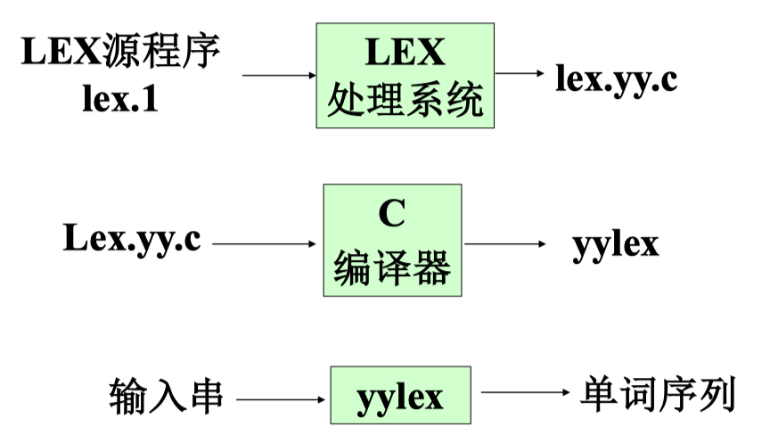
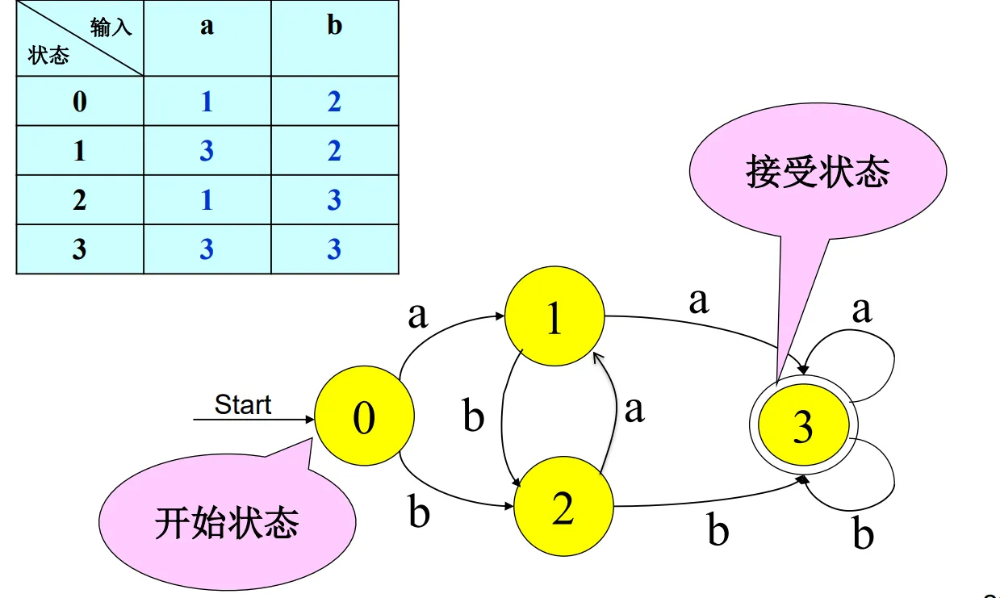
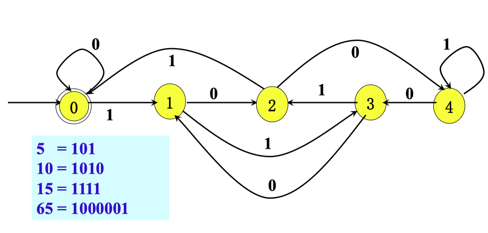

# 02 词法分析 II

<center>
  by <a href="https://github.com/zhuozhiyongde">Arthals</a>
  <br/>
  blog：<a href="https://arthals.ink">Arthals' ink</a>
</center>

## 状态转换图 (Transition Diagram)

**状态 (State)**：在识别词素时可能出现的情况，即对表示已处理部分的总结。

-   **接受状态或最终状态**：表示找到词素。
-   **加上 \* 的接受状态**：表示最后读入的符号不在词素中。
-   **开始状态（初始状态）**：用 “开始 / Start” 边表示。

**边 (Edge)**：从一个状态指向另一个状态，边的标号是一个或多个符号。

-   当前状态为 $s$，下一个输入符号为 $a$，则从 $s$ 沿着标号为 $a$ 的边到达下一个状态 $s \xrightarrow{a} s'$

### 词法单元的自动识别

**基本目标**：判断一个串 $s$ 是否属于一个正则表达式 $R$ 表示的语言：

$$
s \in L(R)
$$

### 词法自动识别过程

1. 分别为每一类词法单元写出正则表达式 $R_i$
2. 构造一个正则表达式 $R$ 来匹配所有的词法单元：
    $$
    R = R_1 | R_2 | \ldots | R_k
    $$
3. 输入为 $x_1 x_2 \ldots x_n$，对于 $1 \leq i \leq n$，检查是否 $x_1 \ldots x_i \in L(R)$
4. 如果匹配成功，则存在 $j$，使得 $x_1 \ldots x_i \in L(R_j)$
5. 把 $x_1 \ldots x_i$ 从输入中移走，继续执行步骤（3）

### 匹配过程中需要解决的问题

1. **确定匹配长度**：可能有多种前缀，选择最长匹配。
2. **选择正则表达式**：可能有多个正则表达式匹配，优先匹配前面的。
3. **无法匹配**：构造一个 ERROR 正则表达式，放在表末尾，用于报错。

## Lex

**Lex**：一种词法分析程序自动构造工具，通常与 Yacc 一起使用，生成编译器前端。

**实现原理**：根据正则表达式自动生成词法分析程序，利用正则表达式与 DFA 的等价性。

**转换方式**：正则表达式 $\Rightarrow$ NFA $\Rightarrow$ DFA $\Rightarrow$ min DFA

### 用 Lex 建立词法分析程序的过程



### 词法分析器的工作方式

-   Lex 生成的词法分析器作为函数被调用
-   每次调用过程中读取输入符号
-   发现最长的匹配输入前缀时，执行相应动作
    -   动作处理并返回控制
    -   如果不返回，继续寻找词素

### Lex 源程序

由三部分组成：声明、转换规则及动作、辅助子程序

各部分用 `%%` 隔开

#### 声明

-   包括变量、C 语言常量和正则定义式

#### 转换规则及动作

-   形式：`p_i {动作 i}`
-   识别某类单词时，执行相应动作
-   动作用 C 语言书写

#### 辅助子程序

-   执行动作所需的 C 语言程序，可单独编译

**Lex 冲突解决方法**：优先按规则顺序匹配，规则在前者优先。

### Lex 程序示例

```lex
%{
/* 定义常量 */
LT, LE, EQ, NE, GT, GE, IF, THEN, ELSE, ID, NUMBER, RELOP
%}

/* 正则定义 */
delim       [\t\n]
ws          {delim}+
Letter      [A-Za-z]
digit       [0-9]
id          {Letter}({Letter}|{digit})*
Number      {digit}+(\.{digit}+)?(E[+-]?{digit}+)?

%%

{ws}        {/* 不返回 */}
if          {return(IF);}
then        {return(THEN);}
else        {return(ELSE);}
{id}        {yylval = (int) installID(); return(ID);}
{number}    {yylval = (int) installNum(); return(NUMBER);}
"<"         {yylval = LT; return(RELOP);}
"<="        {yylval = LE; return(RELOP);}
"=="        {yylval = EQ; return(RELOP);}
"!="        {yylval = NE; return(RELOP);}
">"         {yylval = GT; return(RELOP);}
">="        {yylval = GE; return(RELOP);}

%%

int installID() {/* 添加符号表指向 yytext */}
int installNum() {/* 添加数字常量到表格 */}
```

`yylval` 是 Lex 提供的变量，用于返回词法单元的值。

## 有限自动机 (Finite Automata)

有限自动机是词法分析器生成工具（Lex）的关键技术。

正则表达式 $\rightarrow$ 有限自动机 $\rightarrow$ 词法分析程序

**识别功能**：有限自动机与状态转换图类似，**只能对每个可能的输入串简单地回答 “yes” 或 “no”。**

**分类**：

-   确定的有限自动机（Deterministic Finite Automaton, **DFA** ）
-   不确定的有限自动机（Nondeterministic Finite Automaton, **NFA** ）

### 确定的有限自动机 (DFA)

**定义**：一个确定的有限自动机 $M$（记作 DFA $M$）是一个五元组 $M = (\Sigma, Q, q_0, F, \delta)$，其中：

1. $\Sigma$ 是一个有限字母表，称为输入符号。
2. $Q$ 是一个有限状态集合。
3. $q_0 \in Q$，称为初始状态。
4. $F \subseteq Q$，称为终止状态（或接受状态）集合。
5. **$\delta$ 是一个从 $Q \times \Sigma \to Q$ 的单值映射（称为转换函数）**

    即：$\delta(q, a) = q' \quad (q, q' \in Q, a \in \Sigma)$ 表示当前状态为 $q$，输入符号为 $a$ 时，自动机 $M$ 将转换到下一个状态 $q'$，$q'$ 称为 $q$ 的一个后继

#### DFA 接受的语言

如果 DFA 中存在一条 **从初始状态到接受状态** 的路径，路径上的符号序列构成的字符串是 $w$，那么该 DFA 可以接受字符串 $w$。

-   $\delta(q, \varepsilon) = q$
-   $\delta(q, wa) = \delta(\delta(q, w), a)$
-   $L(M) = \{w \mid w \in \Sigma^*, \text{若存在} q \in F \text{（接受状态）}, \text{使} \delta(q_0, w) = q\}$

#### 表示形式

-   转移矩阵
-   状态转换图



#### 举例

识别 $\Sigma=\{0,1\}$ 上能被能 $5$ 整除的二进制数



```
(0|1(10)*(0|11)(01*01|01*00(10)*(0|11))*1)*
```

先画出 DFA，然后从 0 开始，转换到 1，转换到 2，再转换到 0。中间有环路的描述。

这里每条转换的 $q \xrightarrow{a} q':q' = (2 \times q + a) \% 5$ 。

### 不确定的有限自动机（NFA）

**定义**：NFA 是一个五元组 $M = (\Sigma, Q, q_0, F, \delta)$，其中：

1. $\Sigma$ 是一个有限字母表，称为输入符号。
2. $Q$ 是一个有限状态集合。
3. $q_0 \in Q$，称为初始状态。
4. $F \subseteq Q$，称为终止状态（或接受状态）集合。
5. **$\delta$ 是一个从 $Q \times (\Sigma \cup \{\varepsilon\}) \to 2^Q$ 的映射（称为转换函数，$2^Q$ 表示 $Q$ 的幂集）**

#### NFA 接受的语言

如果 NFA 中存在一条 **从初始状态到接受状态** 的路径，路径上的符号序列构成的字符串是 $w$，那么该 NFA 可以接受字符串 $w$，记作 $w \in L(M)$。

#### 关于 NFA 的说明

1. **接受的字符串和语言**：
    - 字符串在 NFA 中可能对应不同的接受路径。
    - 接受的字符串可能存在其他不能接受的路径。
    - 如果某状态对输入字符 $a$ 不存在可用的转移动作，则不能通过该路径接受当前字符串。
2. **DFA 是 NFA 的一种特例**：DFA 的表达能力与 NFA 等价。
