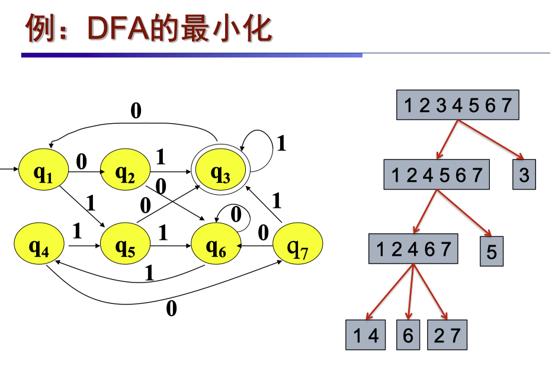
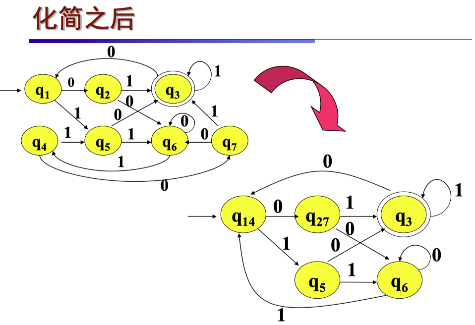
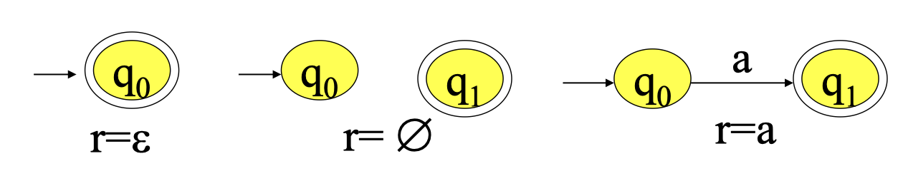
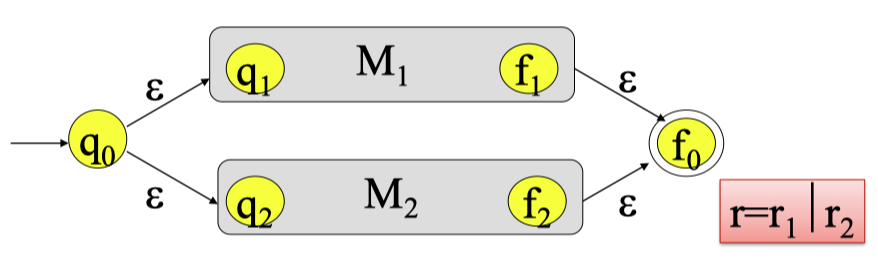
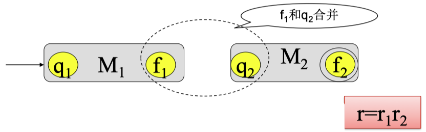
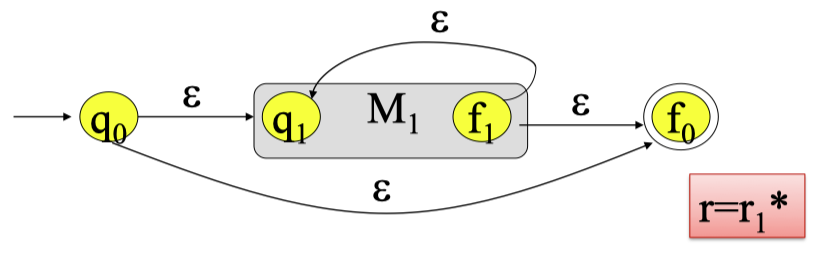
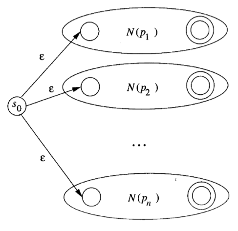
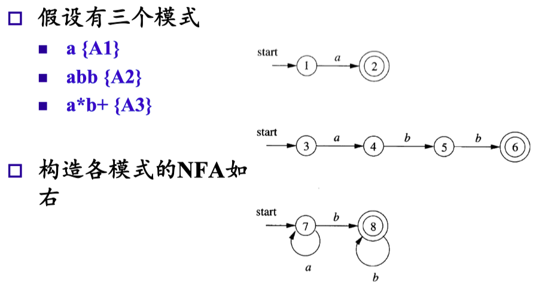
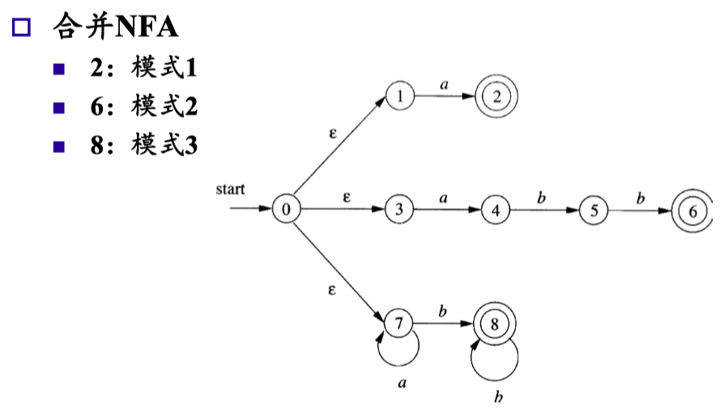
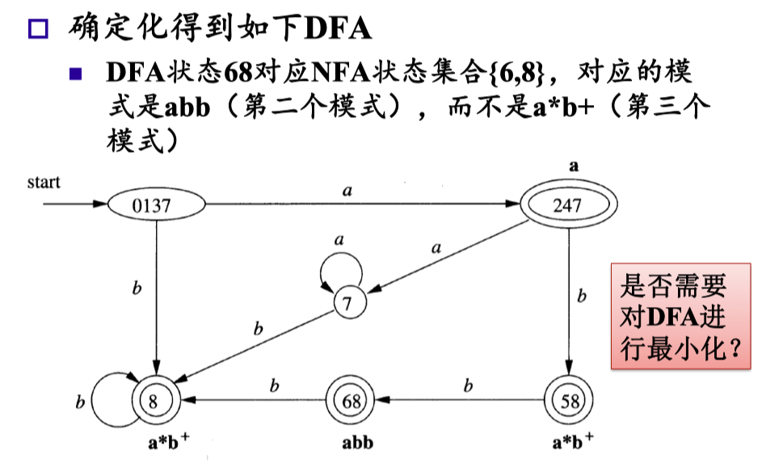

# 03 词法分析 III

  by <a href="https://github.com/zhuozhiyongde">Arthals</a>
   
  blog：<a href="https://arthals.ink">Arthals' ink</a>

## 从 NFA 构造 DFA

### 闭包 $\varepsilon\text{\_closure}(S)$

**定义**：从状态集合 $S$ 中 **任一状态出发**，仅沿 $\varepsilon$ 弧到达的状态集合（包括 $S$ 自身）称为 $S$ 的 $\varepsilon$ 闭包，记为 $\varepsilon\text{\_closure}(S)$：

$$
T = S \cup (\bigcup \text{edge}(t, \varepsilon)), \quad t \in T
$$

其中，$\text{edge}(t, a)$ 是 $M$ 中从状态 $t$ 出发，仅沿 $a$ 弧到达的状态集合。

### DFA M' 中的状态

-   $M'$ 中的每个状态是 $M$ 的状态集合。
-   令 $t_0$ 是 $M$ 的初始状态，$M'$ 的初始状态 $d_0 = \varepsilon\text{\_closure}(\{t_0\})$。
-   **包含 $M$ 的任意终止状态的状态集合都是 $M'$ 中的终止状态。**

### DFA M' 的转移函数

$$
\text{DFAedge}(d, a) = \varepsilon\text{\_closure}(\bigcup_{t \in d} \text{edge}(t, a))
$$

其中：

-   $d$ 是 $M$ 的状态集合
-   $a \in \Sigma$
-   $\text{edge}(t, a)$ 是 NFA $M$ 中从状态 $t$ 出发，仅沿 $a$ 弧到达的状态集合。

## DFA 的最小化

给定 DFA $M = (\Sigma, Q, q_0, F, \delta)$，寻找一个状态数更少的 DFA $M'$，使 $L(M') = L(M)$。

可以证明，存在一个最少状态的 DFA $M'$，使 $L(M) = L(M')$。

### 等价状态

-   设 $p, q \in Q$，若对任意 $w \in \Sigma^*$，$\delta(p, w) \in F$ 当且仅当 $\delta(q, w) \in F$（$F$ 是终态集合），则称 $p$ 和 $q$ 是等价状态
-   否则，称 $p$ 和 $q$ 是可区别的

等价状态的意义：**如果两个状态是等价的，则可以将它们合并成一个状态而不影响 DFA 接受的语言。**

### 等价状态的判别条件

等价状态定义了状态集合上的等价关系。因此状态集合能被划分成等价类。

两个状态 $p$ 和 $q$ 等价应满足如下条件：

-   **一致性条件**：$p$ 和 $q$ 必须同时为接受状态或为非接受状态。
-   **蔓延性条件**：
    -   对于 $\forall a \in \Sigma$，$\delta(p, a) = r$，$\delta(q, a) = s$，$r$ 和 $s$ 必须 **等价**
    -   反之若 $r$ 和 $s$ 不等价，则 $p$ 和 $q$ 不等价

### 等价类划分方法

1. 把所有状态划分为两个组：接受状态组和非接受状态组。
2. 任意选定一个输入符号 $a$，**判断每个组中的各个状态对于 $a$ 的转换**，如果落入不同的组中，**就把该组中的状态按照转换之后的组进行分割**，使分割之后的每个组对于 $a$ 的转换都落入同一个组。
3. 重复第 2 步，直至每个组中的所有状态都等价。

> 感觉是一个不断二分的过程？

#### 例子

## 从正则表达式构造 FA（有限自动机）

**定理**：设 $r$ 是 $\Sigma$ 上一个正则表达式，则存在 FA $M$ 接受 $L(r)$，并且 $M$ 的终态是唯一的且无有向边射出。

**证明**：对正则表达式 $r$ 的 **运算符数目** 作归纳。

设 $r$ 具有零个运算符，必有 $r=\varepsilon$ 或 $r=\varnothing$ 或 $r=a \in \Sigma$，则 FA 分别为：

设结论对少于 $i$（$i\leq1$）个运算的正则表达式 $r$ 成立。

当 $r$ 有 $i$ 个运算时，有三种情况：

-   $r = r_1 \mid r_2$
-   $r = r_1 r_2$
-   $r = r_1^*$

有 $M_1=(\Sigma_1, Q_1, q_1, F_1, \delta_1)$，$M_2=(\Sigma_2, Q_2, q_2, F_2, \delta_2)$ 且 $L(M_1)=L(r_1)$，$L(M_2)=L(r_2)$。

由 $M_1$ 和 $M_2$ 构造 $M$，使得 $L(M)=L(r)$，构造方法如图示如下：

-   情况 1：$r = r_1 \mid r_2$

    

-   情况 2：$r = r_1 r_2$

    

-   情况 3：$r = r_1^*$

    

由此可以证明：假定知道 $r$ 的计算顺序，对于任意正则表达式 $r$，可以构造一个 FA $M$，使得 $L(M)=L(r)$。

### 转换得到的 NFA 的特性

-   状态数量最多为 $r$ 中的运算符和运算符分量总数的两倍
    -   因为每个步骤只引入两个状态
-   有且只有一个开始状态和一个接受状态
-   除接受状态之外，每个状态要么有一条标号不为 $\varepsilon$ 的出边，要么有两条标号为 $\varepsilon$ 的出边

## NFA 合并的方法

1. **引入新状态**：引入新的开始状态 $s_0$，并引入从这个开始状态到各个原开始状态的 $\varepsilon$ 转换
2. **语言并集**：得到的 NFA 所接受的语言是原来各个 NFA 语言的 **并集**
3. **不同接受状态**：不同的接受状态可代表不同的模式
4. **模式识别**：不仅判断输入前缀是否 NFA 的语言，还需知道对应于哪个模式

### NFA 到 DFA 的转换

1. **确定化**：对得到的 NFA 进行确定化，得到 DFA。

    可进一步对得到的 DFA 的状态进行最小化。

2. **状态集合**：一个 DFA 的接受状态对应于 **NFA 状态的集合**，其中 **至少包括一个 NFA 接受状态**。

    如果其中包括多个对应于不同模式的 NFA 接受状态，则表示当前的输入前缀对应于多个模式，存在冲突。

3. **模式输出**：找出第一个这样的模式，将这个模式作为这个 DFA 接受状态的输出。

### 例子

### 运行的方式

1. **模拟 DFA，不断读入字符串中的字符**，直到某一时刻没有后继为止（不是达到某个接受状态）
2. **回头查找最后的接受状态，执行相应的动作**
    - 如果查不到，报告词法错误
    - 在回退时，需要同时回退读入的字符
