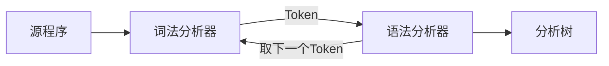
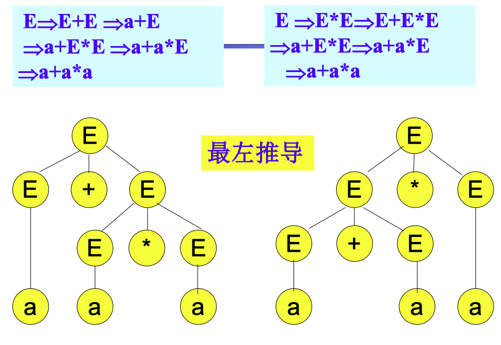

# 04 语法分析 I

<center>
  by <a href="https://github.com/zhuozhiyongde">Arthals</a>
  <br/>
  blog：<a href="https://arthals.ink">Arthals' ink</a>
</center>

## 概述

程序设计语言构造的语法可使用 **上下文无关文法** 或 **BNF 表示法** 来描述

## 语法分析器的作用



-   功能：根据文法规则，从源程序单词符号串中识别出语法成分，并进行语法检查
-   **基本任务**：识别符号串 $S$ 是否为某个合法的语法单元

## 语法分析器的种类

分类

-   通用语法分析器
    -   可以对任意文法进行语法分析
    -   效率很低，不适合用于编译器
-   **自顶向下** 的语法分析器
    -   从语法分析树的根部开始构造语法分析树
-   **自底向上** 的语法分析器
    -   从语法分析树的叶子开始构造语法分析树

后两种方法

-   通常从左到右逐个扫描词法单元
-   为了保证效率，**只针对特定类型的文法**，但是这些文法足以用来描述常见的程序设计语言

## 文法（Grammar）

**定义**：文法 $G = (V_T, V_N, S, P)$，其中：

-   $V_T$ 是一个非空有穷的 **终结符号（terminal）** 集合
-   $V_N$ 是一个非空有穷的 **非终结符号（nonterminal）** 集合，且 $V_T \cap V_N = \varnothing$
-   $P = \{ \alpha \to \beta | \alpha \in (V_T \cup V_N)^*\text{且至少包含一个非终结符号}, \beta \in (V_T \cup V_N)^*\}$，称为 **产生式（production）** 集合
    -   BNF 范式：产生式可以写成 $A ::= \alpha$ 或 $A \rightarrow \alpha$
    -   $A \rightarrow \alpha_1 \quad A \rightarrow \alpha_2$ 可以缩写为：$A \rightarrow \alpha_1 | \alpha_2$
-   $S \in V_N$，称为 **开始符号（start symbol）**

    $S$ 必须在某个产生式的左部至少出现一次

### 关于文法的一些约定

通常可以不用将文法 $G$ 的四元组显式地表示出来，而只需将产生式写出，一般约定：

-   **第一条产生式 $P_0$** 的左部是 **开始符号**
-   用 **尖括号 $<>$** 括起来的是 **非终结符号**，而 **不用尖括号** 的是 **终结符号**
-   或者 **大写字母 $ABC$** 表示 **非终结符号**，**小写字母 $abc$** 表示 **终结符号**
-   **小写的希腊字母 $\alpha \beta \gamma$** 表示 **（可能为空的）** 文法符号串

另外也可以把 $G$ 表示为 $G[S]$，其中 $S$ 为开始符号

### 上下文无关文法（Context-free grammar，CFG）

**所有产生式的左边只有一个非终结符号**，即

-   产生式的形式为：$A \rightarrow \beta$
-   因此不需要任何上下文（context）就可以对 $A$ 进行推导

上下文无关文法描述的语言称为上下文无关语言

## 推导 / 规约

### 直接推导 / 直接规约

**直接推导（Immediate Derivation）/ 直接规约（Immediate Reduction）**：若某个串 $\alpha$ 可以根据某条文法一步化为串 $\beta$，则称：

-   $\alpha$ 可以直接推导出 $\beta$
-   $\beta$ 可以直接归约到 $\alpha$

标准定义：令语法 $G=(V_T, V_N, S, P)$，若 $\alpha \to \beta \in P$，且 $\gamma, \delta \in (V_T \cup V_N)^*$，则称 $\gamma \alpha \delta$ 可以直接推导出 $\gamma \beta \delta$，表示为：

$$
\gamma \alpha \delta \Rightarrow \gamma \beta \delta
$$

如果 $\gamma \alpha \delta$ **直接推导（左到右）** 出 $\gamma \beta \delta$，即 $\gamma \alpha \delta \Rightarrow \gamma \beta \delta$，则称 $\gamma \beta \delta$ **直接归约（右到左）** 到 $\gamma \alpha \delta$。

规约是推导的逆过程。

### 推导（Derivation）

若一个直接推导序列为：

$$
\alpha_0 \Rightarrow \alpha_1 \Rightarrow \alpha_2 \Rightarrow \ldots \Rightarrow \alpha_n \quad (n > 0)
$$

可以表示为：

$$
\alpha_0 \Rightarrow^+ \alpha_n
$$

拓展定义 $\alpha_0 \Rightarrow^* \alpha_n$ 为：

-   要么 $\alpha_0 = \alpha_n$ （直接就是）
-   要么 $\alpha_0 \Rightarrow^+ \alpha_n$ （经过几次推导）

> 这里类似正则表达式，在正则表达式中：
>
> -   `+` 代表一次或者多次匹配
> -   `*` 代表零次或者多次匹配

### 最左推导和最右推导

对于文法 $G$ 和字符串 $w$，如果 $w \in L(G)$，即 $w$ 可以由 $G$ 生成，那么有如下构造推导 $S \Rightarrow^* w$ 的方法：

-   **最左推导**：若 $\alpha A \beta \Rightarrow_{lm} \alpha \gamma \beta$， $\alpha \in V_T^*$，即 **$\alpha$ 是一个由终结符组成的字符串**。
-   **最右推导**：若 $\alpha A \beta \Rightarrow_{rm} \alpha \gamma \beta$， $\beta \in V_T^*$，即 **$\beta$ 是一个由终结符组成的字符串**。

**最左推导每次替换最左边的非终结符，而最右推导每次替换最右边的非终结符。**

## 句型 / 句子 / 语言

### 句型（sentential form）

如果 $S \Rightarrow^* \alpha$，那么 $\alpha$ 是文法的句型

-   句型 **可能既包含非终结符号，又包含终结符号**
-   句型也 **可以是空串**

> 型 → 行，即可以达到的状态

### 句子（sentence）

文法的句子是 **不包含非终结符号** 的句型（即全是终结符号，最终状态）

> 子 → 子集（即最具体的句子）

### 语言

文法 $G$ 的语言是 $G$ 的所有 **句子** 的集合，记为 $L(G)$

$w$ 在 $L(G)$ 中当且仅当 $w$ 是 $G$ 的句子，即 $S \Rightarrow^* w$

### 证明文法生成的语言

基本步骤：

1. 首先证明 $L(G) \subseteq L$（文法 $G$ 生成的任意句子都属于语言 $L$）
2. 然后证明 $L \subseteq L(G)$（语言 $L$ 的任意句子都可以用文法 $G$ 生成）
3. 一般可以使用 **数学归纳法**。
    - $L(G)\subseteq L$：按推导序列的长度来归纳
    - $L\subseteq L(G)$：按符号串长度来构造推导序列

#### 文法生成语言的例子

文法 $G$：$$ S \rightarrow (S)S \mid \varepsilon $$

语言 $L$：所有具有对称括号的串。

$L(G) \subseteq L$ 的证明：依据 **推导序列的长度** 来归纳

-   **归纳基础**：推导长度为 $n=1$, $S \Rightarrow \varepsilon$，满足括号对称。
-   **归纳步骤**：假设长度小于 $n$ 的推导都能得到括号对称的句子。考虑推导步骤为 $n$ 的最左推导：

    $$
    S \Rightarrow_{lm} (S)S \Rightarrow_{lm}^{*} (x)S \Rightarrow_{lm}^{*} (x)y
    $$

    其中 $x$ 和 $y$ 的 **推导步骤** 都小于 $n$，因此 $x$ 和 $y$ 也是括号对称的句子

    即依据 **推导路径长度** 来进行归纳

$L \subseteq L(G)$ 的证明：依据 **生成句子长度** 来进行归纳

-   注意：指括号对称的串的长度必然是偶数。
-   **归纳基础**：如果指括号对称的串的长度为 $0$，那么它可以从 $S$ 推导得到。
-   **归纳步骤**：假设长度小于 $2n$ 的指括号对称的串都能被 $S$ 推导得到，$w$ 是括号对称且长度为 $2n$ 的串。

    那么，$w$ 必然以左括号开头，且可以写成 $(x)y$ 的形式，其中 $x$ 也是括号对称的。因为 $x$、$y$ 的长度都小于 $2n$ ，根据归纳假设，$x$ 和 $y$ 都可以从 $S$ 推导得到，进而 $w$ 可以从 $S$ 推导得到：
    $$
    S \Rightarrow_{lm} (S)S \Rightarrow_{lm}^{*} (x)S \Rightarrow_{lm}^{*} (x)y
    $$

## 语法解析树（Parse Tree）

**语法解析树**：推导的一种图形表示形式

-   **根节点**：文法的开始符号 $S$
-   **叶子节点**：非终结符号、终结符号或 $\varepsilon$
-   **内部节点（即非叶子节点）**：非终结符号
    -   每个内部节点往下推，表示某个产生式的一次应用
    -   内部节点的标签为产生式左部，该节点的子节点从左到右对应产生式的右部



画的时候可以从顶向下推导，也可以从底向上规约。

几点说明：

-   有时允许根不是开始符号（对应于某个短语）
-   树的叶子组成的序列是根的文法符号的句型
-   一棵解析树可对应多个推导序列，但是解析树和最左（右）推导序列之间具有一一对应关系

## 二义性 / 歧义性（Ambiguity）

### 定义

-   如果一个文法中存在某个句子有两棵解析树，那么该句子是 **二义性的**
-   如果一个文法产生二义性的句子，则称这个文法是 **二义性的**
-   否则，该文法是 **无二义性的**

#### 举例

考虑下面的表达式文法 $G2[E]$，其产生式如下：

$$
E \rightarrow E + E \mid E * E \mid (E) \mid a
$$

对于句子 $a + a * a$，有如下两个最左推导：

$$
E \Rightarrow E + E \Rightarrow a + E \Rightarrow a + E * E \Rightarrow a + a * E \Rightarrow a + a * a
$$

$$
E \Rightarrow E * E \Rightarrow E + E * E \Rightarrow a + E * E \Rightarrow a + a * E \Rightarrow a + a * a
$$


#### 几点说明

1. 一般来说，程序语言存在 **无二义性文法**。
2. 在能够驾驭的情况下，经常使用二义性文法

    条件语句通常使用二义性文法描述。

3. 对于任意一个上下文无关文法，不存在一个算子，判定它是无二义性的；

    但能够给出一组充分条件，满足这组充分条件的文法是无二义性的。

4. 存在 **先天二义性** 的 **语言**，即语言本身就是二义性，无论采用何种文法描述。

    例如：$\{ a^i b^i c^j | i, j \geq 1 \} \cup \{ a^i b^j c^j | i, j \geq 1 \}$

    存在一个二义性的句子 $a^k b^k c^k$。

## 上下文无关文法和正则表达式

上下文无关文法比正则表达式的能力 **更强**：

-   所有的正则语言都可以使用上下文无关文法描述。
-   但是一些用上下文无关文法描述的语言不能用正则文法描述。

### 用上下文无关文法描述的语言不都能用正则文法描述

1. 首先证明：存在上下文无关文法 $S \rightarrow aSb \mid ab$ 描述了语言 $\{ a^n b^n | n > 0 \}$，但是它 **无法用 DFA 识别**。

2. 反证法：假设 DFA 识别该语言，设这个文法有 $k$ 个状态。

    那么在其尝试识别 $a^{k+1}$ （即输入串中有 $k+1$ 个 $a$）的输入串时，必然两次到达同一个状态（$a$ 到 $a^k$ 最多用 $k$ 个状态，再来一个肯定重复，也即抽屉原理）。

    设自动机在第 $i$ 和第 $j$ 个输入 $a$ 时到达同一个状态（那么就形成了环路）。

    那么，因为 DFA 识别 $L$，$a^i b^i$ 必然到达接受状态。

    由于 $a^i$、$a^j$ 使得 DFA 到达同一个状态，所以 $a^j b^i$ 也必然到达接受状态。

    这与 $a^j b^i$ 不是语言的句子矛盾。

### 任何正则语言都可以表示为上下文无关文法的语言

首先，任何正则语言都必然有一个等价的 NFA。

而对于任意的 NFA 可以构造如下的上下文无关文法：

1. 对 NFA 的每个状态 $i$，创建非终结符号 $A_i$
2. 如果有 $i$ 在输入 $a$ 上到达 $j$ 的转换，增加产生式 $A_i \rightarrow a A_j$
3. 如果 $i$ 在输入 $\varepsilon$ 上到达 $j$，那么增加产生式 $A_i \rightarrow A_j$
4. 如果 $i$ 是一个接受状态，增加产生式 $A_i \rightarrow \varepsilon$
5. 如果 $i$ 是初始状态，令 $A_i$ 为所得文法的开始符号

## 非上下文无关的语言结构

在程序语言中，某些语言结构 **不能总能用上下文无关文法** 描述。

1. **例 1**
    $$
    L_1 = \{ wcw \mid w \in \{a,b\}^+ \}
    $$
    - 例如，`aabcaab` 是 $L_1$ 的一个句子
    
    - 该语言是检查程序中标识符的声明应先于引用的抽象（先声明 $w$，隔了 $c$，再引用 $w$）
    
      ```cpp
      int a;
      // ...
      a++;
      ```
    
      
    
2. **例 2**
    $$
    L_2 = \{ a^n b^m c^n d^m \mid n,m \geq 0 \}
    $$
    - 它是检查程序声明的形参个数和过程调用的实参个数一致的问题的抽象（先 $n$ 个 $a$，再 $m$ 个 $b$，再 $n$ 个 $c$，再 $m$ 个 $d$）
    
      ```cpp
      int f(int a, int b){
        //...
      }
      f(1, 2)
      ```

## 文法分类（Chomsky）

### 0 型（任意文法）

$$
G = (V_T, V_N, S, P)
$$

-   规则形式：$\alpha \rightarrow \beta, {~}{~}\alpha, \beta \in (V_T \cup V_N)^*, {~}{~}\alpha \neq \varepsilon$
-   翻译：任意非空串到任意串
-   推导：$\gamma \alpha \delta \Rightarrow \gamma \beta \delta$

### 1 型（上下文有关，Context-Sensitive Grammar）

-   规则形式：$\alpha A \beta \rightarrow \alpha \gamma \beta,{~}{~}A \in V_N, {~}{~}\alpha, \gamma, \beta \in (V_T \cup V_N)^*,{~}{~} \gamma \neq \varepsilon$
-   翻译：需要一个上下文（式中 $\alpha,\beta$），然后发生一次非终止符号到任意串的推导
-   注：可以包含 $S \to \varepsilon$，但此时不允许 $S$ 出现在产生式右边

### 2 型（上下文无关，Context-Free Grammar, CFG）

-   规则形式：$A \rightarrow \beta, {~}{~}A \in V_N, {~}{~}\beta \in (V_T \cup V_N)^*$
-   翻译：没有上下文，产生式左侧只能为一个非终止符号，右侧可以为任意串
-   上下文无关语法是没有记忆的

### 3 型（正则文法，Regular Grammar）

-   右线性：$A \rightarrow aB, {~}{~}A \rightarrow a$
-   左线性：$A \rightarrow Ba, {~}{~}A \rightarrow a, {~}{~}a \in V_T \cup \{ \varepsilon \}$
-   两种只能选其一
-   翻译：产生式左侧只能为一个非终止符号，右侧最多包含两个符号，且其中一个必须是非终结符

### 总结

-   **每一类逐渐对产生式施加限制，表示范围逐步缩小。**
-   任意文法 > 上下文有关**（可以有记忆）**> 上下文无关**（没有记忆）**> 正则文法

### 在程序语言中的实际应用

-   与词法相关的规则属于 **正则文法**
-   与局部语法相关的规则属于 **上下文无关文法**
-   与全局语法和语义有关的部分主要用 **上下文有关文法** 来描述，实际上很少使用
-   为简化分析过程，会把 **描述词法的正则文法** 从 **描述语法的上下文无关文法** 中分离出来

    在分离出正则文法后的上下文无关文法中，这些单词符号属于终结符号 $V_T$ 中的符号
