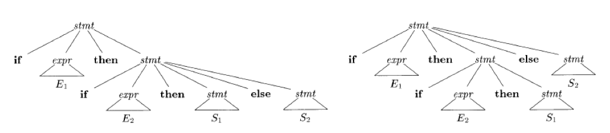
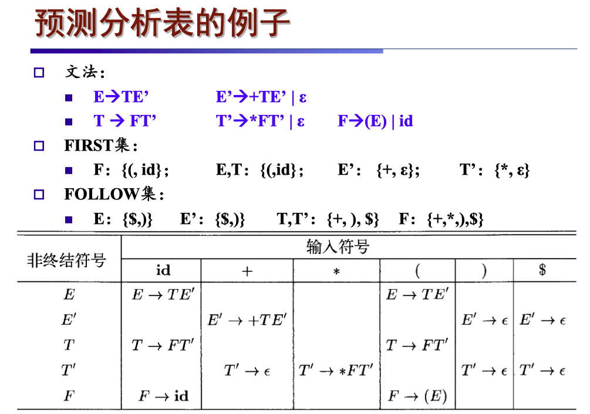

# 05 语法分析 II

  by <a href="https://github.com/zhuozhiyongde">Arthals</a>
   
  blog：<a href="https://arthals.ink">Arthals' ink</a>

## 文法的设计方法

### 消除二义性

一些二义性文法可以被改成等价的无二义性文法

### 例子：dangling-else

$$
\begin{aligned}
\text{stmt} \rightarrow& \textbf{if} \ \text{expr} \ \textbf{then} \ \text{stmt} \\
|& \textbf{if} \ \text{expr} \ \textbf{then} \ \text{stmt} \ \textbf{else} \ \text{stmt} \\
|& \text{other}
\end{aligned}
$$

在这个语法下，$\textbf{if} \ \text{expr}_1 \ \textbf{then} \ \textbf{if} \ \text{expr}_2 \ \textbf{then} \ \text{stmt}_1 \ \textbf{else} \ \text{stmt}_2$ 有两棵语法树：

即：这个 else 既可以和第一个 then 匹配，也可以和第二个 then 匹配。

#### 消除 dangling-else 二义性

引入 `matched_stmt` 表示匹配好的语句，文法如下：

$$
\begin{aligned}
\text{stmt} \rightarrow& \text{matched\_stmt} | \text{open\_stmt} \\
\text{matched\_stmt} \rightarrow& \textbf{if} \ \text{expr} \ \textbf{then} \ \text{matched\_stmt} \ \textbf{else} \ \text{matched\_stmt} \\
|& \text{other} \\
\text{open\_stmt} \rightarrow& \textbf{if} \ \text{expr} \ \textbf{then} \ \text{stmt} \\
|& \textbf{if} \ \text{expr} \ \textbf{then} \ \text{matched\_stmt} \ \textbf{else} \ \text{open\_stmt}
\end{aligned}
$$

即：通过引入新的非终结符，来保证 else 与最近未匹配的 then 匹配。

### 例子：近对称符号串

文法 $G$ 的产生式如下：

$$
S \rightarrow aSb \,|\, bSa \,|\, SS \,|\, ba \,|\, ab
$$

$L(G)$：

-   最小单元：$abab,aabb,baba,bbaa$
-   最小单元外侧可以对称着包 $a\cdots b$ 或者 $b\cdots a$
-   然后包完了还可以重复

#### 二义性示例

$G$ 是二义性的，例如 $ababab$ 有两个不同的最左推导：

1. $S \Rightarrow SS \Rightarrow abS \Rightarrow abSS \Rightarrow ababab$
2. $S \Rightarrow SS \Rightarrow SSS \Rightarrow abS \Rightarrow ababab$

#### 等价上下文无关文法

$$
\begin{aligned}
S &\rightarrow TS \,|\, T \\
T &\rightarrow aB \,|\, bA \\
A &\rightarrow a \,|\, bAA \\
B &\rightarrow b \,|\, aBB
\end{aligned}
$$

### 消除文法中的左递归

**文法左递归**：$A\Rightarrow^+A\alpha$

-   **直接左递归**：直接左递归经过一次推导就可以看出文法存在左递归
    $$
    A \rightarrow A \alpha \mid \beta
    $$
-   **间接左递归**：间接左递归是指需多次推导才可以看出文法存在左递归
    $$
    S \rightarrow A a \mid b \\
    A \rightarrow S d \mid \varepsilon
    $$

#### 消除直接左递归

将原始规则 $A \rightarrow A \alpha \mid \beta$ 转换为：

$$
\begin{aligned}
A &\rightarrow \beta A' \\
A' &\rightarrow \alpha A' \mid \varepsilon
\end{aligned}
$$

#### 消除间接左递归

1. 先转换成直接左递归：

    使用替换法，将 $S$ 的规则替换为 $A$ 的规则：

    $$
    \begin{aligned}
    S &\rightarrow A a \mid b \\
    A &\rightarrow S d \mid \varepsilon
    \end{aligned}
    $$

    转换为：

    $$
    \begin{aligned}
    S &\rightarrow A a \mid b \\
    A &\rightarrow A a d \mid b d \mid \varepsilon
    \end{aligned}
    $$

2. 再消除左递归：

    $$
    \begin{aligned}
    A &\rightarrow b d A' \mid A' \\
    A' &\rightarrow a d A' \mid \varepsilon
    \end{aligned}
    $$

### 消除所有左递归的算法

1. 将文法 $G$ 的非终结符顺序整理为 $A_1, A_2, \cdots, A_n$。
2. 逐步消除间接左递归

    1. 对于每个 $i$ 从 1 到 $n$，对于每个 $j$ 从 1 到 $i-1$，将形如 $A_i \rightarrow A_j r$ 的规则替换为：

        $$
        A_i \rightarrow \delta_1 r \mid \delta_2 r \mid \cdots \mid \delta_k r
        $$

        其中，$A_j \rightarrow \delta_1 \mid \delta_2 \mid \cdots \mid \delta_k$ 是当前 $A_j$ 的所有产生式。

    2. 然后，消除 $A_i$ 规则中的直接左递归。

    **理解**：循环操作，先避免 $A_i \rightarrow A_j r\ (j < i)$ 的退化，再消除 $A_i$ 的左递归，从而避免了所有非终结符的左递归

3. 化简得到的文法

## 预测分析法

**预测分析法**：试图从开始符号推导出输入符号串

-   以开始符号 $S$ 作为初始的当前句型
-   每次为最左边的非终结符号选择适当的产生式
    -   通过查看下一个输入符号来选择这个产生式
    -   有多个可能的产生式时预测分析法无能为力

问题：**当两个产生式具有相同的前缀时无法预测**

文法：

$$
\begin{aligned}
\text{stmt} \rightarrow& \textbf{if} \ \text{expr} \ \textbf{then} \ \text{stmt} \ \textbf{else} \ \text{stmt} \\
|& \textbf{if} \ \text{expr} \ \textbf{then} \ \text{stmt}
\end{aligned}
$$

处理办法：**提取左公因子**

新文法：

$$
\begin{aligned}
\text{stmt} \rightarrow& \textbf{if} \ \text{expr} \ \textbf{then} \ \text{stmt} \ \text{elsePart} \\
\text{elsePart} \rightarrow& \textbf{else} \ \text{stmt} \mid \varepsilon
\end{aligned}
$$

### 提取左公因子

含有左公因子的文法：

$$
A \rightarrow \alpha \beta_1 \mid \alpha \beta_2
$$

提取左公因子：

$$
\begin{aligned}
A &\rightarrow \alpha A' \\
A' &\rightarrow \beta_1 \mid \beta_2
\end{aligned}
$$

### 自顶向下的语法分析

**定义**：自顶向下分析是从文法的开始符号出发，试构造出一个 **最左推导**，从左至右匹配输入的单词串。

**步骤**：

1. **推导替换**：
    - 当前被替换的非终结符号为 $A$
    - 当前从左至右读到的单词符号为 $a$
2. **匹配产生式**：
    - 如果 $A$ 的产生式为：$A \rightarrow \alpha_1 \mid \alpha_2 \mid \cdots \mid \alpha_n$
    - 其中由 $\alpha_i(1 ≤ i ≤ n)$ 推导出的第一个终结符号为 $a$，则选择产生式 $A \rightarrow \alpha_i$ 构造最左推导
3. **策略**：
    - 用 $\alpha_i$ 替换 $A$，进行预测分析
    - 如果匹配失败，则进行回溯尝试

### 关键点

-   自顶向下分析通过 **试探和回溯** 来构造符合输入的句子结构。
-   最左推导是核心策略，确保每一步都尽可能匹配输入的左边部分。

### 回溯的解决

对文法加什么样的限制可以保证没有回溯？

> 在自顶向下的分析技术中，通常使用向前看几个符号来唯一地确定产生式（这里只假定只看一个符号）。

1. 假设当前句型是 $xA\beta$，而输入是 $xa\cdots$，那么选择产生式 $A \rightarrow \alpha$ 的 **必要条件** 是下列之一：

    - $\alpha \Rightarrow^* \varepsilon$ 且 $\beta$ 以 $a$ 开头（可以用更强的条件替代：在某个句型中 $a$ 跟在 $A$ 之后）
    - $\alpha \Rightarrow^* a\cdots$

2. 如果按照这两个条件选择时能够保证唯一性，那么我们就可以避免回溯

总结：

-   使用向前看符号（展望符号）来唯一确定产生式
-   确保选择产生式时满足特定条件以避免回溯

## First 和 Follow

### First 集合

**First**：可以从某个符号串 $\alpha$ 推导出的串的首符号（终结符）的集合。

-   形式化定义：

    $$
    \text{First}(\alpha) = \{a \mid \alpha \Rightarrow^* a\cdots, a \in V_T\}
    $$

    其中，$V_T$ 是终结符的集合

-   特别地，如果 $\alpha \Rightarrow^* \varepsilon$，即 $\alpha$ 可以推导出空串 $\varepsilon$，那么我们规定 $\varepsilon \in \text{First}(\alpha)$

简单来说，**First 集合包含了 $\alpha$ 能够推导出的所有串的第一个终结符**。

### Follow 集合

**Follow**：可能在某些句型中紧跟在非终结符 $A$ 右边的终结符的集合。

-   形式化定义：

    $$
    \text{Follow}(A) = \{a \mid S \Rightarrow^* \cdots Aa\cdots, a \in V_T\}
    $$

    其中，$S$ 是开始符号

-   如果 $A$ 是某个句型的最右符号时，那么 $$ \$ $$ 也属于 $\text{Follow}(A)$

简单来说，**Follow 集合包含了在某些推导过程中可能出现在 $A$ 右边的终结符**。

### 计算 First 集合

#### 计算单个符号 X 的 First 集合

**终结符**：如果 $X$ 是终结符，那么 $\text{First}(X) = \{X\}$。

**非终结符**：

1. 如果 $X$ 是非终结符，并且 $X \rightarrow Y_1Y_2\cdots Y_k$ 是一个产生式：

    - 如果某个 $a$ 在 $\text{First}(Y_i)$ 中，并且 $\varepsilon$ 在 $\text{First}(Y_1), \text{First}(Y_2), \cdots, \text{First}(Y_{i-1})$ 中，那么 $a$ 也在 $\text{First}(X)$ 中

        **人话**：如果 $\varepsilon$ 在这些 $\text{First}(Y_i)$ 中，那么就意味着 $Y_i \Rightarrow^* \varepsilon$，也就可以忽略前面的

    - 如果 $\varepsilon$ 在 $\text{First}(Y_1), \text{First}(Y_2), \cdots, \text{First}(Y_k)$ 中，那么 $\varepsilon$ 也在 $\text{First}(X)$ 中

        **人话**：所有的子部分都可以推出空串，那么 $X$ 也可以推出空串

2. 如果 $X$ 是非终结符，并且 $X \rightarrow \varepsilon$ 是一个产生式，那么 $\varepsilon$ 在 $\text{First}(X)$ 中

#### 计算产生式右部 $X_1 X_2 \cdots X_n$ 的 First 集合

1. 向集合中加入 $\text{First}(X_1)$ 中所有非 $\varepsilon$ 的符号
2. 如果 $\varepsilon$ 在 $\text{First}(X_1)$ 中，再加入 $\text{First}(X_2)$ 中的所有非 $\varepsilon$ 的符号
3. 依次类推，直到所有 $X_i$ 被处理完
4. 如果 $\varepsilon$ 在所有的 $\text{First}(X_i)$ 中，则将 $\varepsilon$ 加入 $\text{First}(X_1 X_2 \cdots X_n)$ 中

### 计算 Follow 集合

1. 将右端结束标记 $$\$ $$ 放到 $\text{Follow}(S)$ 中。
2. 不间断迭代以下规则，直到所有的 Follow 集合都不再增长为止：

    - 如果存在产生式 $A \rightarrow \alpha B \beta$，那么 $\text{First}(\beta)$ 中所有非 $\varepsilon$ 的符号都在 $\text{Follow}(B)$ 中

        **人话**：此时即存在式子可以推导出 $Bx, x \in \text{First}(\beta)$

    - 如果存在产生式 $A \rightarrow \alpha B$，或者 $A \rightarrow \alpha B \beta$ 且 $\text{First}(\beta)$ 包含 $\varepsilon$，那么 $\text{Follow}(A)$ 中的所有符号都加入到 $\text{Follow}(B)$ 中

        **人话**：此时即  $\text{Follow}(A) \sub \text{Follow}(B)$，因为对于每个 $A$ 出现的式子，我们都可以执行这个替换，从而使得原本接在 $A$ 后面的字符接到 $B$ 后面

## LL (1) 文法

**定义**：对于文法中任意两个不同的产生式 $A \rightarrow \alpha | \beta$：

1. 不存在终结符号 $a$ 使得 $\alpha$ 和 $\beta$ 都可以推导出以 $a$ 开头的串
2. $\alpha$ 和 $\beta$ 最多只有一个可以推导出空串
3. 如果 $\beta$ 可以推导出空串，那么 $\alpha$ 不能推导出以 $\text{Follow}(A)$ 中任何终结符号开头的串

    **理解**：如果可以，那么产生了二义性：

    - 对于 $A$ 推导为 $\beta$，然后再推导得到空串 $\varepsilon$，接着后接 $\text{Follow}(A)$ 中的字符
    - 对于 $A$ 推导为 $\alpha$，然后再推导得到 $\text{Follow}(A)$ 中的字符

注：这里不一定只有 $\alpha$ 和 $\beta$ 两个产生式，而是所有可能的产生式，这里只是简写了（有 “任意两个” 这一条件）。

**这里主要是为了自顶向下的语法分析的时候能确定找到唯一路径。**

### 等价条件

对于文法中任意两个不同的产生式 $A \rightarrow \alpha | \beta$：

-   $\text{First}(\alpha) \cap \text{First}(\beta) = \varnothing$ （条件 1, 2）
-   如果 $\varepsilon \in \text{First}(\beta)$，那么 $\text{First}(\alpha) \cap \text{Follow}(A) = \varnothing$ （条件 3）

### LL (1) 文法的说明

输入串以 $$\$ $$ 为结束标记，这相当于对文法作扩充，即增加产生式 $$S' \rightarrow S\$ $$，所以 $\text{Follow}(S)$ 一定包含 $$\$ $$。

### 预测分析表的构造方法

-   输入：文法 $G$

-   输出：预测分析表 $M$，用于指导预测分析器如何根据当前输入符号和栈顶符号做出解析决策

    其中每一项 $M[A, a]$ 表明当前栈顶是 $A$，输入符号是 $a$ 时，应该使用哪个产生式

-   构造方法：

    -   对于文法 $G$ 的每个产生式 $A \rightarrow \alpha$：

        对于 $\text{First}(\alpha)$ 中的每个终结符号 $a$，将 $A \rightarrow \alpha$ 加入到 $M[A, a]$ 中；

        如果 $\varepsilon \in \text{First}(\alpha)$，那么对于 $\text{Follow}(A)$ 中的每个符号 $b$，将 $A \rightarrow \alpha$ 加入到 $M[A, b]$ 中。

    -   最后在所有的空白条目中填入 $\text{error}$

### LL (1) 文法解析例子

假设有以下文法：

$$
\begin{aligned}
E &\rightarrow T E' \\
E' &\rightarrow + T E' | \varepsilon \\
T &\rightarrow F T' \\
T' &\rightarrow * F T' | \varepsilon \\
F &\rightarrow ( E ) | id
\end{aligned}
$$

假设输入字符串为 $id + id * id$。

那么，LL (1) 分析器的工作流程如下：

首先计算出 First 集合：

$$
\begin{aligned}
\text{First}(E) &= \{(, id)\} \\
\text{First}(E') &= \{+, \varepsilon\} \\
\text{First}(T) &= \{(, id)\} \\
\text{First}(T') &= \{*, \varepsilon\} \\
\text{First}(F) &= \{(, id)\}
\end{aligned}
$$

1. 初始状态：
    - 输入：$$id + id * id \$ $$（$$ \$ $$ 是输入结束符）
    - 符号栈：$$E \$ $$（注意，**左边是栈顶** ）
2. 根据预测：
    - 当前栈顶 $E$ 和输入符号 $id$ 使我们选择产生式 $E \rightarrow T E'$
    - 更新符号栈为 $$T E' \$ $$
3. 继续向下：
    - 栈顶 $T$ 和输入符号 $id$ 选择 $T \rightarrow F T'$
    - 更新符号栈为 $$F T' E' \$ $$
4. 接着：
    - 栈顶 $F$ 和输入符号 $id$ 使用 $F \rightarrow id$，匹配后弹出 $id$
    - 更新符号栈为 $$T' E' \$ $$
5. 重复此过程，运用 First 集合和下一个输入符号进行预测，以此类推

### 错误处理

目的：**继续完成整段程序的语法分析**

思路：将预测分析表中的空白位置以某种方式填充

两种方法：恐慌模式 / 短语层次的恢复

语法错误的类型

-   词法错误：标识符 / 关键字拼写错误等
-   语法错误：分号位置错误，$\{ \}$ 不匹配
-   语义错误：运算符和变量类型不匹配
-   逻辑错误：编译器看不出来，例如 = 和 == 写错导致的错误（但可以过编译）

### 恐慌模式

思路：忽略输入中的部分符号，直到出现特定的 **“同步词法单元”**，我们认为 “同步词法单元（sync）” 和之前的内容都属于当前符号（出错的这个符号），然后跳过该段，继续分析

省流：**当分析器遇到错误时，它会忽略一些输入符号，直到遇到某个可以继续解析的符号。**

方法：将 $\text{First}(A)$ 和 $\text{Follow}(A)$ 加入 $A$ 的 **同步集合** 中。在预测分析表中，标记为 **sync**

假设出错时，我们在试图识别一个非终结符号 $A$ （栈顶为 $A$），遇到了终结符号 $a$

-   如果 $M[A, a]$ 为空，什么也不做，直接忽略 $a$ （将之视为多打了的字符）
-   如果 $M[A, a]$ 为 sync，则跳过 $a$，弹出栈顶的 $A$ （认为从当前位置一直到 $a$ 都属于 $A$ 的范畴），然后尝试继续正常的语法分析过程

### 短语层次的恢复

-   在 **预测分析表** 的空白位置，填入 **指向错误处理例程的指针**
-   错误处理例程的可能行为：

    -   改变 / 插入 / 删除符号
    -   发送错误信息
    -   弹栈

-   要避免死循环
