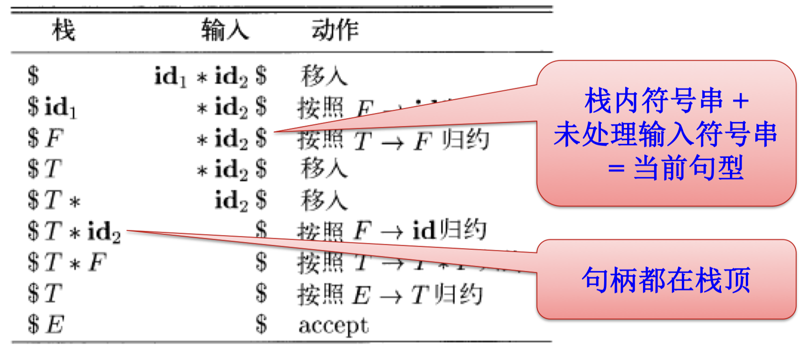
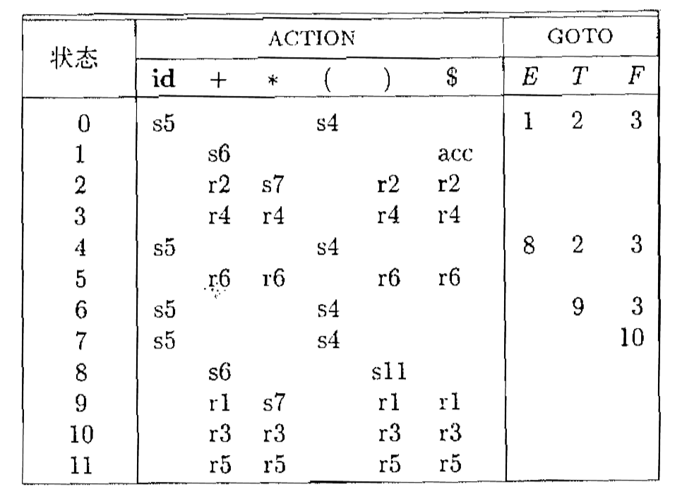
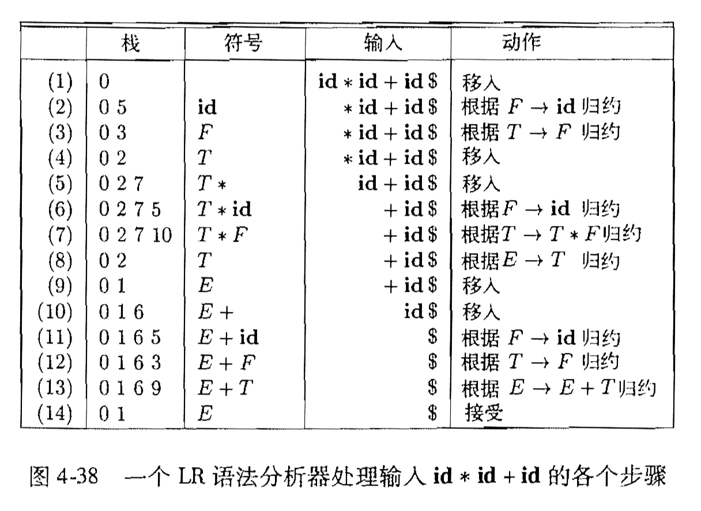

# 06 语法分析 III

  by <a href="https://github.com/zhuozhiyongde">Arthals</a>
   
  blog：<a href="https://arthals.ink">Arthals' ink</a>

## 自底向上语法分析

自底向上语法分析：将一个串 $w$ **归约** 回到文法开始符号 $S$ 的过程。

在每个归约（reduction）步骤中，一个与某 **产生式右部相匹配的特定子串** 被替换为该 **产生式左部** 的非终结符号。

下文中，对如下概念不加区分：

-   产生式左部 / 产生式头
-   产生式右部 / 产生式体

**归约**：是一个推导步骤的反向操作

-   推导步骤：将句型中的一个非终结符号替换为该符号的某个产生式的体 $A \rightarrow \alpha$
-   归约步骤：与某产生式体匹配的子串被替换为该产生式头部的非终结符号 $\alpha \leftarrow A$

### 自底向上语法分析的目标

目标：反向构造一个推导过程。

方法：对输入进行从左到右的扫描，并在扫描过程中进行自底向上语法分析，就可以反向构造出一个最右推导。

### 句柄（Handle）

**句柄**：是与某个 **产生式体** 匹配的 **子串**，对它的归约代表了相应的最右推导中的一个反向步骤（看接下来的形式定义会好理解一些）。

> Ref：
>
> -   **前缀（prefix）**：移走 $x$ 尾部的 **零个** 或多个连续的符号。
> -   **后缀（suffix）**：移走 $x$ 头部的 **零个** 或多个连续的符号。
> -   **子串（substring）**：从 $x$ 中删去一个前缀和一个后缀。

注意，和某个产生式体匹配的最左子串不一定是句柄（ **需要归约后能回到开始符号** ）。

#### 形式定义

若有 $S {\Rightarrow}^{*}_{\text{rm}} \alpha A w \Rightarrow_{\text{rm}} \underbrace{\alpha \beta w}_{\gamma}$ ，那么紧跟在 $\alpha$ 之后的 $\beta$ 是 **句柄**。

最右句型：所有在最右推导中出现的句型，其内句柄右边的串 $w$ 只包含终结符号。

将 $\beta$ 替换为 $A$ （ **规约** ）之后得到的串（$\alpha A w$）是 $\gamma$ 的某个 **最右推导序列** 中出现在位于 $\gamma$（$\alpha \beta w$） 之前的最右句型。

句柄可能存在多个，如果一个文法是 **无二义性** 的，那么该文法的 **每个最右句型都有且只有一个句柄**。

#### 句柄的寻找方法

给定：

$$
S = \gamma_0 \stackrel{rm}{\Rightarrow} \gamma_1 \stackrel{rm}{\Rightarrow} \gamma_2 \stackrel{rm}{\Rightarrow} \cdots \stackrel{rm}{\Rightarrow} \gamma_{n-1} \stackrel{rm}{\Rightarrow} \gamma_n = w
$$

为了以相反顺序重构这个推导，我们在 $\gamma_n$ 中寻找句柄 $\beta_n$，并将 $\beta_n$ 替换为相关产生式 $A \rightarrow \beta_n$ 的头部 $A$，得到前一个最右句型 $\gamma_{n-1}$。

## 移入 - 归约语法分析技术

移入 - 归约语法分析是一种 **自底向上** 的语法分析技术，主要操作包括 **移入** 和 **归约**。

### 组成

-   **栈**：存放已识别的文法符号，**句柄通常出现在栈的顶部**
-   **输入缓冲区**：存放待分析的符号，通常显示在右侧

### 主要操作

1. **移入（shift）**：将下一个输入符号移到栈的顶部
2. **归约（reduce）**：将栈顶符号串（右部）替换为相应的产生式左部
3. **接受（accept）**：语法分析成功完成
4. **报错（error）**：发现语法错误，并调用错误恢复工具

LR ($k$) 中的 $k$ 表示 **在输入中向前看 $k$ 个符号**。

移入 - 归约的语法分析技术可以使用栈中离栈顶很远的信息（向前看符号）来引导语法分析过程。

### 移入 - 归约语法分析中的冲突

有些上下文无关文法不能使用移入 - 归约语法分析技术。

即使知道了栈中的所有内容以及接下来的 $k$ 个输入符号，我们仍然可能会遇到：

1. **移入 / 归约冲突**：无法判断应该进行移入还是归约操作
2. **归约 / 归约冲突**：无法在多个可能的归约方法中选择正确的归约动作

接下来，我们举例说明。

#### 移入 / 规约冲突举例

**定义**：在某个状态下，分析器既可以进行移入操作，也可以进行归约操作，但无法确定应该选择哪一种。

考虑以下文法：

1. $E \rightarrow E + E$
2. $E \rightarrow id$

假设当前状态是：

-   栈：$id$
-   剩余输入：$+ id$

在这种情况下，分析器可以选择：

1. **移入**：将 $+$ 移入栈中
2. **归约**：根据 $E \rightarrow id$，将 $id$ 归约为 $E$

这是一个典型的移入 / 归约冲突，因为分析器无法确定是应该移入 $+$ 还是进行归约。

#### 规约 / 规约冲突举例

**定义**：在某个状态下，分析器可以进行多种归约操作，但无法确定应当选择哪一种。

考虑以下文法：

1. $S \rightarrow A$
2. $S \rightarrow B$
3. $A \rightarrow a$
4. $B \rightarrow a$

假设当前状态是：

-   栈：$a$
-   剩余输入：空

在这种情况下，分析器可以选择：

1. 根据 $A \rightarrow a$ 进行归约。
2. 根据 $B \rightarrow a$ 进行归约。

这是一个归约 / 归约冲突，因为分析器无法确定是应该将 $a$ 归约为 $A$ 还是 $B$。

## LR ($k$) 语法分析

**LR ($k$)** 语法分析的定义：

-   **L** 表示对输入进行从左到右的扫描
-   **R** 表示反向构造出一个最右推导序列
-   **$k$** 表示在做出语法分析决策时向前看 $k$ 个输入符号（用于指导规约操作）

对于实际应用，$k = 0$ 和 $k = 1$ 具有重要意义，因此这里只考虑 $k \leq 1$ 的情况。当省略 $k$ 时，假设 $k = 1$。

### LR (0) 项和 LR (0) 自动机

#### LR (0) 项

**项**：一些状态，这些状态表示了语法分析过程中所处的位置。

一个文法 $G$ 的一个 **LR (0) 项** 是 $G$ 的一个产生式再加上一个位于它的右侧某处的点。

举例：$A \rightarrow XYZ$：

-   $A \rightarrow \cdot XYZ$
-   $A \rightarrow X \cdot YZ$
-   $A \rightarrow XY \cdot Z$
-   $A \rightarrow XYZ \cdot$

这里，**$\cdot$ 标记了当前读到的位置，$\cdot$ 左边是已经读到的，$\cdot$ 右边是尚未读到的。**

项表明了语法分析过程的给定点，我们已经看到一个产生式的哪些部分。

比如，$A \rightarrow X \cdot YZ$ 表明当前已经读到了 $X$，期望接下来在输入中看到一个从 $YZ$ 推导得到的串（从而可以规约回 $YZ$，再读入 $YZ$ 后即可规约回 $A$）。

LR (0) 项可分为四类：

1. **移进项**：$A \to \alpha \cdot a \beta, \quad a \in V_T$，表示当前可以读取符号 $a$ 并进行移入操作
2. **待归约项**：$A \to \alpha \cdot B \beta, \quad B \in V_N$，表示当前需要继续其他操作后（至少还要把 $B$ 给规约出来），才可以归约到 $A$
3. **归约项**：$A \to \alpha \cdot$，表示当前可以进行规约操作（已经把一个产生式体完全读入了），即将 $\alpha$ 规约为 $A$
4. **接受项**：$S' \to S \cdot$

对于产生式 $A \to \varepsilon$ 的唯一一项是 $A \to \cdot$，它是归约项。

**项集**：这些项的列表

我们还可以划分每个项为如下两类：

1. **内核项**：包括初始项 $S' \rightarrow \cdot S$ 以及点不在最左端的所有项（代表要么正在从头开始，要么已经有一些已读信息了）
2. **非内核项**：除了 $S' \rightarrow \cdot S$ 之外点在最左端的所有项（代表我们对于这个产生式完全没有任何已读信息）

### 规范 LR (0) 项集族的构造

为了构造一个文法的规范 LR (0) 项集族，我们定义了一个 **增广文法** （augmented grammar）和两个函数：**Closure** 和 **Goto**。

#### 增广文法

如果 $G$ 是一个以 $S$ 为开始符号的文法，那么 $G$ 的增广文法 $G'$ 就是在 $G$ 中加上新开始符号 $S'$ 和产生式 $S' \rightarrow S$ 而得到的文法。

当且仅当语法分析器要使用规则 $S' \rightarrow S$ 进行归约时（即 $S' \rightarrow S \cdot$），输入符号串被接受（即表明已经完全规约回到了原开始符号）。

引入这个新的开始产生式的目的是使得文法开始符号（$S'$）仅出现在一个产生式的左边，**从而使得分析器只有一个接受状态**。

#### 项集的闭包

如果 $I$ 是文法 $G$ 的一个项集，那么 $\text{Closure}(I)$ 就是根据下面的两个规则从 $I$ 构造得到的项集：

1. 一开始，将 $I$ 中的各个项加入到 $\text{Closure}(I)$ 中
2. 如果 $A \rightarrow \alpha \cdot B \beta$ 在 $\text{Closure}(I)$ 中，$B \rightarrow \gamma$ 是一个产生式，并且项 $B \rightarrow \cdot \gamma$ 不在 $\text{Closure}(I)$ 中，就将这个项加入其中。不断应用这个规则，直到没有新项可以加入到 $\text{Closure}(I)$ 为止

直观地讲，$\text{Closure}(I)$ 中的项 $A \rightarrow \alpha \cdot B \beta$ 表明在语法分析过程的某点上，我们认为接下来可能会在输入串中看到一个能够从 $B \beta$ 推导得到的子串。

这个可以从 $B \beta$ 推导得到的子串的某个前缀肯定可以从 $B$ 推导得到，而推导 / 逆向规约时必然要用某个 $B$ 产生式。

因此我们加入了各个 $B$ 产生式对应的项。也就是说，如果 $B \rightarrow \gamma$ 是一个产生式，那么我们把 $B \rightarrow \cdot \gamma$ 加入到 $\text{Closure}(I)$ 中。

#### Goto 函数

$\text{Goto}$ 函数形式为 $\text{Goto}(I, X)$，其中：

-   $I$ 是一个项集
-   $X$ 是一个文法符号

$\text{Goto}(I, X)$ 被定义为 $I$ 中所有形如 $[A \rightarrow \alpha \cdot X \beta]$ 的项所对应的项 $[A \rightarrow \alpha X \cdot \beta]$ 的集合的闭包，即：

$$\text{Goto}(I, X) = \text{Closure}(\{ [A \rightarrow \alpha X \cdot \beta] \mid [A \rightarrow \alpha \cdot X \beta] \in I \})$$

直观地讲，$\text{Goto}$ 函数用于定义一个文法的 LR (0) 自动机中的移入单个符号（ **终结符号或者非终结符号都可以** ）的步骤，也即一类 **状态转换**。

#### 求 LR (0) 项集规范族的算法

$$
\begin{aligned}
&\text{void } items(G') \{ \\
&\quad    C = \textbf{Closure}(\{[S' \to \cdot S]\}); \\
&\quad    \text{repeat} \\
&\quad    \quad    \text{for (}C \text{ 中每个项集 } I \text{)} \\
&\quad    \quad    \quad    \text{for (每个文法符号 } X \text{)} \\
&\quad    \quad    \quad    \quad    \text{if (} Goto(I, X) \text{ 非空且不在 } C \text{ 中)} \\
&\quad    \quad    \quad    \quad    \quad    将 Goto(I, X) 加入 C 中; \\
&\quad    \text{until 在某一轮中没有新的项集被加入到 } C \text{ 中;} \\
&\}
\end{aligned}
$$

从初始项集开始，不断计算各种可能的后继，直到生成所有的项集。

### LR (0) 自动机的构造

1. 规范 LR (0) 项集族中的项集可以作为 LR (0) 自动机的状态
2. $\text{Goto}(I, X) = J$，则从 $I$ 到 $J$ 有一个标号为 $X$ 的转换
3. 初始状态为 $\text{Closure}(\{ S' \rightarrow \cdot S \})$ 对应的项集
4. 接受状态：包含形如 $A \rightarrow \alpha \cdot$ 的项集对应的状态，即任何表示识别出了一个句柄的状态都是这个自动机的终态

    > 可以发现所有的终态都是规约动作，说明 LR 事实上就是一直规约句柄的过程
    >
    > 对于整个 LR (0) 的编译过程而言，$S'\to S \cdot$ 当然是表示编译完成的终态
    >
    > 但是 LR (0) 自动机只是我们构造 LR (0) 分析表的中间步骤
    >
    > 要手动填 Action 和 Goto 表之后才构成整个 LR (0) 分析流程

**移入 - 归约决策过程**：

假设文法符号串 $\gamma$ 使 LR (0) 自动机从开始状态运行到状态 （项集） $j$：

1. **归约判断**：如果 $j$ 中有一个形如 $A \rightarrow \alpha \cdot$ 的项，那么：
    - 在 $\gamma$ 之后添加一些 **终结符号** 可以得到一个最右句型
    - $\alpha$ 是 $\gamma$ 的后缀，且 $A \rightarrow \alpha$ 是这个句型的句柄
    - 表示 **可能** 找到了当前最右句型的句柄
2. **移入判断**：如果 $j$ 中存在一个项 $B \rightarrow \alpha \cdot X \beta$，那么：
    - 在 $\gamma$ 之后 **添加 $X \beta$，然后再添加一个终结符号串** 可以得到一个最右句型
    - 在这个句型中 $B \rightarrow \alpha X \beta$ 是句柄
    - 此时表示还没有找到句柄，至少还需要移进 $X$

### LR 语法分析表

语法分析表由两个部分组成：

-   一个语法分析动作函数 $\text{Action}$
-   一个转换函数 $\text{Goto}$

#### Action 表

$\text{Action}$ 函数有两个参数：

-   状态 $i$
-   **终结符号** $a$（或者是输入结束标记 $$\$ $$）。

$\text{Action}[i, a]$ 的取值可以有下列四种形式：

1. **移入（Goto） $S_j$**：$j$ 表示一个状态，$S_j$ 表示移进（Shift）到 $j$。语法分析器的动作是将输入符号 $a$ 移入栈中，使用状态 $j$ 来代表 $a$
2. **归约（Reduce） $r_j$**：产生式 $j = A \rightarrow \beta$：语法分析器将栈顶的 $\beta$ 根据这个产生式归约为产生式头 $A$
3. **接受（Accept）**：语法分析器接受输入并完成语法分析过程
4. **报错（Error）**：语法分析器在输入中发现错误并执行某个纠正动作

#### Goto 表

我们把定义在项集上的 $\text{Goto}$ 函数扩展为定义在状态集上的函数：如果 $\text{Goto}[I_i, A]=I_j$，那么 $\text{Goto}$ 把状态 $i$ 和一个非终结符号 $A$ 映射到状态 $j$。

### 分析过程

1. 把状态 0（$S_0$）和符号 $$ \$ $$ 压入初始为空的栈里。

2. 设置栈顶元素中的状态为 $s$，当前读入的符号为 $a$。

3. 反复执行以下各动作，直到分析成功或发现语法错误为止：

    1. **移进**：若 $\text{Action}[s, a]=S_i$，（Shift，移进）则把 $a$ 和状态 $i$ 压进栈，读下一个输入符号到 $a$ 中
    2. **归约**：若 $\text{Action}[s, a]=r_j$ (reduce，即产生式 $j=A \rightarrow X_{m-k+1} X_{m-k+2} \cdots X_m$)，则出栈 $k$ 项，把 $A$ 和 $s_{new}=\text{Goto}[s', A]$ 进栈，其中 $s'$ 是出栈 $k$ 项后新的栈顶元素中的状态

    3. **接受**：若 $$\text{Action}[s, \$]=\text{accept}$$，则分析成功，结束

4. **出错**：若 $$\text{Action}[s, a]=\text{error}$$，则转由错误处理程序

### 举例说明

文法：

$$
\begin{aligned}
E &\rightarrow T E' \\
E' &\rightarrow + T E' | \varepsilon \\
T &\rightarrow F T' \\
T' &\rightarrow * F T' | \varepsilon \\
F &\rightarrow ( E ) | id
\end{aligned}
$$

假设输入字符串为 $id + id * id$。

### 分析表结构

分析表的第一列是状态，第二列是 Action 部分，由 $|T|+1$ 列构成，第三列是 Goto 部分，由 $|V|$ 列构成。

$$
\text{Action}[s, a] =
\begin{cases}
移进 S_i & a\ 和状态\ i\ 进栈 \\
归约 r_j & \text{出栈 k 项,然后}\ A\ \text{和 Goto[s',A] 进栈} \\
接受 & \text{接受} \\
出错 & \text{出错}
\end{cases}
$$

其中：

-   $s$ 是状态
-   $a$ 是读入的终结符（单词）或 $$ \$ $$
-   $k$ 是 $j$ 号产生式 $A \rightarrow \beta$ 的长度 $|\beta|$
-   $s'$ 是出栈 $k$ 项后新的栈顶元素中的状态

## LR (0) 分析表中的冲突

### 移进规约冲突

假设有一个项集 $I$ 包含以下项目：

-   $A \rightarrow \alpha \cdot a \beta$
-   $B \rightarrow \gamma \cdot$

在这种情况下，如果当前输入符号是 $a$：

-   根据项目 $A \rightarrow \alpha \cdot a \beta$，分析器会尝试移进符号 $a$，以期待未来能够归约到 $A$
-   根据项目 $B \rightarrow \gamma \cdot$，分析器会尝试进行归约操作，把当前栈顶的 $\gamma$ 归约为 $B$

这就导致了移进 - 归约冲突。

### 移进规约冲突解决方案：SLR 分析表

SLR：Simple LR。

依据 $\text{Follow}$ 集来选择是否进行归约。

如果 $I=\{X \rightarrow \alpha \cdot b \beta$，$A \rightarrow \alpha \cdot$，$B \rightarrow \alpha \cdot\}$，且若 $\{b\}$、$\text{Follow}(A)$、$\text{Follow}(B)$ **两两不交**，则面对应当前读入符号 $a$，状态 $I$ 的解决方法：

1. 若 $a=b$，则移进
2. 若 $a \in \text{Follow}(A)$，则用 $A \rightarrow \alpha$ 进行归约
3. 若 $a \in \text{Follow}(B)$，则用 $B \rightarrow \alpha$ 进行归约
4. 此外，报错

注：此处只举例了两个规约项、一个移入项，实际上可以有更多个规约项、移入项。

**每个 SLR (1) 文法都是无二义性的**，但是存在很多不是 SLR (1) 的无二义性文法。

#### SLR 原理：可行前缀（Viable Prefix）

不是所有的最右句型的前缀都可以出现在栈中，因为语法分析器在移入时 **不能越过句柄**。

**可行前缀 (Viable Prefix)**：某个最右句型的前缀，且没有越过该句型的句柄的右端。

**有效项**：如果存在 $S \Rightarrow \alpha Aw \Rightarrow \alpha \beta_1 \beta_2 w$，那么我们说项 $A \rightarrow \beta_1 \cdot \beta_2$ 对 $\alpha \beta_1$ 有效。

当我们知道 $A \rightarrow \beta_1 \cdot \beta_2$ 对 $\alpha \beta_1$ 有效：

-   如果 $\beta_2$ 不等于空，表示句柄尚未出现在栈中，**应继续移进或者等待归约**
-   如果 $\beta_2$ 等于空，表示句柄出现在栈中，**应归约**

如果某个时刻存在两个有效项要求执行不同的动作，那么就应该设法解决冲突。

冲突实际上表示可行前缀可能是两个最右句型的前缀，第一个包含了句柄，而另一个尚未包含句柄。

**SLR 解决冲突的方法**：假如要按照 $A \rightarrow \beta$ 进行归约，那么得到的新句型中 $A$ 后面跟着的是下一个输入符号。因此只有当下一个输入在 $\text{Follow}(A)$ 中时才可以归约。

-   如果在文法 $G$ 的 LR (0) 自动机中，从初始状态出发，沿着标号为 $\gamma$ 的路径到达一个状态，那么这个状态对应的项集就是 $\gamma$ 的 **有效项集**

-   回顾确定分析动作的方法，就可以知道我们实际上是按照有效项来确定的

    为了避免冲突，归约时要求下一个输入符号在 $\text{Follow}(A)$ 中，且 SLR 语法保证了 $\text{Follow}$ 集合两两不交

### SLR 语法分析器的弱点

#### 没有展望符号

没有展望符号，不能确定规约之后还是不是可行前缀（即使 $\text{Follow}$ 集合得到满足也不保证）

举例：

1. 假设此时栈中的符号串为 $\beta \alpha$，输入符号是 $a$
2. 如果 $\beta A a$ 不能是某个最右句型的前缀，那么即使 $a$ 在某个句型中跟在 $A$ 之后，仍然不应该按照 $A \rightarrow \alpha$ 归约。

#### 不能提前确定信息

$A \rightarrow \alpha \cdot$ 出现在项集中的条件：

1. 首先 $A \rightarrow \cdot \alpha$ 出现在某个项集中，然后逐步读入 / 归约到 $\alpha$ 中的符号，点不断后移，直到末端
2. 而 $A \rightarrow \cdot \alpha$ 出现的条件是 $B \rightarrow \beta \cdot A \gamma$ 出现在项中

    期望首先按照 $A \rightarrow \alpha$ 归约，然后将 $B \rightarrow \beta \cdot A \gamma$ 中的点后移到 $A$ 之后

3. 显然，在按照 $A \rightarrow \alpha$ 归约时要求下一个输入符号是 $\gamma$ 的第一个符号
4. 但是从 LR (0) 项集中不能确定这个信息
