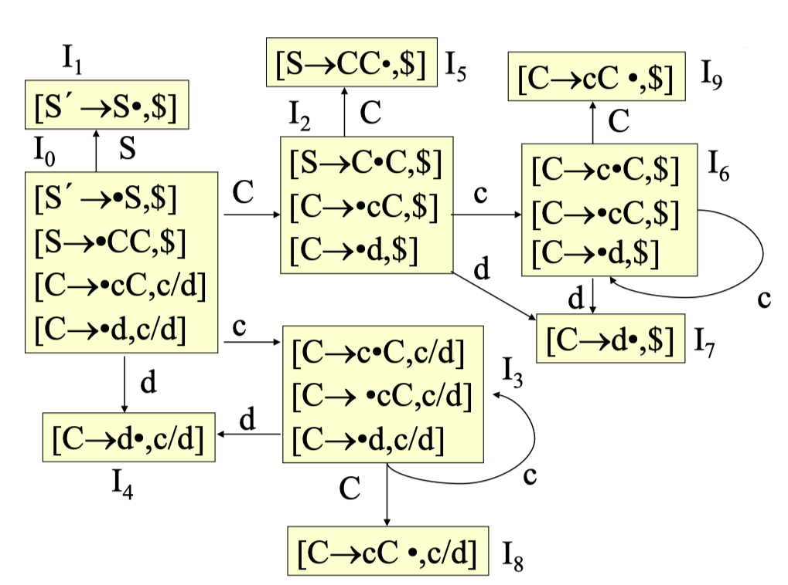
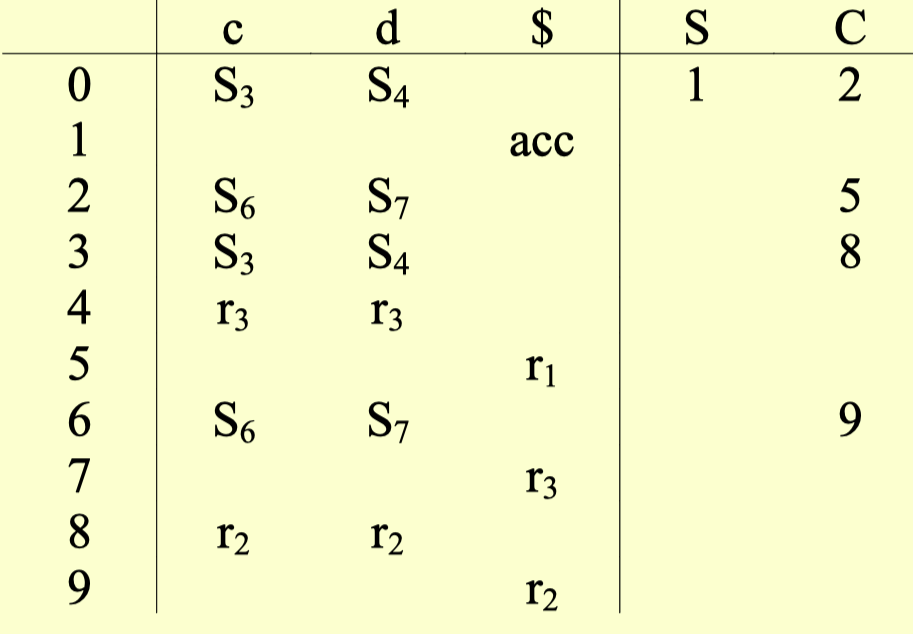

# 07 语法分析 IV

  by <a href="https://github.com/zhuozhiyongde">Arthals</a>
   
  blog：<a href="https://arthals.ink">Arthals' ink</a>

## LR (1) 文法

### LR (k) 项

**形式**：$[A \rightarrow \alpha \cdot \beta, a_1a_2 \ldots a_k]$

-   当 $\beta \neq \varepsilon$ 时，为移进或待归约项，$a_1a_2 \ldots a_k$ 不直接起作用
-   当 $\beta = \varepsilon$ 时，即为归约项 $[A \rightarrow \alpha \cdot, a_1a_2 \ldots a_k]$，仅当前输入符串前 $k$ 个符号是 $a_1a_2 \ldots a_k$ 时，才能用 $A \rightarrow \alpha$ 进行归约
-   $a_1a_2 \ldots a_k$ 称为向前搜索符号串（展望项）

### LR (1) 有效项

LR (1) 项 $[A \rightarrow \alpha \cdot \beta, a]$ 对于一个可行前缀 $\gamma$ 有效的条件是存在一个推导：

$$
S \Rightarrow_{rm}^* \delta Aw \Rightarrow_{rm}\underbrace{\delta \alpha}_{\gamma} \beta w
$$

其中：

1. $\gamma = \delta \alpha$
2. 要么 $a$ 是 $w$ 的第一个符号，要么 $w$ 为 $\varepsilon$ 且 $a$ 等于 $$ \$ $$

> 考虑文法 $G:S \rightarrow CC \quad C \rightarrow cC \mid d$
>
> 规范推导：
>
> $$
> S \Rightarrow_{rm}^* ccCcd \Rightarrow_{rm} cccCcd
> $$
>
> 项 $[C \rightarrow c \cdot C, c]$ 对可行前缀 $ccc$ 是有效的。

### LR (1) 有效项的推导

若项 $[A \rightarrow \alpha \cdot B \beta, a]$ 对可行前缀 $\gamma = \delta \alpha$ 是有效的，则存在一个规范推导：

$$
S \Rightarrow_{rm}^* \delta Aax \Rightarrow_{rm} \delta \alpha B \beta ax
$$

假定 $\beta ax \Rightarrow_{rm}^* by$，则对每一个形如 $B \rightarrow \xi$ 的产生式，有规范推导：

$$
S \Rightarrow_{rm}^* \delta \alpha B \beta ax \Rightarrow_{rm}^* \delta \alpha Bby \Rightarrow_{rm} \delta \alpha \xi by
$$

从而项 $[B \rightarrow \cdot \xi, b]$ 对于可行前缀 $\gamma = \delta \alpha$ 也是有效的。

注意到 $b$ 必然属于二者之一：

1. 从 $\beta$ 推出的第一个终结符号
2. $\beta \Rightarrow_{rm}^* \varepsilon$ 而 $b = a$

这两种可能性结合在一起，则 $b \in \text{First}(\beta a)$。

### LR (1) 项集的构造

构造有效 LR (1) 项集族的方法实质上和构造规范 LR (0) 项集族的方法相同。

我们只需要修改两个过程：Closure 和 Goto。

#### Closure

设 $I$ 是 $G$ 的一个 LR (1) 项集，$\text{Closure}(I)$ 是从 $I$ 出发用以下三条规则构造的项集：

1. 每一个 $I$ 中的项都属于 $\text{Closure}(I)$
2. 若项 $[A \rightarrow \alpha \cdot B \beta, a]$ 属于 $\text{Closure}(I)$ 且 $B \rightarrow \gamma \in P$，则对任何 $b \in \text{First}(\beta a)$，把 $[B \rightarrow \cdot \gamma, b]$ 加到 $\text{Closure}(I)$ 中
3. 重复执行 (2) 直到 $\text{Closure}(I)$ 不再增大为止

#### Goto

设 $I$ 是 $G$ 的一个 LR (1) 项集，$X$ 是一个文法符号，定义：

$$
\text{Goto}(I, X) = \text{Closure}(J)
$$

其中 $J = \{[A \rightarrow \alpha X \cdot \beta, a] \mid [A \rightarrow \alpha \cdot X \beta, a] \in I\}$

### LR (1) 项集族的构造方法

**输入**：一个增广文法 $G'$。

**输出**：LR (1) 项集族，其中的每个项集对文法 $G'$ 的一个或多个可行前缀有效。

**方法**：过程 Closure 和 Goto，以及用于构造项集的主例程 `items`。

#### 过程 Closure

$$
\begin{aligned}
&\text{SetOfItems } \textbf{Closure}(I) \{ \\
&\quad    \text{repeat} \\
&\quad    \quad    \text{for (} [A \to \alpha \cdot B \beta, a] \in I \text{)} \\
&\quad    \quad    \quad    \text{for (} B \to \gamma \in G' \text{)} \\
&\quad    \quad    \quad    \quad    \text{for (} b \in \text{First}(\beta a) \text{)} \\
&\quad    \quad    \quad    \quad   \quad    \text{将 } [B \to \cdot \gamma, b] \text{ 加入 } I \text{ 中;} \\
&\quad    \text{until 不能向 } I \text{ 中加入更多的项;} \\
&\quad    \text{return } I; \\
&\}
\end{aligned}
$$

#### 过程 Goto

$$
\begin{aligned}
&\text{SetOfItems } \textbf{Goto}(I, X) \{ \\
&\quad    J \leftarrow \varnothing; \\
&\quad    \text{for (} [A \to \alpha \cdot X \beta, a] \in I \text{)} \\
&\quad    \quad    \text{将 } [A \to \alpha X \cdot \beta, a] \text{ 加入 } J \text{ 中;} \\
&\quad    \text{return } \textbf{Closure}(J); \\
&\}
\end{aligned}
$$

最后执行 $\text{Closure}$ 的原因是，$\text{Goto}$ 函数返回的是一个新的项集，需要对其进行闭包操作。

#### 项集族 $C$

$$
\begin{aligned}
&\text{void } \textbf{items}(G') \{ \\
&\quad    C \leftarrow \{ \textbf{Closure}(\{ [S' \to \cdot S, \$] \}) \}; \\
&\quad    \text{repeat} \\
&\quad    \quad    \text{for (每个项集 } I \in C \text{)} \\
&\quad    \quad    \quad    \text{for (每个文法符号 } X \text{)} \\
&\quad    \quad    \quad    \quad    \text{if (} \textbf{Goto}(I, X) \neq \varnothing \text{ 且不在 } C \text{ 中)} \\
&\quad    \quad    \quad    \quad    \quad    \text{将 } \textbf{Goto}(I, X) \text{ 加入 } C \text{ 中;} \\
&\quad    \text{until 不再有新的项集加入到 } C \text{ 中;} \\
&\}
\end{aligned}
$$

### 构造 LR (1) 分析表

1. **DFA 状态对应分析表行**：

    DFA 中的每个状态对应分析表中的一行。

2. **DFA 状态转移**：

    对于 DFA 中的每一个从状态 $i$ 到状态 $j$ 的转移：

    - 如果转移符号为终结符 $a$：在表项 $M[i, a]$ 中填写 **移进动作 $S_j$** （Shift，Action 列）
    - 如果转移符号为非终结符 $A$：在表项 $M[i, A]$ 中填写 **转移到状态 $j$** （Goto 列）

3. **包含归约项 $[A \rightarrow \alpha \cdot, a]$ 的状态 $i$**：

    在表项 $M[i, a]$ 中填写归约动作 $r_k$（Reduce），其中 $k$ 是产生式 $A \rightarrow \alpha$ 的编号

注意：**如果每个单元格中只包含一个动作，则分析表合法**。

### LR（1）分析表举例

文法：

$$
\begin{aligned}
& \quad S' \rightarrow S \\
& \quad S \rightarrow CC \\
& \quad C \rightarrow cC \\
& \quad C \rightarrow d \\
\end{aligned}
$$

项集族：

分析表：

## LALR 文法

LALR：Look-Ahead LR

**LR (1) 分析表**：状态多，实际使用较少。

**同心集**：两个 LR (1) 项集 **去掉搜索符后相同**，称为 **同心**。

**LALR (1) 分析表**：合并同心集（合并搜索符串）后构造出的 LR 分析表。

**合并同心项集不会产生移进 / 归约冲突，但是有可能产生归约 / 归约冲突**。

因为合并的时候合并的是同心项的展望符，而展望符只在规约的时候起作用，在移入的时候是不起作用的，只要合并前各个同心项目集本身是没有移进 / 归约冲突的，就不会有移进 / 归约冲突（后文有证明）。

### LALR 分析表的高效构造算法

通过先构造 LR (1) 分析表再合并得到 LALR (1) 分析表的过程太慢了。

1. **内核项表示**：

    使用内核项表示 LR (0) 或 LR (1) 项集。

    内核项：$[S' \rightarrow \cdot S]$ 或 $$[S' \rightarrow \cdot S, \$]$$，以及 $\cdot$ 不在最左边的项（这些项代表对于已经读入的符号完全没有要求）。

2. **传播和自发生成**：

    通过传播和自发生成，获得向前看符号，得到 LALR (1) 内核项。

    传播 / 自发生成：向前看符号的传递过程。

    对于某个项 $[A \rightarrow \alpha \cdot B \beta, a]$ 执行闭包：

    **传播**：假设向前看符号是一个不在文法中的符号 $\#$，即对 $[A \rightarrow \alpha \cdot B \beta, \#]$ 进行闭包，若得到的某些项的向前看符号 **就是 $\#$**，那么就认为这些项的向前看符号是传播得到的，直接复制 $a$，就行；

    **自发生成**：假设向前看符号是一个不在文法中的符号 $\#$，即对 $[A \rightarrow \alpha \cdot B \beta, \#]$ 进行闭包，若有些项的向前看符号 **不是 $\#$**，那么就认为这些项的向前看符号是传播得到的，不改动这些项的向前看符号；

3. **Closure 函数**：

    使用 $\text{Closure}$ 函数求出内核项的闭包，得到 LALR 分析表。

由于传播和自发生成的表述比较抽象，这里给一个例子（书 P175）来自己悟：

文法：

$$
\begin{aligned}
S' &\to S \\
S &\to L = R \mid R \\
L &\to * R \mid id \\
R &\to L
\end{aligned}
$$

**直接根据产生式**，构建出只有内核项的项集族：
$$
\begin{aligned}
I_0 &: \{S' \to \cdot S\} \\
I_1 &: \{S' \to S\cdot\} \\
I_2 &: \{S \to L = \cdot R, R \to L\cdot\} \\
I_3 &: \{S \to R\cdot\} \\
I_4 &: \{L \to * \cdot R\} \\
I_5 &: \{L \to id\cdot\} \\
I_6 &: \{S \to L = \cdot R\} \\
I_7 &: \{L \to * R\cdot\} \\
I_8 &: \{R \to L\cdot\} \\
I_9 &: \{S \to L = R\cdot\}
\end{aligned}
$$

使用如下算法来确定向前看符号：

输入：一个 LR (0) 项集 $I$ 的内核 $K$ 以及一个文法符号 $X$。**$\#$ 是一个不在文法中的符号。**

输出：由 $I$ 中的项为 $\text{Goto}(I, X)$ 中内核项自生成的向前看符号，以及 $I$ 中将其向前看符号传播到 $\text{Goto}(I, X)$ 中内核项的项。

$$
\begin{aligned}
&\text{for } (K \text{中的每个项 } A \to \alpha \cdot \beta) \{ \\
&\quad J := \text{Closure}(\{[A \to \alpha \cdot \beta, \#]\}); \\
&\quad \text{if } ([B \to \gamma \cdot X \delta, a] \text{ 在 } J \text{ 中，并且 } a \neq \#) \\
&\quad\quad \text{断定 } \text{Goto}(I, X) \text{中的项 } B \to \gamma X \cdot \delta \text{的向前看符号 } a \text{ 是自发生成的;} \\
&\quad \text{if } ([B \to \gamma \cdot X \delta, \#] \text{ 在 } J \text{ 中}) \\
&\quad\quad \text{断定向前看符号从 } I \text{中的项 } A \to \alpha \cdot \beta \text{ 传播到了 } \text{Goto}(I, X) \text{中的项 } B \to \gamma X \cdot \delta \text{上}; \\
& \} \\
\end{aligned}
$$

当我们将算法应用于项集 $I_0$ 的内核时，我们首先计算 $\text{Closure}(\{[S' \rightarrow \cdot S, \#]\})$，得到：

$$
\begin{aligned}
& S' \rightarrow \cdot S, \# \\
& S \rightarrow \cdot L = R, \# \\
& S \rightarrow \cdot R, \# \\
& L \rightarrow \cdot *R, \# / = \\
& L \rightarrow \cdot id, \# / = \\
& R \rightarrow \cdot L, \#
\end{aligned}
$$

在这个闭包的项中，我们看到有两个项中的向前看符号 $=$ 是自发生成的；

而对于这个闭包结果，把 $\#$ 替换为真实的闭包前原始项 $$[S' \rightarrow \cdot S, \$]$$ 的向前看符号，即 $$ \$ $$，我们认为此时的向前看符号 $$ \$ $$ 是传播得到的。

### LALR (1) 的讨论

1. **核心依赖性**：

    由于 $\text{Goto}(I, X)$ 仅依赖于 $I$ 的核心，因此 LALR（1）项集合并后的转换函数 $\text{Goto}(I, X)$ 随自身的合并而得到

2. **动作修改**：

    动作 $\text{action}$ 应当进行修改，以反映各被合并集合的既定动作

3. **归约 - 归约冲突**：

    项集合合并时，可能会导致冲突。这种冲突不会是移进 - 归约冲突：

    $$
    \begin{aligned}
     I_k: &\{[A \rightarrow \alpha \cdot, u_1] \quad [B \rightarrow \beta \cdot ay, b]\}  \quad a \cap u_1 = \varnothing \\
     I_j: &\{[A \rightarrow \alpha \cdot, u_2] \quad [B \rightarrow \beta \cdot ay, c]\}  \quad a \cap u_2 = \varnothing \\
     I_{kj}: &\{[A \rightarrow \alpha \cdot, u_1 \cup u_2] \quad [B \rightarrow \beta \cdot ay, b/c]\}  \quad a \cap (u_1 \cup u_2) = \varnothing
     \end{aligned}
    $$

    但可能引起归约 - 归约冲突：

    $$
    \begin{aligned}
     I_k: &\{[A \rightarrow \alpha \cdot, u_1] \quad [B \rightarrow \beta \cdot, u_2]\}\\
     I_j: &\{[A \rightarrow \alpha \cdot, u_2] \quad [B \rightarrow \beta \cdot, u_1]\}\\
     I_{kj}: &\{[A \rightarrow \alpha \cdot, u_1 \cup u_2] \quad [B \rightarrow \beta \cdot, u_1 \cup u_2]\}
     \end{aligned}
    $$

    此时，有两个展望符号相同、核心也相同的归约项，可能产生归约 - 归约冲突。

## 二义性文法的使用

1. **二义性文法不是 LR 的**
2. **有用的二义性文法**：
    - 简洁描述某些结构
    - 隔离某些语法结构，对其进行特殊处理
3. **处理某些二义性文法**：
    - 通过消除二义性规则，保证每个句子只有一棵语法分析树
    - 可以在 LR 分析器中实现这一规则

### 利用优先级 / 结合性消除冲突

1. **二义性文法**：
    - $E \rightarrow E + E \mid E * E \mid (E) \mid \text{id}$
    - 等价于：$E \rightarrow E + T \mid T \quad T \rightarrow T * F \mid F \quad F \rightarrow (E) \mid \text{id}$
2. **二义性文法的优点**：
    - **容易**：修改算符的优先级和结合性
    - **简洁**：多优先级无需引入大量非终结符
    - **高效**：不需处理 $ E \rightarrow T $ 这样的归约

## 四种 LR 解析的对比

1. **如果构造 LR (0) 的 DFA**
    - 没有归约冲突就是 **LR (0)** 文法
    - 有冲突但可以通过 Follow 集合解决冲突就是 **SLR** 文法
    - 否则不是 **SLR** 文法
2. **如果构造 LR (1) 的 DFA**
    - 没有冲突就是 **LR (1)** 文法
    - 如果合并同心集之后也没有冲突，那么就是 **LALR (1)** 文法
3. **包含关系**
    - $\text{LR(0)} < \text{SLR} < \text{LALR} < \text{LR(1)}$

用途比较：

-   $\text{LR}(0)$：最简单，但只能用于最简单的文法
-   $\text{SLR}$：构造简单，易于实现，实用价值高（大多数上下文无关文法均可构造 SLR 分析表）
-   $\text{LR}(1)$：适用文法类最大（几乎所有上下文无关文法），但分析表体积过大，使用价值不大
-   $\text{LALR}(1)$：介于 $\text{SLR}$ 和 $\text{LR}(1)$ 之间，最实用（比 $\text{SLR}$ 适用更多，比 $\text{LR}(1)$ 更简单）
