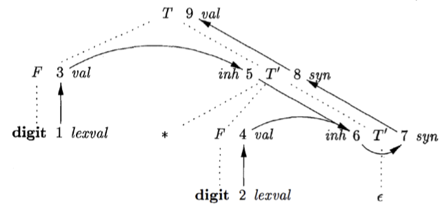

# 08 语法制导翻译 I

  by <a href="https://github.com/zhuozhiyongde">Arthals</a>
   
  blog：<a href="https://arthals.ink">Arthals' ink</a>

## 概述

1. **语法分析器**

    - 用于判断输入在语法上的正确性。
    - 语法分析完成后，通常还需将输入的源代码翻译为目标表示形式。

2. **语法制导定义（Syntax-Directed Definition, SDD）**

    - 将文法符号和某些属性相关联
    - 通过语义规则描述如何计算属性的值

3. **语法制导翻译（Syntax-Directed Translation，SDT）**

    在产生式体中加入语义动作，并在适当的时候执行这些语义动作

    - 编译器在分析过程中执行的工作
    - 包含语义分析和正确性检查，若正确，则翻译为中间代码或目标代码
    - 文法符号的属性描述其语义（如变量的类型、层次、存储地址等），通过对属性值的计算完成翻译任务

## 语法制导定义（SDD）

**SDD 是上下文无关文法和属性 / 规则的结合。**

**规则定义：** 对于 $\forall A \rightarrow X_1 X_2 \ldots X_n \in P$，每个规则的一般形式为：$c = f(c_1, c_2, \ldots, c_k)$

-   **综合属性：** $c$ 是 $A$ 的一个属性，且 $c_1, c_2, \ldots, c_k$ 是 $A$ 的继承属性或是某个 $X_i$ 的属性（向上看继承的或者向下看子节点属性，**综合全局看，通常自下而上进行传递**）。
-   **继承属性：** $c$ 是某个符号 $X_i$ 的属性，且 $c_1, c_2, \ldots, c_k$ 是 $A$ 或 $X_j$ 的属性（父节点、自己、兄弟节点的属性，**向上看，通常自上而下或横向进行传递**）。

不允许 $N$ 的继承属性通过 $N$ 的子结点上的属性来定义，但允许 $N$ 的综合属性依赖于 $N$ 本身的继承属性。

终结符号有综合属性（由词法分析器 lexer 获得），但是没有继承属性（它们的属性在词法分析阶段已经完全确定，不依赖于语法树中其他节点的属性）。

## S 属性的 SDD

**定义**：**只包含综合属性** 的 SDD 称为 S 属性的 SDD。

-   每个语义规则都根据产生式体中的属性值来计算头部非终结符号的属性值
-   如果我们可以给各个属性值排出计算顺序，那么注释分析树就可以计算得到属性值
-   S 属性的 SDD 一定可以按照 **自底向上** 的方式求值

S 属性：Synthesized Attributes。

**实现：**

-   S 属性的 SDD 可以和 LR 语法分析器（从左到右扫描，进行最右推导的逆操作，即从左边开始规约）一起实现
-   栈中的状态可以附加相应的属性值
-   在进行归约时，按照语义规则计算归约得到的符号的属性值（下一章会有实例）

**无副作用**：语义规则不应有复杂的副作用。

-   受控副作用：在 SDD 中添加除求值之外的动作
-   无副作用：要求副作用不影响其它属性的求值
-   没有副作用的 SDD 称为 **属性文法（attribute grammar）**

### 适用于自顶向下分析的 SDD

若存在直接左递归，则无法使用自顶向下分析。

消除左递归后，可能无法直接使用自顶向下分析，比如，我们把一个：

$$
T \rightarrow T + E \mid E
$$

拆成了：

$$
\begin{aligned}
T &\rightarrow E T' \\
T' &\rightarrow + E T' \mid \varepsilon
\end{aligned}
$$

此时，对于第二个产生式，$+$ 的左侧因子无法直接获得。

为此，我们需要引入继承属性。

$$
\begin{array}{|l|l|}
\hline
\text{产生式} & \text{语义规则} \\
\hline
T \rightarrow FT'
    & T'.\text{inh} = F.\text{val} \\
    & T.\text{val} = T'.\text{syn} \\
\hline
T' \rightarrow *FT_1'
    & T_1'.\text{inh} = T'.\text{inh} * F.\text{val} \\
    & T'.\text{syn} = T_1'.\text{syn} \\
\hline
T' \rightarrow \varepsilon
    & T'.\text{syn} = T'.\text{inh} \\
\hline
F \rightarrow digit
    & F.\text{val} = digit.\text{lexval} \\
\hline
\end{array}
$$

注意看黑实线的属性传递流，同一个产生式的语义动作可能不是同时执行的。

这些黑实线实际上构成了一个依赖图（后面会讲）。

## L 属性的 SDD

**定义**：语义规则中的每个属性可以是：

-   综合属性
-   继承属性，且对于任意产生式 $A \rightarrow X_1 X_2 ... X_n \in P$，$X_j$ 的继承属性仅依赖于：

    -   产生式中 $X_j$ **左边** 符号 $X_1, X_2, ..., X_{j-1}$ 的属性

-   $A$ 的继承属性

**每一个 S 属性的 SDD 都是 L 属性的 SDD。**

L 属性：Left-Attributed Definitions。

### L 属性 SDD 的自顶向下语法分析

L 属性的 SDD 可用于按 **深度优先** 顺序来计算。

对于规则：

$$
A \rightarrow X_1 X_2 ... X_n
$$

在递归子程序中实现 L 属性，则对于每个非终结符号 $A$ 或者 $X_i$，其对应的函数的参数为继承属性，返回值为综合属性。

在处理规则时：

-   在调用 $X_i()$ 之前计算 $X_i$ 的继承属性值，然后以它们为参数调用 $X_i()$，得到 $X_i$ 的综合属性值
-   在产生式对应代码的最后计算 $A$ 的综合属性值

**注意：** 如果所有的文法符号的属性计算按上述方式进行，计算顺序必然和依赖关系一致。

## 依赖图

使用 **依赖图** 表示计算顺序：

-   结点：属性值
-   有向边：属性依赖关系

若依赖图无环，则存在一个拓扑排序，确定属性值的计算顺序。

特定类型的 SDD 一定不包含环，且有固定的排序模式：

-   S 属性的 SDD：可用于 **自顶向下** 和 **自底向上** 的语法分析
    -   每个属性都是综合属性
    -   都是根据子构造的属性计算出父构造的属性
    -   在依赖图中，总是通过子结点的属性值来计算父结点的属性值
-   L 属性的 SDD：可用于按 **深度优先** 顺序来计算

### 依赖图的边

-   综合属性：从下到上
-   继承属性：从左到右，从上到下
