# 09 语法制导翻译 II

<center>
  by <a href="https://github.com/zhuozhiyongde">Arthals</a>
  <br/>
  blog：<a href="https://arthals.ink">Arthals' ink</a>
</center>

## 构造抽象语法树的 SDD

### 抽象语法树 (Abstract Syntax Tree)

-   每个 **结点** 代表一个语法结构，对应于一个 **运算符**
-   结点的每个 **子结点** 代表其子结构，对应于 **运算分量**
-   表示这些子结构按照特定方式组成更大的结构
-   可以忽略掉一些标点符号等非本质的东西

### 语法树的表示方法

-   每个结点用一个对象表示
-   对象有多个域
    -   叶子结点中只存放词法值
    -   内部结点中存放 $\text{op}$（操作符）值和参数（通常指向其它结点）

### 抽象语法树的例子

#### 产生式 $S \rightarrow \text{if } B \text{ then } S_1 \text{ else } S_2$ 的语法树

```
          if-then-else
          /     |     \
         B     S_1    S_2
```

```cpp
class StmtIfAST : public BaseAST {
public:
    unique_ptr<BaseAST> exp;
    unique_ptr<BaseAST> then_stmt;
    optional<unique_ptr<BaseAST>> else_stmt;
    Result print() const override;
};
```

#### 赋值语句的语法树

```
          assignment
          /        \
   variable    expression
```

```cpp
class StmtAssignAST : public BaseAST {
public:
    unique_ptr<BaseAST> l_val;
    unique_ptr<BaseAST> exp;
    Result print() const override;
};
```

注意：**在语法树中，运算符号和关键字都不在叶结点，而是在内部结点中出现**。

### 抽象语法树 vs 具体语法树

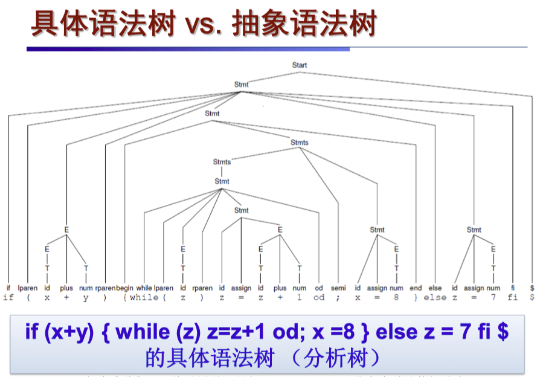

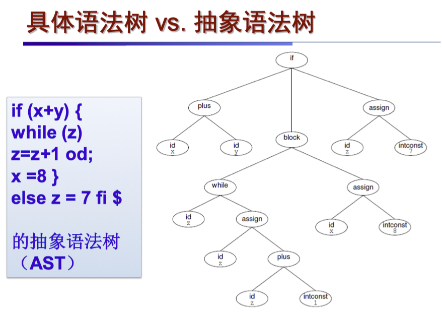

可以看到，AST 相较于具体语法树，不再包含标点符号等非本质的东西，而且不再像具体语法树一样表示为推导的完整过程，而是带有了一部分的语义信息。

### 抽象语法树的构造

**定义**：抽象语法树中的每个结点代表一个程序构造，子结点代表构造的组成部分。

> 例如，表达式 $E_1 + E_2$ 的语法树结点标号为 $+$，子结点分别代表 $E_1$ 和 $E_2$。

结点构造： 每个结点有一个 $\text{op}$ 字段表示结点标号，及以下字段：

1. **叶子结点（Leaf）**：
    - 有一个附加域存储此叶子结点的词法值
    - 构造函数 $\text{Leaf}(\text{op}, \text{val})$ 创建叶子结点对象
    - 例如：$\text{Leaf}(\text{num}, 5)$ 表示一个叶子结点，标号为 $\text{num}$，值为 $5$
2. **内部结点（Node）**：
    - 附加字段数量等于结点的子结点数量
    - 构造函数 $\text{Node}(\text{op}, c_1, c_2, ..., c_k)$ 创建内部结点对象
    - 例如：$\text{Node}(+, E_1, E_2)$ 表示一个内部结点，标号为 $+$，子结点为 $E_1$ 和 $E_2$

总结：

-   抽象语法树结点通过 $\text{op}$ 字段表示 **标号**，叶子结点通过 $\text{val}$ 存储 **值**，内部结点通过 **构造函数** $\text{Node}$ 连接子结点
-   属性 $\text{E.node}$ 指向 $\text{E}$ 对应的这一块 **以之为根节点的语法树** 的一部分

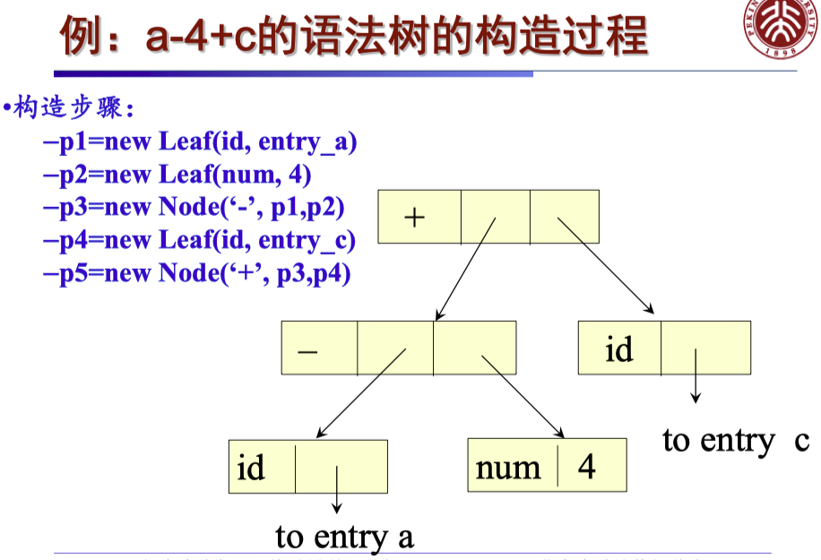

### 自顶向下的 AST 构造过程

$$
\begin{array}{|l|l|l|}
\hline
& \quad \textbf{产生式}&\textbf{语义规则}\\
\hline
\textbf{1)} & \quad E \rightarrow T \, E' & E.\text{node} = E'.\text{syn} \\
            & &E'.\text{inh} = T.\text{node} \\
\hline
\textbf{2)} & \quad E' \rightarrow + \, T \, E'_1 & E'_1.\text{inh} = \text{new Node}('+', E'.\text{inh}, T.\text{node}) \\
            & & E'.\text{syn} = E'_1.\text{syn} \\
\hline
\textbf{3)} & \quad E' \rightarrow - \, T \, E'_1 & E'_1.\text{inh} = \text{new Node}('-', E'.\text{inh}, T.\text{node}) \\
            & & E'.\text{syn} = E'_1.\text{syn} \\
\hline
\textbf{4)} & \quad E' \rightarrow \varepsilon & E'.\text{syn} = E'.\text{inh} \\
\hline
\textbf{5)} & \quad T \rightarrow ( \, E \, ) & T.\text{node} = E.\text{node} \\
\hline
\textbf{6)} & \quad T \rightarrow \text{id} & T.\text{node} = \text{new Leaf}(\text{id}, \text{id.entry}) \\
\hline
\textbf{7)} & \quad T \rightarrow \text{num} & T.\text{node} = \text{new Leaf}(\text{num}, \text{num.val}) \\
\hline
\end{array}
$$

对于式子 $a - 4 + c$，构造出语法分析树如下：

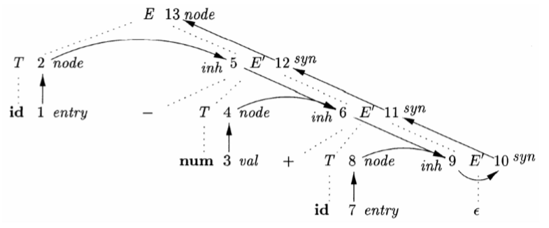

注意：

-   最后一列语义规则不一定是同时执行的，如在产生式（1）中，实际上先计算了继承属性 $E'.\text{inh} = T.\text{node}$，但是在最后才计算综合属性 $E.\text{node} = E'.\text{syn}$。
-   一个文法符号可能对应多个结点，如图里结点 4、8 都对应同一个 $T$
-   虚线部分构成的是一颗 **语法分析树**，而不是 **抽象语法树**

注意这张图中实际上有个关系：

-   虚线：语法分析树
-   黑线：依赖图，依赖图中的边表示的是依赖关系，而不是等于关系

非终结符号 $E'$ 有一个继承属性 $\text{inh}$ 和一个综合属性 $\text{syn}$。

**属性 $\text{inh}$ 表示至今为止构造得到的部分抽象语法树**

举例：$E'.\text{inh}$ 表示的是位于 $E'$ 的子树左边的输入串前缀所对应的抽象语法树的根

1. 在图中的结点 5 处，$E'.\text{inh}$ 表示对应于节点 2（$a$）的抽象语法树的根
2. 在节点 6 处则对应节点 5（$a - 4$）
3. 在节点 9 处则对应节点 6（$a - 4 + c$），因为没有更多的输入，所以在结点 9 处，$E'.\text{inh}$ 指向整个抽象语法树的根

继承属性可以把值从一个结构传递到另一个并列的结构，也可把值从父结构传递到子结构。

**属性 $\text{syn}$ 把这个值沿着语法分析树向上传递，直到它成为 $E.\text{node}$ 的值**

举例：

1. 结点 10 上的属性值 $E'.\text{syn}$ 是通过产生式 4 所关联的规则 $E'.\text{syn} = E'.\text{inh}$ 来定义的
2. 结点 11 处的属性值 $E'.\text{syn}$ 是通过产生式 2 所关联的规则 $E'.\text{syn} = E'_1.\text{syn}$ 来定义的
3. 类似的规则还定义了结点 12 和 13 处的值

## 语法制导的翻译方案（SDT）

**定义**：语法制导的翻译方案（syntax-directed translation scheme，SDT）是对语法制导定义的补充，也称作语法制导的翻译模式。

-   把 SDD 的 **语义规则改写为计算属性值的程序片段**，用花括号 $\{\}$ 括起来，插入到产生式右部的任何合适的位置上
-   这种方法表示语法分析和语义动作交错，可以在按 **深度优先** 遍历分析树的过程中随时执行语义动作

说人话：

-   **SDT** 是在语法分析过程中附带语义动作（程序计算片段）
-   语义动作可以放在产生式的任意位置，通常用大括号 $\{\}$ 包围

**基础文法**：原来的不含语义动作的文法称作基础文法。

### 举例

一个简单的 SDT （只包含 +/- 操作的表达式）：

$$
\begin{aligned}
E \rightarrow& TR \\
R \rightarrow& \text{addop } T \{ \text{print(addop.lexeme)} \} R_1 \\
  |& \varepsilon \\
T \rightarrow& \text{num} \{ \text{print(num.val)} \}
\end{aligned}
$$

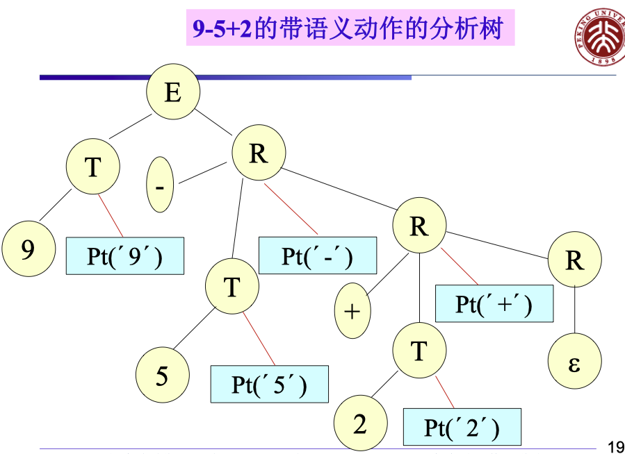

图中 pt 即 print，以深度优先搜索遍历这颗树的时候，即得到后缀表达式。

### SDT 的实现方法

**基本实现方法**：

-   建立语法分析树
-   将语义动作看作是虚拟的结点
-   从左到右，深度优先地遍历分析树，在访问虚拟结点时执行相应动作

通常情况下在语法分析过程中实现，不需要真的构造语法分析树。

**实现 SDD 的两种重要基础文法**：

-   基础文法是 LR 的，SDD 是 S 属性的

    LR：自底向上、从左向右扫描、进行最右推导的逆操作，即从左边开始归约

-   基础文法是 LL 的，SDD 是 L 属性的

    LL：自顶向下、从左向右扫描、进行最左推导

### 翻译方案的设计

#### 原则

1. **根据语法制导定义设计翻译方案**
2. **需要保证语义动作不会引用还没有计算的属性值**

#### 只需要综合属性的情况

操作：为每一个语义规则建立一个包含赋值的动作，**并把这个动作放在相应的产生式右边的末尾**。

例如：

$$
\text{T} \rightarrow \text{T}_1 * \text{F}
$$

所需动作：$\text{T.val} = \text{T}_1.\text{val} * \text{F.val}$

改写后：

$$
\text{T} \rightarrow \text{T}_1 * \text{F} \{\text{T.val} = \text{T}_1.\text{val} * \text{F.val}\}
$$

#### 既有综合属性又有继承属性

原则：

-   产生式 **右边** 的符号的 **继承属性** 必须在 **这个符号以前** 的动作中计算出来（不然上哪里去继承？）

-   一个动作 **不能引用** 这个动作 **右边符号的综合属性** （还没算到右边符号呢）

    继承属性肯定得允许，不然你赋值 $\{ \text{A}_1.\text{in} = 1 \} \text{A}_1$ 都不行。

-   产生式 **左边非终结符号的综合属性** 只有在它所 **引用的所有属性都计算出来** 以后才能计算

    计算这种属性的动作通常可放在产生式右端的末尾（同上文只需要综合属性的情况）

例如：

$$
\text{S} \rightarrow \text{A}_1 \text{A}_2 \{ \text{A}_1.\text{in} = 1;\text{A}_2.\text{in} = 2 \} \\
\text{A} \rightarrow a \{ \text{print(A.in)} \}
$$

此翻译方案不满足要求（违背原则 1，应该在 $\text{A}_1$ 出现之前，先算出其继承属性 $\text{A}_1.\text{in}$），可以改成如下的形式：

$$
\text{S} \rightarrow \{ \text{A}_1.\text{in} = 1 \} \text{A}_1 \{ \text{A}_2.\text{in} = 2 \} \text{A}_2 \\
\text{A} \rightarrow a \{ \text{print(A.in)} \}
$$

### 后缀翻译方案

**后缀 SDT**：所有动作都在产生式最右端的 SDT

文法可以自底向上分析且 SDD 是 S 属性的，必然可以构造出后缀 SDT。

**构造方法**：

-   将每个语义规则看作是一个赋值语义动作
-   将所有的语义动作放在规则的 **最右端**

#### 举例

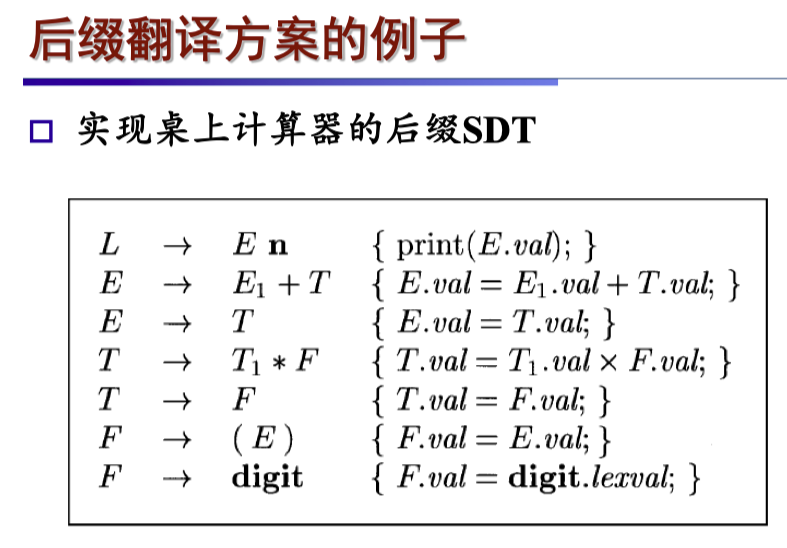

#### 后缀 SDT 的语法分析栈实现

**实现方法**：可以在 LR 语法分析的过程中实现。

-   **归约时** 执行相应的语义动作
-   定义用于记录各文法符号的属性的 union 结构
-   栈中的每个文法符号（或者说状态）都附带一个这样的 union 类型的值

在按照产生式 $A \rightarrow XYZ$ 归约时，$Z$ 的属性可以在栈顶找到，$Y$ 的属性可以在下一个位置找到，$X$ 的属性可以在再下一个位置找到。

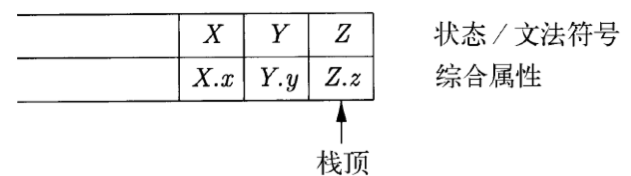

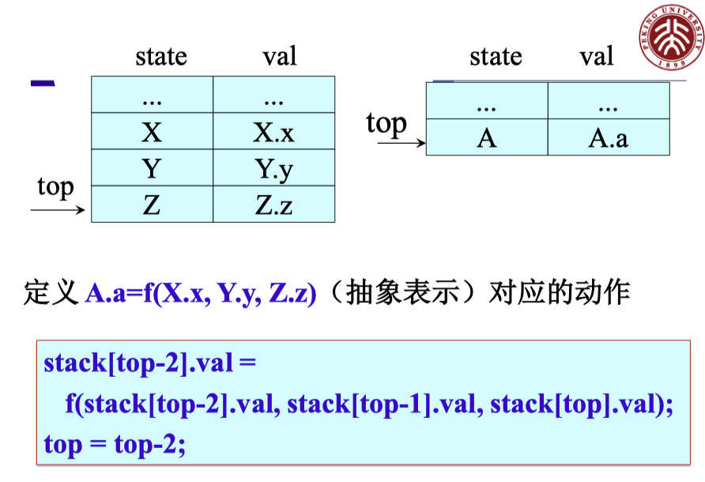

上图展示了一个规约的过程，把 $XYZ$ 规约回了 $A$，并在此过程中完成了属性的传递。

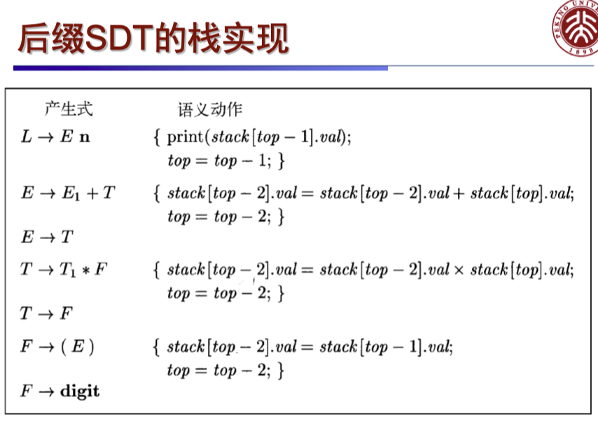

**再次强调：这是自底向上的分析过程，语义动作在规约时生效。**

### 产生式内部带有语义动作的 SDT

$$
B \rightarrow X \{a\} Y
$$

动作**左边**的所有符号（以及动作）处理完成后 ，就立刻执行这个动作。

-   自底向上分析时，（最早就开始）在 $X$ 出现在栈顶（即刚刚规约出 $X$）时执行动作 $a$
-   自顶向下分析时，（延迟到最晚）在试图展开 $Y$ 或者在输入中检测到 $Y$ 的时候执行 $a$

### 有问题的 SDT

并不是所有的 SDT 都可以在分析过程中实现。

比如，从中缀表达式到前缀表达式的转换：

$$
\begin{array}{rl}
1) & L \rightarrow E \; n \\
2) & E \rightarrow \{ \text{print}(\text{“+”}); \} \; E_1 + T \\
3) & E \rightarrow T \\
4) & T \rightarrow \{ \text{print}(\text{“*”}); \} \; T_1 * F \\
5) & T \rightarrow F \\
6) & F \rightarrow (E) \\
7) & F \rightarrow \text{digit} \; \{ \text{print}(\text{digit.lexval}); \} \\
\end{array}
$$

在自顶向下和自底向上的分析中都无法实现这种 SDT：

在这个 SDT 中，操作符（+ 和 \*）需要在操作数之前打印，这就是将中缀表达式转换为前缀表达式的要求。然而：

-   在自顶向下分析中：

    -   分析过程是从左到右进行的
    -   当遇到产生式 $E \rightarrow E_1 + T$ 时，必须先处理 $E_1$
    -   但是根据语义动作的要求，我们需要在处理 $E_1$ 之前就打印“+”
    -   这造成了时序上的矛盾

-   在自底向上分析中：
    -   分析过程是按照规约顺序进行的
    -   当要规约 $E_1 + T$ 到 $E$ 时，$E_1$ 和 $T$ 的值已经计算完成
    -   此时再打印“+”就太晚了，因为操作数已经处理完毕

所以，对于这种一般的 SDT，可以先建立分析树（语义动作作为虚拟的结点），然后进行前序遍历并执行动作。

### 消除左递归时 SDT 的转换方法

如果动作不涉及属性值，可以 **把动作当作终结符号** 进行处理，然后消左递归。

原始的产生式：

$$
\begin{aligned}
E & \rightarrow E_1 + T \{ \text{print(“+”)} \} \\
E & \rightarrow T
\end{aligned}
$$

转换后得到：

$$
\begin{aligned}
E & \rightarrow T R \\
R & \rightarrow + T \{ \text{print(“+”)} \} R \\
R & \rightarrow \varepsilon
\end{aligned}
$$

### 左递归文法翻译方案的转换

带左递归的文法：

$$
\begin{aligned}
E & \rightarrow E_1 + T \{ E.\text{val} = E_1.\text{val} + T.\text{val} \} \\
E & \rightarrow E_1 - T \{ E.\text{val} = E_1.\text{val} - T.\text{val} \} \\
E & \rightarrow T \{ E.\text{val} = T.\text{val} \} \\
T & \rightarrow (E) \{ T.\text{val} = E.\text{val} \} \\
T & \rightarrow \text{num} \{ T.\text{val} = \text{num}.\text{val} \}
\end{aligned}
$$

转换后的不带有左递归的文法：

$$
\begin{aligned}
E & \rightarrow T \{ R.\text{i} = T.\text{val} \} R \{ E.\text{val} = R.\text{s} \} \\
R & \rightarrow + T \{ R_1.\text{i} = R.\text{i} + T.\text{val} \} R_1 \{ R.\text{s} = R_1.\text{s} \} \\
R & \rightarrow - T \{ R_1.\text{i} = R.\text{i} - T.\text{val} \} R_1 \{ R.\text{s} = R_1.\text{s} \} \\
R & \rightarrow \varepsilon \{ R.\text{s} = R.\text{i} \} \\
T & \rightarrow (E) \{ T.\text{val} = E.\text{val} \} \\
T & \rightarrow \text{num} \{ T.\text{val} = \text{num}.\text{val} \}
\end{aligned}
$$

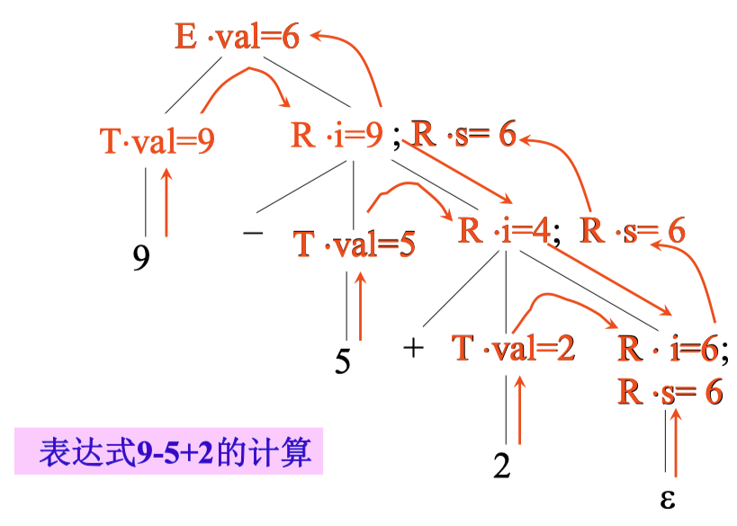

#### 举例

原有文法：

$$
\begin{aligned}
A & \to A_1 Y \{ A.a = g(A_1.a, Y.y) \} \\
A & \to X \{ A.a = f(X.x) \} \\
\end{aligned}
$$

消除左递归之后，文法转换成

$$
A \to XR \\
R \to YR | \varepsilon
$$

消除左递归后的翻译方案：

$$
\begin{aligned}
A &\to X \{ R.i = f(X.x) \} R \{ A.a = R.s \} \\
R &\to Y \{ R_1.i = g(R.i, Y.y) \} R_1 \{ R.s = R_1.s \} \\
R &\to \varepsilon \{ R.s = R.i \} \\
\end{aligned}
$$

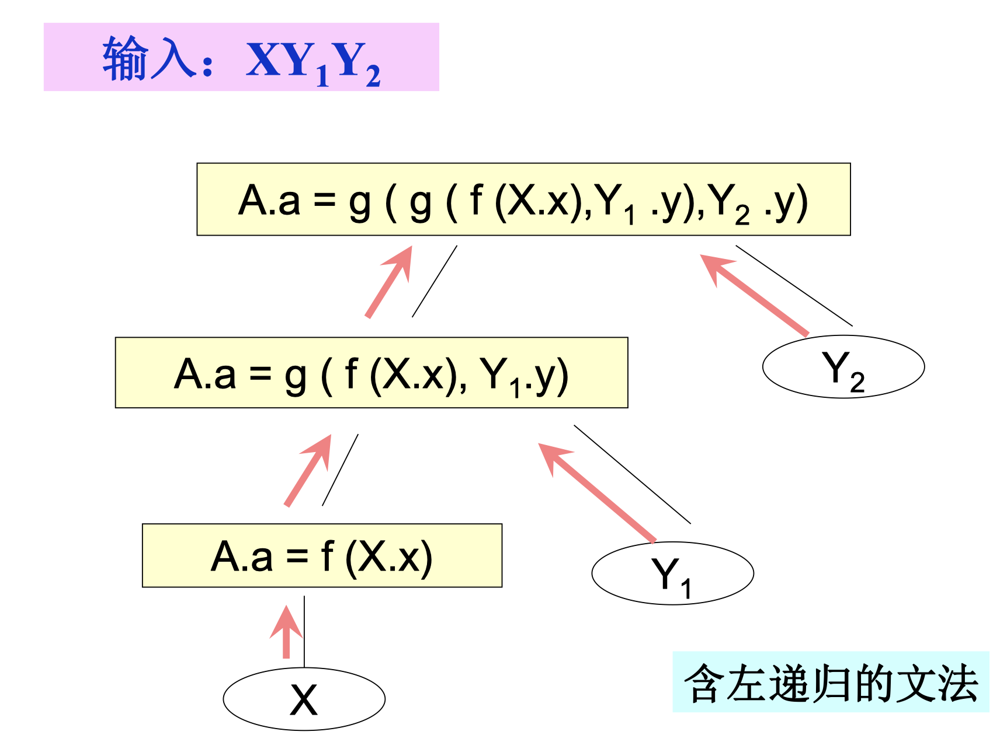

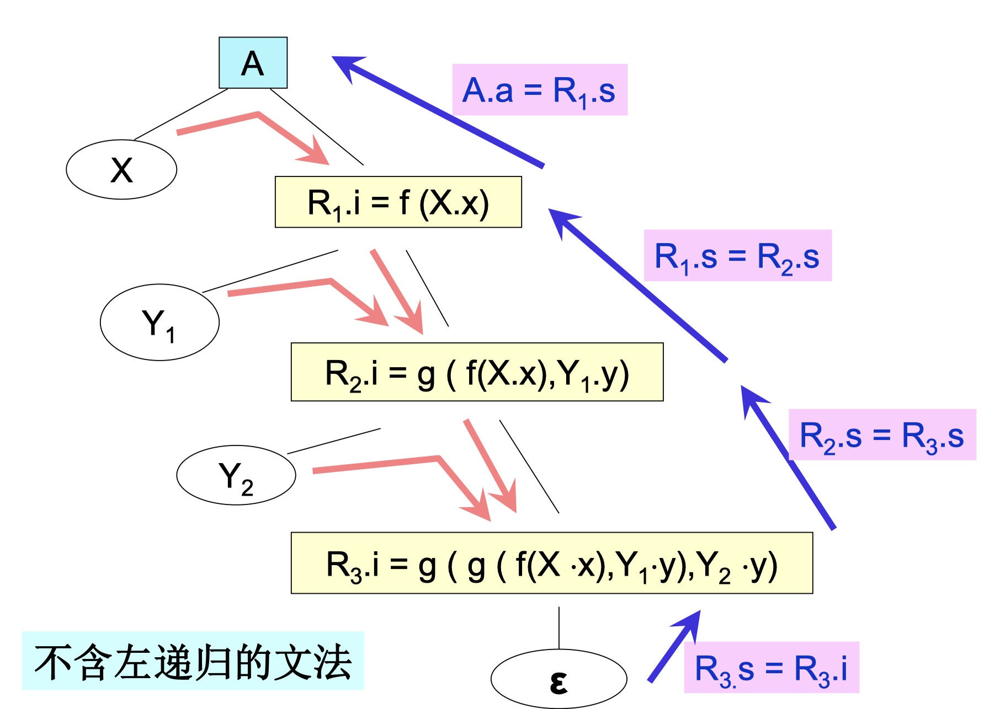

### 注意事项

-   并不是所有的 SDT 都可以在分析过程中实现
-   后缀 SDT 以及 L 属性 SDT 可以在分析时完成
