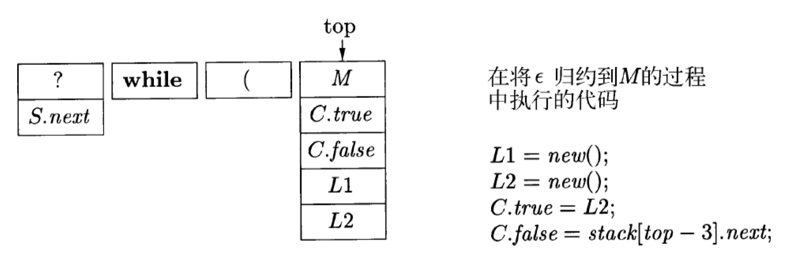
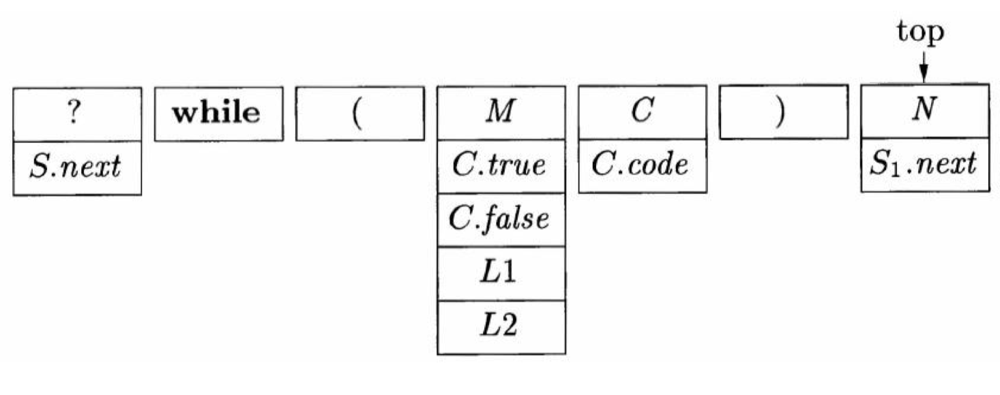
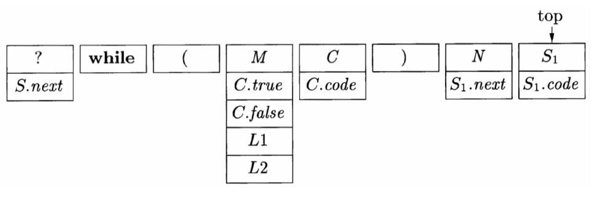
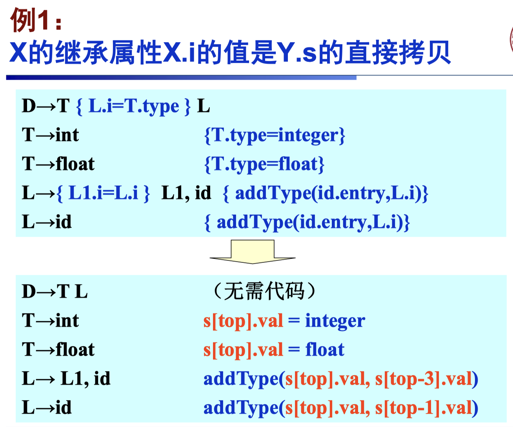
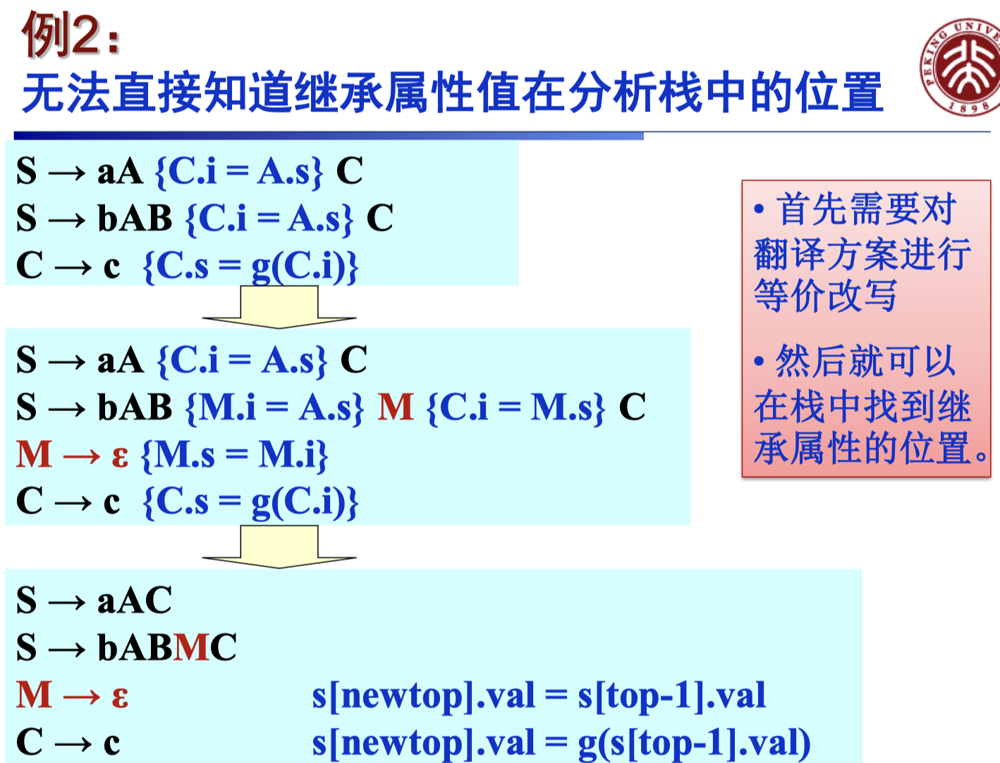
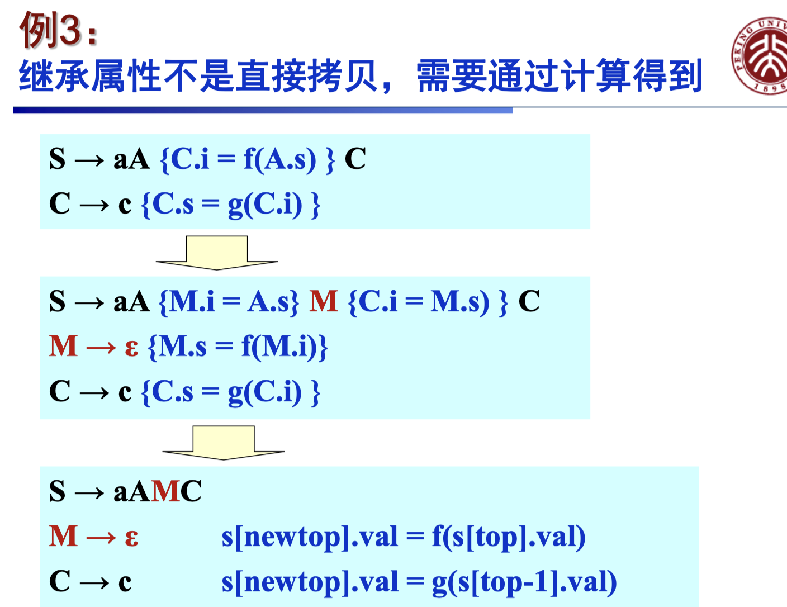

# 10 语法制导翻译 III

  by <a href="https://github.com/zhuozhiyongde">Arthals</a>
   
  blog：<a href="https://arthals.ink">Arthals' ink</a>

## 基础属性文法（SDD）

（后文中均以此为例说明）

这是一个 while 的常见语法：

$$
S \rightarrow \text{while} (C) \ S_1
$$

这里：

-   $S$ 是生成各种语句的非终结符号，我们假设这些语句包括 $\text{if}$ 语句、赋值语句和其他类型的语句
-   $C$ 表示一个条件表达式，也即一个值为真或假的布尔表达式

这个 $\text{while}$ 语句的含义是首先对条件表达式 $C$ 求值。

-   如果 $C$ 是真，控制就转向 $S_1$ 的代码开始处（循环体）
-   如果 $C$ 的值为假，那么控制就转向跟在这个 $\text{while}$ 语句的代码之后的代码（循环结束）

我们还必须设计 $S_1$ 的代码，使得它在结束的时候能够跳转到这个 $\text{while}$ 语句的代码开始处（也即 $C$ 处），继续下一轮循环条件判断。

为此，我们生成一些形式为 $\text{label } L$ 的指令，其中 $L$ 是一个标识符。这个指令表明后一句指令的标号是 $L$，这会方便我们定位语句。

从而，我们得到这个 L 属性 SDD （回忆：SDD 是上下文无关文法和属性 / 规则的结合）的属性计算：

$$
\begin{array}{|l|l|}
\hline
\text{产生式} & \text{语义规则} \\
\hline
S \rightarrow \text{while} (C) \ S_1
& L1 = \text{new()} \\
& L2 = \text{new()} \\
& S_1.\text{next} = L1 \\
& C.\text{false} = S.\text{next} \\
& C.\text{true} = L2 \\
& S.\text{code} = \text{label} \ || \ L1 \ || \ C.\text{code} \ || \ \text{label} \ || \ L2 \ || \ S_1.\text{code} \\
\hline
\end{array}
$$

（注：有一说一，第一次看这个的时候很迷惑，但是如果你写完了 lab 的 lv6、lv7 之后你会发现毫无难度）

我们使用下面的属性来生成正确的中间代码：

1. 继承属性 $S.\text{next}$ 是必须在 $S$ 执行结束之后执行的代码的开始处的标号，在调用这个产生式推导之前就已经有了
2. 综合属性 $S.\text{code}$ 是中间代码的序列，它实现了语句 $S$
3. 继承属性 $C.\text{true}$ 是在 $C$ 为真时执行的代码的开始处的标号
4. 继承属性 $C.\text{false}$ 是在 $C$ 为假时执行的代码的开始处的标号
5. 综合属性 $C.\text{code}$ 是一个中间代码的序列，它实现了条件表达式 $C$

转换上述 SDD 为 SDT 的语义动作：

$$
\begin{array}{|r|l|}
\hline
\text{产生式} & \text{语义动作} \\
\hline
S \rightarrow \text{while} ( & \{L1 = \text{new()}; L2 = \text{new()}; C.\text{false} = S.\text{next}; C.\text{true} = L2; \} \\
C) & \{ S_1.\text{next} = L1; \} \\
S_1& \{ S.\text{code} = \text{label} \ || \ L1 \ || \ C.\text{code} \ || \ \text{label} \ || \ L2 \ || \ S_1.\text{code}; \} \\
\hline
\end{array}
$$

**注意，这里把原先的语义动作分开后插入到了产生式中。**

为什么要这么做？

因为我们需要先根据依赖关系计算需要用到的属性，然后进行代码生成。

$L1 = \text{new()}; L2 = \text{new()}$：存放了在代码片段需要的标号（函数 $\text{new()}$ 生成了新的标号），后续定位代码时需要用到
-   $L1$ 存放了条件判断语句（同时也是 $\text{while}$ 语句）的开始标号，每次循环体 $S_1$ 结束时需要跳转至此
-   $L2$ 存放了 $S_1$ 的开始标号，当 $C$ 为真时需要跳转至此

这里在展开下一步对应的表达式前，设置了两个继承属性：

-   $C.\text{false} = S.\text{next}; C.\text{true} = L2$：计算 $C$ 的继承属性，$C$ 为真 / 假时应该跳转到哪里
-   $S_1.\text{next} = L1$：计算 $S_1$ 的继承属性，$S_1$ 结束后需要跳转至 $L1$

类似我们现在正在展开的 $S$，以上继承属性，在即将展开 $C$、$S_1$ 的时候会用到。

这样，再递归的调用 $C$ 和 $S_1$ 的语义动作，就可以生成正确的综合属性（中间代码） $C.\text{code}$ 和 $S_1.\text{code}$。

在最后，我们已经完成了 $S$ 产生式体内所有计算综合属性 $S.\text{code}$ 所需要的属性，从而可以在这个产生式的最后生成综合属性（中间代码） $S.\text{code}$。

## L 属性 SDD 的实现方法

### 递归下降函数法

使用递归下降的语法分析器，**为每个非终结符建立一个函数**，在函数中计算属性。

$$
\begin{array}{l}
\textbf{string } S(\text{label next}) \{ \\
\quad \textbf{string } Scode, Ccode; \quad /* 存放代码片段的局部变量 */ \\
\quad \text{label } L1, L2; \quad /* 局部标号 */ \\
\quad \textbf{if} ( 当前输入 == 词法单元\textbf{while} ) \{ \\
\quad \quad 读取输入; \\
\quad \quad 检查 \text{“(”} 是下一个输入符号, 并读取输入; \\
\quad \quad L1 = \textbf{new}(); \\
\quad \quad L2 = \textbf{new}(); \\
\quad \quad Ccode = C(\text{next, L2}); \quad /* 当条件为真时跳转为 S 最开始的 next 标号，否则跳转至 L2 */ \\
\quad \quad 检查 \text{“)”} 是下一个输入符号, 并读取输入; \\
\quad \quad Scode = S(L1); \\
\quad \quad \textbf{return}(\text{“label”} \| L1 \| Ccode \| \text{“label”} \| L2 \| Scode); \\
\quad \} \\
\quad \textbf{else} \{ /* 其他语句类型 */ \} \\
\}
\end{array}
$$

类似上述展开方式，只不过我们将 “展开” 这一动作实现为了函数调用，用中间值 $Scode$ 和 $Ccode$ 来存放递归调用得到的中间代码片段。

对于 $C()$ 和 $S()$ 的调用，**我们将其所需要的继承属性作为参数传递过去。**

### 递归下降、边扫描边生成（On-the-fly）

使用递归下降的语法分析，边扫描边生成代码（on-the-fly）。

递归下降函数法存在的问题：**当属性值很大时，对属性值进行运算的效率很低**。

我们总需要用中间值 $Scode$ 和 $Ccode$ 来存放递归调用得到的中间代码片段，而且最后会返回 $S.\text{code}$。这些中间值可能是一个上百 KB 的串，对其进行并置等运算会比较低效。

所以，我们可以逐步生成属性的各个部分，并增量式添加到最终的属性值中。

#### 可行性条件

-   存在一个 **主属性**，且主属性是综合属性
-   在各个产生式中，主属性是通过产生式体中各个非终结符号的主属性 **连接（并置）** 得到的。同时还会连接一些其它的元素
-   **各非终结符号的主属性的连接顺序和它在产生式体中的顺序相同**

此时，只需要在适当的时候 “发出（emit）” 非主属性的元素，即把这些元素拼接到适当的地方就可以了。

**人话**：就是分开生成，只要生成顺序正确，那么最后结果也是正确的，和 lab 里一样。

#### 举例

**产生式**：$S \to \text{while} (C) \, S1$，目标 $S.code = \text{Label} \, || \, L1 \, || \, C.code \, || \, \text{Label} \, || \, L2 \, || \, S1.code$

SDT：
$$
\begin{array}{|r|l|}
\hline
\text{产生式} & \text{语义动作} \\
\hline
S \rightarrow \text{while} ( & \{L1 = \text{new()}; L2 = \text{new()}; C.\text{false} = S.\text{next}; C.\text{true} = L2; \text{print}(\text{“label”}, L1); \} \\
C) & \{ S_1.\text{next} = L1; \text{print}(\text{“label”}, L2); \} \\
S_1&  \\
\hline
\end{array}
$$

继续推导 $C$ 和 $S_1$ 的时候，会自动生成相应的代码，并且其继承属性已经提前设置。

为了避免刚才说的问题，我们可以在处理 $S$ 时，先调用 $C$，再调用 $S$（对应于 $S_1$）。

如果各个函数把属性 $code$ 打印出来，我们处理 $\text{while}$ 语句时，只需要：

1. 先打印 $\text{Label} \, L1$
2. 再调用 $C$（打印 $C$ 的代码）
3. 再打印 $\text{Label} \, L2$
4. 再调用 $S$（打印 $S1$ 的代码）

对于当前这个规则而言，只需要处理 1、3，即打印 $\text{Label} \, L1$ 和 $\text{Label} \, L2$，2、4 在 $C()$ 和 $S()$ 中处理。

$$
\begin{array}{l}
\textbf{string } S(\text{label next}) \{ \\
\quad \text{label } L1, L2; \quad /* 局部标号 */ \\
\quad \textbf{if} ( 当前输入 == 词法单元\textbf{while} ) \{ \\
\quad \quad 读取输入; \\
\quad \quad 检查 \text{‘(’} 是下一个输入符号, 并读取输入; \\
\quad \quad L1 = \textbf{new}(); \\
\quad \quad L2 = \textbf{new}(); \\
\quad \quad print(\text{“label”} \| L1); \\
\quad \quad C(\text{next, L2}); \quad /* 当条件为真时跳转为 S 最开始的 next 标号，否则跳转至 L2 */ \\
\quad \quad print(\text{“label”} \| L2); \\
\quad \quad 检查 \text{‘)’} 是下一个输入符号, 并读取输入; \\
\quad \quad S(L1); \\
\quad \} \\
\quad \textbf{else} \{ /* 其他语句类型 */ \} \\
\}
\end{array}
$$

注意：没有最后的 $\text{return}$ 语句了，改为分阶段 $\text{print}$。

### 自底向上语法分析

以 LL 文法为基础的 L 属性 SDD 可以在 **LR 语法分析（自底向上）** 过程中实现。

我们遵循如下的三个原则：

1. 首先构造出 L 属性 SDD 的 SDT，这样的 SDT：
    - 在各个非终结符号之前放置语义动作来计算它的**继承属性**
    - 并且在产生式后端放置一个动作来计算**综合属性**

2. 对 $A$ 的规则中每个内嵌的语义动作 $a$，向这个文法中引入一个标记非终结符号 $M$ 来替换它。每个这样的位置都有一个不同的标记，并且对于任意一个标记 $M$ 都有一个产生式 $M \rightarrow \varepsilon$

3. 如果标记非终结符号 $M$ 在某个产生式 $A \rightarrow \alpha \{a\} \beta$ 中替换了语义动作 $a$，对 $a$ 进行修改得到 $a'$，并且将 $a'$ 关联到 $M \rightarrow \varepsilon$ 上。这个动作 $a'$：
    1. 将动作 $a$ 需要的 $A$ 或 $\alpha$ 中符号的任何属性作为 $M$ 的 **继承属性** 进行拷贝

       注：L 属性 SDD 保证了它计算的时候所需要的继承属性不包括右边 $\beta$ 的属性。

    2. 按照 $a$ 中的方法计算各个属性，但是将计算得到的这些属性作为 $M$ 的 **综合属性**

动作 $a'$ 必须设法找到相应的属性，因为产生式 $M \rightarrow \varepsilon$ 中没有 $A$ 的符号。

这个变换看起来是非法的，因为通常和产生式 $M \rightarrow \varepsilon$ 相关的动作将不得不访问某些没有出现在这个产生式中的文法符号的属性（如 $A.i$）。

然而，**我们将在 LR 语法分析栈上实现各个语义动作**。就像我们现在在栈中添加了 $M$ 一样，在规约到 $A$ 之前，我们亦会在栈中其前添加一个记录，其存放 $A$ 的一些属性。

所以，必要的属性总是可用的，它们位于栈顶之下的已知位置上。

所有这些属性的拷贝工作能够正确进行的原理是：**所有拷贝都发生在对某个非终结符号的一次展开时创建的不同记录之间。**

因此，这些记录中的每一个都知道其他各个记录在栈中离它有多远，因此可以安全地把值写到它下面的记录中。

#### 举例 1

$$
A \rightarrow \{B.i=f(A.i);\}BC
$$

引入 $M$ 后变为：

-   $A \rightarrow MBC$
-   $M \rightarrow \varepsilon \{M.i=A.i; M.s=f(M.i);\}$

以下给出对于栈结构说明的一个 **基础约定（和 PPT 原文有变动）**：

-   栈由各个记录组成，图中栈顶 / 栈上方在右，栈底 / 栈下方在左。
-   每个记录包含多个域，每个域对应一个属性。

即：

-   栈
    -   记录 X
        -   域 1（属性）
        -   域 2（属性）
    -   记录 Y
        -   域 1（属性）
        -   域 2（属性）

**属性传递过程**：

-   当执行到 $M$ 的归约时，$A.i$ 的值存放在 $M$ 记录的栈下方记录的域（当然，这个域的名字肯定不是 $A$）中
-   如果产生式右部为 $KMBC$，那么在栈中，$M$ 记录的栈下方记录为 $K$，$K$ 的某个域中存放 $A.i$
-   $M.s$ 即 $B.i$，$M$ 记录的栈下方记录存放 $A.i$，即将归约到 $B$ 时，$B.i$ 存放在栈中归约位置的下方记录中

> 我觉得这里理解起来比较烦，但你可以这么想：我们随时都要确保进行一次规约之前，其所需要的继承属性都已经准备好了，所以对于 $A \rightarrow MBC$，我们未来要规约到 $A$，那么 $A$ 所需要的继承属性必然也要提前准备好，位置就在当前栈下方记录的域，这个域可以是当前产生体的一部分，比如上文的 $K$，也可能是不在产生体中的，比如还有一个 $S \rightarrow DA$，那么就会在 $D$ 记录里。

#### 举例 2

原始规则：

$$
\begin{array}{|r|l|}
\hline
\text{产生式} & \text{语义动作} \\
\hline
S \rightarrow \text{while} ( & \{L1 = \text{new()}; L2 = \text{new()}; C.\text{false} = S.\text{next}; C.\text{true} = L2; \} \\
C) & \{ S_1.\text{next} = L1; \} \\
S_1& \{ S.\text{code} = \text{“label”} \ || \ L1 \ || \ C.\text{code} \ || \ \text{“label”} \ || \ L2 \ || \ S_1.\text{code}; \} \\
\hline
\end{array}
$$

转换为：

$$
\begin{align*}
S &\rightarrow \text{while}(M C) N S_1 \\
M &\rightarrow \varepsilon \\
N &\rightarrow \varepsilon
\end{align*}
$$

按照此产生式归约，我们希望会首先规约 $\varepsilon \leftarrow M$，然后规约 $\varepsilon \leftarrow N$，最后将 $\text{while}(M C) N S_1$ 规约回 $S$（LR 从左到右读，然后逐渐归约）。

-   $S.\text{next}$ 位于栈中右部的栈下方记录的域中（它会在规约完 $S$ 的后续流程中被修改为正确的值，就像你现在还没规约到 $C$，但是使用了一个 $M$ 来存储）
-   $C$ 的继承属性 $\text{true}$、$\text{false}$ （即条件满足 / 不满足时的下一句指令的位置）位于栈中紧靠 $C$ 的下方记录 $M$ 的域中

当将 $\varepsilon$ 规约到 $M$ 时，由于我们需要将 $C.\text{false}$ 的值设为 $M$ 的一个域，所以我们在栈中 $M$ 的栈下方记录中找到 $S.\text{next}$ 的值，它就是 $C.\text{false}$ 的值。

由于此时栈顶指针在 $M$，所以这里执行的是 $C.\text{false} = \text{stack[top-3].L1}$。

这样在下一步规约 $C$ 时，其所需要的继承属性 $\text{true}$ 和 $\text{false}$ 都已经计算完毕，并存放在栈中紧靠在它栈下方记录 $M$ 的域中。

又一例：

-   我们要为即将到来的规约到 $S_1$ 做准备，所以要准备 $S_1.\text{next}$，存放在 $N$ 的栈记录中，使得它恰好存放在紧靠 $S_1$ 的栈记录之下的记录 $N$ 的域中
-   $S_1.\text{next} = \text{stack[top-3].L1}$（此时 $\text{top}$ 指针在 $N$）

- 这个时候就要执行对 $S_1$ 的规约就可以用其继承属性 $S_1.\text{next}$ 了。

最终得到：

$$
\begin{array}{|l|l|}
\hline
\text{产生式} & \text{规约时动作} \\
\hline
S \to \text{while} ( M C ) N S_1
  & \text{tempCode }= \text{label} \, || \, \text{stack}[\text{top} - 4].L1 \, || \\
  & \quad \text{stack}[\text{top} - 3].\text{code} \, || \, \text{“label”} \, || \, \text{stack}[\text{top} - 4].L2 \, || \\
  & \quad \text{stack}[\text{top}].\text{code}; \\
  & \text{top} = \text{top} - 6; \\
  & \text{stack}[\text{top}].\text{code} = \text{tempCode}; \\
\hline
M \to \varepsilon
  & \text{top} = \text{top} + 1; \\
  & L1 = \text{new()}; \\
  & L2 = \text{new()}; \\
  & C.\text{true} = L2; \\
  & C.\text{false} = \text{stack}[\text{top} - 3].\text{next}; \\
\hline
N \to \varepsilon
  & \text{top} = \text{top} + 1; \\
  & S_1.\text{next} = \text{stack}[\text{top} - 3].L1; \\
\hline
\end{array}
$$

$$
\begin{array}{c}
\hline
0 & 1 & 2 & 3 & 4 & 5 & 6 & 7 \\
\hline
? & \text{while} & ( & M & C & ) & N & S_1 \\
\hline
S.\text{next} & & & C.\text{true} & C.\text{code} & & S_1.\text{next} & S_1.\text{code} \\
 & & & C.\text{false} & & & & \\
 & & & L_1 & & & & \\
 & & & L_2 & & & & \\
\hline
\end{array}
$$

### 确定继承属性在分析栈中的位置

综合属性值很容易在栈中（$\text{stack}[i].\text{val}$）找到，因此在自底向上分析中处理 L 属性定义的关键是 **确定继承属性值在栈中的位置**。

实际使用中，$X$ 的继承属性 $X.i$ 通常和文法符号 $Y$ 的综合属性 $Y.s$ 有关：

-   或者是 $Y.s$ 的直接拷贝
-   或者是 $Y.s$ 值的函数值

#### 例子

在原始文法中，属性 $A.s$ 需要传递给 $C.i$。

但是由于存在两个产生式 $S \to aA\{C.i = A.s\}C$ 与 $S \to bAB\{C.i = A.s\}C$，所以要规约到 $C$ 时，我们不知道 $A.i$ 应该在相对于栈顶的 $\text{stack}[\text{top}-1]$ 还是 $\text{stack}[\text{top}-2]$ 记录获得。

通过引入 $M$，可以将这个过程明确为：

$$
A.s \rightarrow M.i = M.s \rightarrow C.i
$$

即：分解复杂的属性传递路径，使得属性的传递过程变得更清晰、可控。

先一步一步传下来继承属性，然后再在 $M$ 内部完成计算，因为这样可以明确参数在栈中的位置。

即：通过分解复杂的计算过程，使得每一步都能够明确地进行属性传递和计算。
