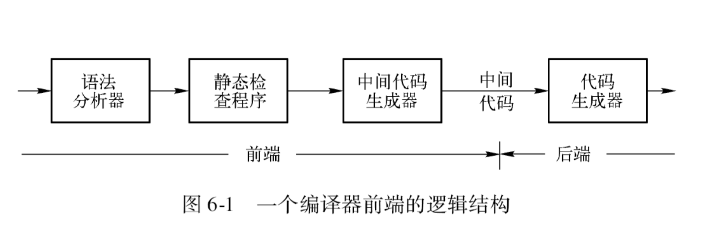
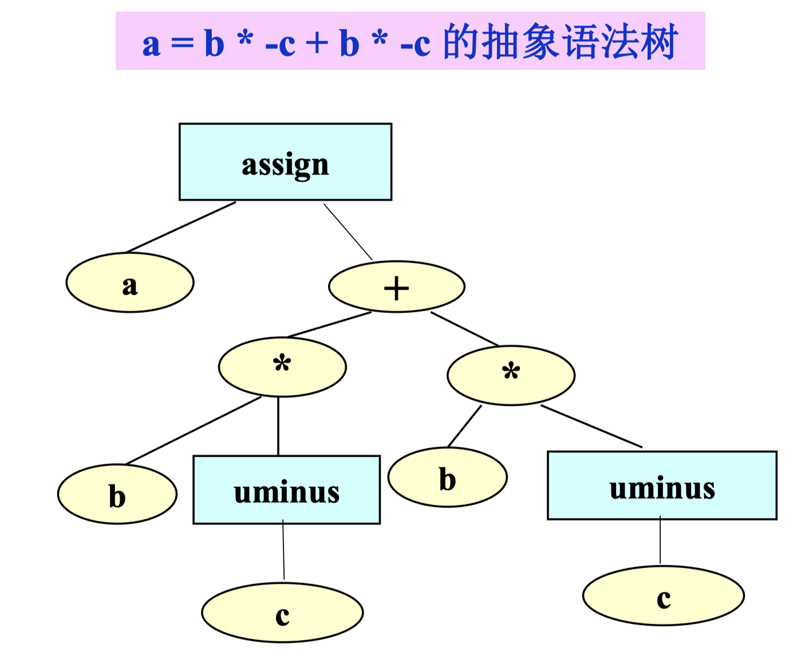
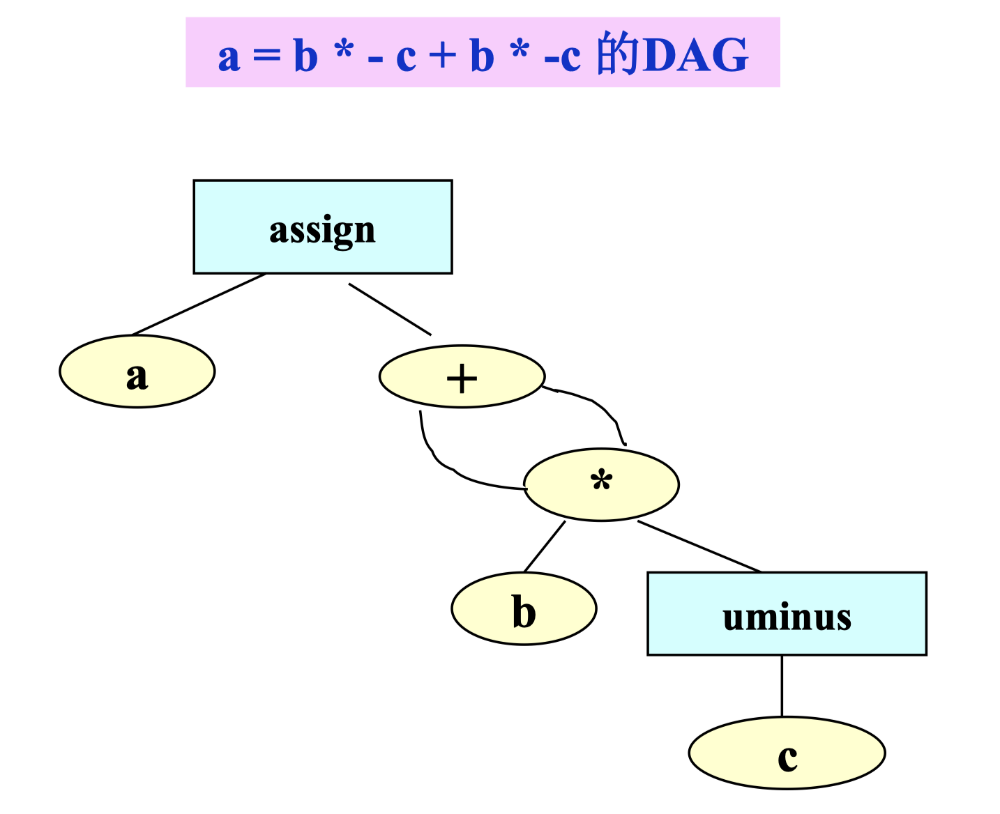
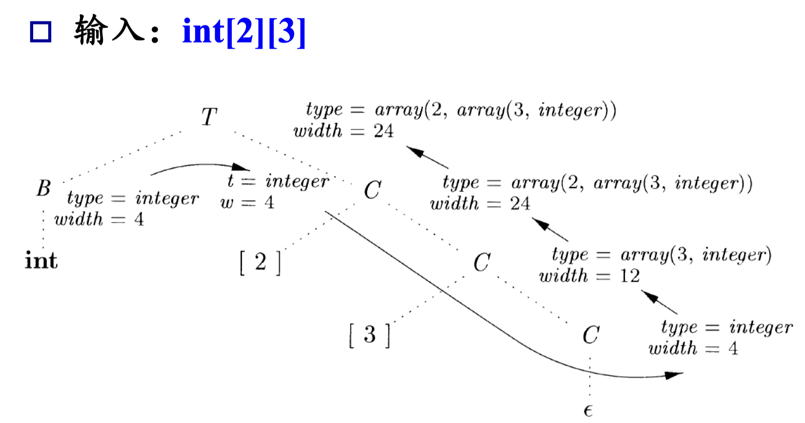

# 11 中间代码生成 I

<center>
  by <a href="https://github.com/zhuozhiyongde">Arthals</a>
  <br/>
  blog：<a href="https://arthals.ink">Arthals' ink</a>
</center>

## 中间代码

中间代码是介于源代码和目标代码之间的一种代码形式，它既不依赖于具体的编程语言，也不依赖于具体的目标机。

-   对不同的程序语言进行编译时，可以采用同一种形式的中间代码。
-   同一种形式的中间代码，可以转换成不同目标机的目标代码。
-   在中间代码上可以进行各种不依赖于目标机的优化，这些优化程序可以在不同的程序语言和不同的目标机的编译程序中重复使用。

编译器前端的逻辑结构：



### 中间代码的表示形式

-   抽象语法树（AST）
-   DAG（Directed Acyclic Graph 有向无环图）
-   后缀式（也称逆波兰表示）
-   三地址代码

## AST

AST 抽象语法树的生成方式同前文章所述。



## DAG



**和 AST 的区别**：尽可能的复用相同的节点。

这点在翻译上亦有体现：在产生表达式 DAG 的翻译方案中，每次调用 `Leaf()` 和 `Node()` 的构造函数时，要检查是否已存在相同结构的节点，如果存在，则返回找到的已有节点，否则构造新节点（但这在下表中不体现，所以看上去和 AST 没有区别）。

$$
\begin{array}{|l|l|}
\hline
\text{产生式} & \text{语义动作} \\
\hline
E \to E_1 + T  &\{ E.\text{node} = \text{new Node (“+”}, E₁.\text{node}, T.\text{node}); \} \\
E \to T       &\{ E.\text{node} = T.\text{node}; \} \\
T \to T_1 * F  &\{ T.\text{node} = \text{new Node (“*”}, T₁.\text{node}, F.\text{node}); \} \\
T \to F       &\{ T.\text{node} = F.\text{node}; \} \\
F \to (E)     &\{ F.\text{node} = E.\text{node}; \} \\
F \to id      &\{ F.\text{node} = \text{new Leaf(ID, id.name); } \} \\
F \to num     &\{ F.\text{node} = \text{new Leaf(NUM, num.val); } \} \\
\hline
\end{array}
$$

由于这个检查的存在，DAG 生成效率降低了，但是运行效率提高了。

## 三地址代码

基本形式：

$$
x = y \text{ op } z
$$

类别：

1. 一元运算：$ x = \text{op } y $，$\text{op}$ 是一元运算符，如一元减、逻辑非等。

2. 复制指令：$ x = y $

3. 无条件跳转：$ \text{goto } L $

4. 条件跳转：$ \text{if } x \text{ goto } L $ （$x$ 为真时跳转）或 $ \text{if } \text{False } x \text{ goto } L $ （$x$ 为假时跳转）

5. 条件转移：$ \text{if } x \text{ ROP } y \text{ goto } L $，仅当 $x \text{ ROP } y$ 成立时跳转

    $\text{ROP}$ 是关系运算符，包括 $<$、$\leq$、$>$、$\geq$、$==$、$!=$ 等

6. 参数传递与函数调用：

    1. 首先使用 $ \text{param } x_1$、 $\text{param } x_2$ $\cdots$ $\text{param } x_n $ 传递参数
    2. 然后使用 $ \text{call } p, n $ 调用函数，其中 $p$ 是函数名，$n$ 是参数个数

7. 数组与地址操作
    1. 把数组元素 $y[z]$ 的值赋给 $x$：$x = y[z]$
    2. 把 $z$ 的值赋给数组元素 $x[y]$：$x[y] = z$
    3. 把 $y$ 的地址赋给 $x$：$x = \&y$
    4. 把 $y$ 值为地址的存储空间的值赋给 $x$：$x = *y$
    5. 把 $y$ 值赋给 $x$ 值为地址的存储空间：$*x = y$

### 示例 1

#### 语句

```c
do i = i + 1; while (a[i] < v);
```

#### 符号标号

```text
L:  t1 = i + 1
    i = t1
    t2 = i * 8
    t3 = a[t2]
    if t3 < v goto L
```

#### 位置号

```text
100: t1 = i + 1
101: i = t1
102: t2 = i * 8
103: t3 = a[t2]
104: if t3 < v goto 100
```

### 三地址代码具体实现

对于表达式

$$
a = b * -c + b * -c
$$

其三地址代码可以表示为如下几种方式。

#### 四元式表示

$$
\begin{array}{|c|c|c|c|c|}
\hline
\text{inst} & \text{op} & \text{arg1} & \text{arg2} & \text{result} \\
\hline
(0) & \text{uminus} & c & & t_1 \\
(1) & * & b & t_1 & t_2 \\
(2) & \text{uminus} & c & & t_3 \\
(3) & * & b & t_3 & t_4 \\
(4) & + & t_2 & t_4 & t_5 \\
(5) & \text{assign} & t_5 & & a \\
\hline
\end{array}
$$

#### 三元式表示

$$
\begin{array}{|c|c|c|c|}
\hline
\text{inst} & \text{op} & \text{arg1} & \text{arg2} \\
\hline
\text{(0)} & \text{uminus} & c & \\
\text{(1)} & * & b & (0) \\
\text{(2)} & \text{uminus} & c & \\
\text{(3)} & * & b & (2) \\
\text{(4)} & + & (1) & (3) \\
\text{(5)} & \text{assign} & a & (4) \\
\hline
\end{array}
$$

注：三元式中可以使用指向三元式语句的指针来表示操作数。

#### 间接三元式表示

$$
\begin{array}{|c|c|}
\hline
\text{address}  & \text{inst} \\
\hline
\text{0} & \text{(0)} \\
\text{1} & \text{(1)} \\
\text{2} & \text{(2)} \\
\text{3} & \text{(3)} \\
\text{4} & \text{(4)} \\
\text{5} & \text{(5)} \\
\hline
\end{array}
$$

$$
\begin{array}{|c|c|c|c|}
\hline
\text{inst}  & \text{op} & \text{arg1} & \text{arg2} \\
\hline
\text{(0)} & \text{uminus} & c & \\
\text{(1)} & * & b & (0) \\
\text{(2)} & \text{uminus} & c & \\
\text{(3)} & * & b & (2) \\
\text{(4)} & + & (1) & (3) \\
\text{(5)} & \text{assign} & a & (4) \\
\hline
\end{array}
$$

间接三元式：三元式表 + 间接码表。

间接码表是一张指示表，按运算的先后次序列出相关三元式们在三元式表中的位置。

这样，**修改语句顺序的时候，只需要修改间接码表，而不需要修改三元式表**，方便优化。

#### 不同表示方法的对比

-   四元式需要利用较多的临时单元，四元式之间的联系通过**临时变量**实现
-   中间代码优化处理时，四元式比三元式更为方便
-   间接三元式与四元式同样方便，两种实现方式需要的存储空间大体相同

## 静态单赋值（SSA）

**SSA（Static Single Assignment）**：每个变量在 SSA 形式中只赋值一次，每次赋值都对应一个不同的变量名。

### 示例

转换前：

```cpp
p = a + b
q = p - c
p = q * d
p = e - p
q = p + q
```

转换后：

```cpp
p1 = a + b
q1 = p1 - c
p2 = q1 * d
p3 = e - p2
q2 = p3 + q1
```

### Phi 函数

作用：在不同路径中对同一个变量赋值时，使用 $\phi$ 函数来合并不同的赋值。

示例：

```c
if (flag) x = -1;
else x = 1;
y = x * a;
```

转换前：

$$
\begin{array}{l}
\text{if(flag)} \\
\quad x = -1; \\
\text{else} \\
\quad x = 1; \\
y = x * a; \\
\end{array}
$$

转换后：

$$
\begin{array}{l}
\text{if (flag)} \\
\quad x1 = -1; \\
\text{else} \\
\quad x2 = 1; \\
x3 =  \phi(x1, x2); \\
y = x3 * a; \\
\end{array}
$$

类似于 ICS 中学到的条件转移 `cmov` 指令。

## 类型和声明

**类型检查（Type Checking）**：利用一组规则来检查运算分量的类型和运算符的预期类型是否匹配。

### 语言类型

-   **类型化的语言**：变量都被给定类型的语言。

    特点：表达式、语句等语法构造的类型都是可以静态确定的。

    例如，类型为 `boolean` 的变量 `x` 在程序每次运行时的值只能是布尔值，`not(x)` 总有意义。

-   **非类型化的语言**：不限制变量值范围的语言。

    特点：一个运算可以作用到任意的运算对象，其结果可能是一个有意义的值，一个错误，一个异常或一个语言未加定义的结果。

### 类型表达式

**类型表达式 (Type Expression)**：用来表示源程序中变量、常量、表达式、语句等语言成分的类型。

种类：

-   基本类型：$\text{boolean}$, $\text{char}$, $\text{integer}$, $\text{float}$ 等
-   类名
-   数组类型：$\text{array}$
-   记录（结构）类型：$\text{record}$
-   函数类型：$\text{s} \rightarrow \text{t}$ 从 $\text{s}$ 到 $\text{t}$ 的函数表示为 $\text{s} \rightarrow \text{t}$
-   笛卡尔积：用 $\times$ 表示列表或元组（例如函数参数）
-   指针类型
-   类型表达式的变量

#### 类型表达式的例子

C 语言的类型：

```c
struct {
    int no;
    char name[20];
}
```

类型表达式为：

$$
\text{record} \left( (\text{no} \times \text{integer}) \times (\text{name} \times \text{array} (20, \text{char})) \right)
$$

### 类型等价 (Type Equivalence)

**类型等价**：两个类型的值集合相等并且作用于其上的运算集合相等。

特点：具有**对称性**。

种类：

-   **按名字等价**：两个类型名字相同，或者被定义成等价的两个名字
-   **按结构等价**：两个类型的结构完全相同，但是名字不一定相同

**按名字等价一定是按结构等价的。**

### 类型兼容 (Type Compatibility)

**类型兼容**：两个类型可以替换而不会引起类型错误。

注意，其是针对某种运算而言，而且类型相容 **不具有对称性**。

比如，在有的语言中，整型类型对实型值运算与实型类型相容。

即允许把整型的值赋给实型变量，但不允许把实型的值赋给整型变量。

### 声明语句

文法：

$$
\begin{array}{l}
D \rightarrow T \ id \ ; \ D \ | \ \varepsilon \\
T \rightarrow B \ C \ | \ \text{record} \ \text{“\{”} \ D \ \text{“\}”} \\
B \rightarrow \text{int} \ | \ \text{float} \\
C \rightarrow \varepsilon \ | \ [num] \ C \\
\end{array}
$$

含义：

-   `D` 生成一系列声明（Declaration）
-   `T` 生成不同的类型（Type）
-   `B` 生成基本类型 `int`/`float`
-   `C` 表示分量，生成 `[num]` 序列

注意 `record` 中用 `D` 嵌套表示各个字段的声明。

字段声明和变量声明的文法一致。

### 局部变量的存储布局

-   变量的类型可以确定变量需要的内存（即类型的宽度）
-   可变大小的数据结构只需要考虑指针
-   函数的局部变量总是分配在连续的区间
-   给每个变量分配一个相对于这个区间开始处的相对地址，变量的类型信息保存在符号表中

### 计算 T 的类型和宽度的 SDT

综合属性：$\text{type, width}$

全局变量 $t$ 和 $w$ 用于将类型和宽度信息从 $B$ 传递到 $C \to \varepsilon$

相当于 $C$ 的继承属性，因为总是通过拷贝来传递，所以在 SDT 中只赋值一次。

也可以把 $t$ 和 $w$ 替换为 $C.\text{type}$ 和 $C.\text{width}$（继承属性）

$$
\begin{array}{|ll|}
\hline
\text{产生式} & \text{动作} \\
\hline
T \to B & \{ t = B.\text{type}; w = B.\text{width}; \} \\
\phantom{ T \to \ } C & \{ T.\text{type} = C.\text{type}; T.\text{width} = C.\text{width} \} \\
\hline
B \to \textbf{int} & \{ B.\text{type} = \text{integer}; B.\text{width} = 4; \} \\
B \to \textbf{float} & \{ B.\text{type} = \text{float}; B.\text{width} = 8; \} \\
\hline
C \to \varepsilon & \{ C.\text{type} = t; C.\text{width} = w; \} \\
C \to [ \textbf{num} ] C_1 & \{ C.\text{type} = \text{array}(\textbf{num.value}, C_1.\text{type}); \} \\
& \{ C.\text{width} = \textbf{num.value} \times C_1.\text{width}; \} \\
\hline
\end{array}
$$

例子：



