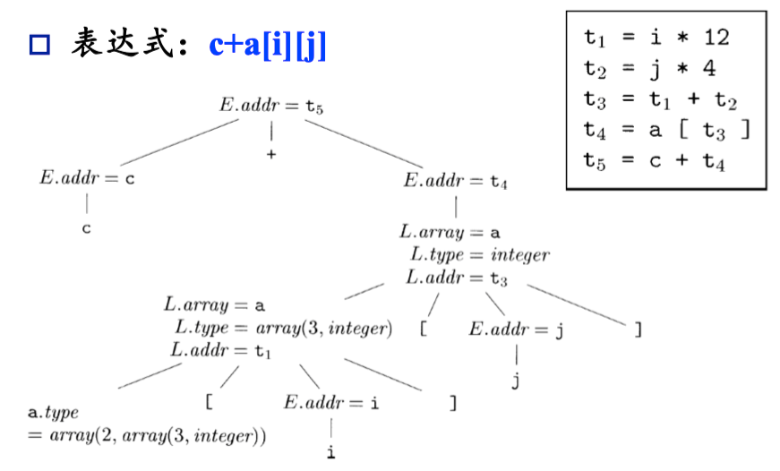
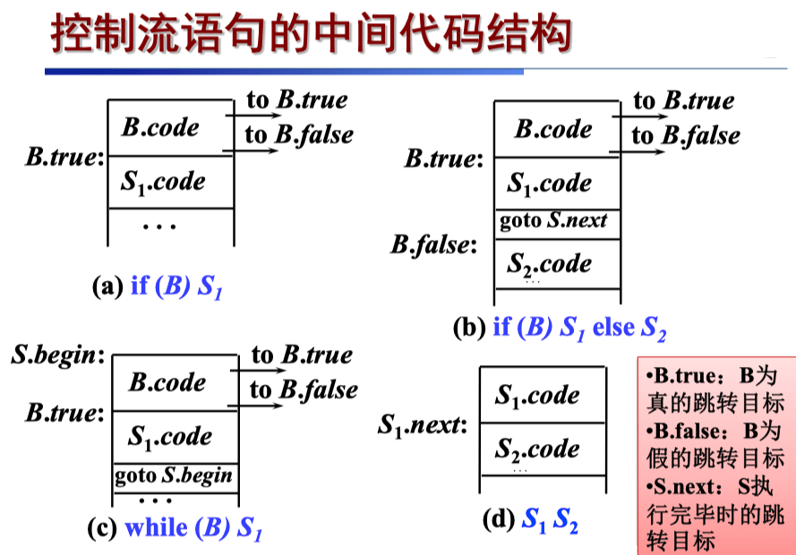

# 12 中间代码生成 II

<center>
  by <a href="https://github.com/zhuozhiyongde">Arthals</a>
  <br/>
  blog：<a href="https://arthals.ink">Arthals' ink</a>
</center>

## 生成表达式代码的 SDD

$$
\begin{array}{|ll|}
\hline
\text{产生式} & \text{语义规则} \\
\hline
S \to \text{id} = E ; & S.\text{code} = E.\text{code} \parallel \\
                      & \quad \text{gen}(\text{top.get(id.lexeme)} = E.\text{addr}) \\
\hline
E \to E_1 + E_2 & E.\text{addr} = \text{new Temp()} \\
                 & E.\text{code} = E_1.\text{code} \parallel E_2.\text{code} \parallel \\
                 & \quad \text{gen}(E.\text{addr} = E_1.\text{addr} + E_2.\text{addr}) \\
\hline
\phantom{E \to \ }| - E_1 & E.\text{addr} = \text{new Temp()} \\
                         & E.\text{code} = E_1.\text{code} \parallel \\
                         & \quad \text{gen}(E.\text{addr} = \text{“minus”} E_1.\text{addr}) \\
\hline
\phantom{E \to \ }| ( E_1 ) & E.\text{addr} = E_1.\text{addr} \\
                           & E.\text{code} = E_1.\text{code} \\
\hline
\phantom{E \to \ }| \text{id} & E.\text{addr} = \text{top.get(id.lexeme)} \\
                             & E.\text{code} = \text{“”} \\
\hline
\end{array}
$$

其中：

-   综合属性 $\text{code}$ 表示代码
-   $\text{addr}$ 表示存放表达式结果的地址（临时变量）
-   $\text{top.get}(\cdots)$ 从栈顶符号表（符号是嵌套的，可以实现为栈）开始，逐个向下寻找 $\text{id}$ 的信息
-   $\text{new} \, \text{Temp}()$ 可以生成一个临时变量
-   $\text{gen}(\cdots)$ 生成相应代码

这里实际上是一个增量式翻译，即要运算得到 `c = a + b`，先翻译出生成 `a` 和 `b` 的代码，再翻译生成 `c` 的代码。

## 数组元素

### 数组元素的寻址

#### 一维数组的寻址

假设数组元素被存放在连续的存储空间中，元素从 0 到 $n-1$ 编号，第 $i$ 个元素的地址为：

$$
\text{base} + i \cdot w
$$

其中：

-   $\text{base}$ 为数据 $A$ 的内存块的起始地址，即 $A[0]$ 的相对地址
-   $w$ 为每个数组元素的宽度
-   $\text{base}$, $w$, $n$ 的值都可以从符号表中找到

#### k 维数组的寻址

假设数组按行存放，即首先存放 $A[0][i_2]...[i_k]$，然后存放 $A[1][i_2]...[i_k]$, ...

设 $n_j$ 为第 $j$ 维的维数，$w_j$ 为第 $j$ 维的每个子数组元素的宽度，$w_k = w$ 为单个元素的宽度：

$$
\begin{aligned}
w_{k-1} &= n_k \cdot w_k = n_k \cdot w \\
w_{k-2} &= n_{k-1} \cdot w_{k-1} = n_{k-1} \cdot n_k \cdot w
\end{aligned}
$$

多维数组 $A[i_1][i_2]...[i_k]$ 的地址为：

$$
\text{base} + i_1 \cdot w_1 + i_2 \cdot w_2 + ... + i_k \cdot w_k
$$

或者：

$$
\text{base} + (((...((i_1 \cdot n_2 + i_2) \cdot n_3 + i_3)...) \cdot n_k) + i_k) \cdot w
$$

#### 多维数组的存放方法

-   行优先（一般选择）
-   列优先

求 $a[i]$ 的地址：

$$
\text{base} + (i - \text{low}) \cdot w = \text{base} - \text{low} \cdot w + i \cdot w
$$

注意，这里 $\text{low}$ 是下界，**其不一定为 0。**

### 包含数组元素的表达式文法

#### 添加新的文法产生式

1. 数组元素 $L: L \rightarrow L[E] \ | \ id[E]$
2. 以数组元素为左部的赋值 $S \rightarrow L = E$
3. 数组元素作为表达式中的因子 $E \rightarrow L$

#### 翻译方案

1. 计算偏移量：对 $L$ 的代码计算偏移量，将结果存于 $L.\text{addr}$ 所指的临时变量中。

2. 综合属性 $\text{array}$：记录相应数组的信息：元素类型，基地址等。

3. 数组元素作为因子

    - $L$ 的代码只计算了偏移量

    - 数组元素的存放地址应该根据偏移量进一步计算，即 $L$ 的数组基地址加上偏移量
    - 使用三地址指令 $x = a[i]$

4. 数组元素作为赋值左部

    - 使用三地址指令 $a[i] = x$。

$$
\begin{array}{|ll|}
\hline
\text{产生式} & \text{语义规则} \\
\hline
L \to \text{id} [ E ] & L.\text{array} = \text{top.get(id.lexeme)} \\
                      & L.\text{type} = L.\text{array.type.elem} \\
                      & L.\text{addr} = \text{new Temp()} \\
                      & \text{gen}(L.\text{addr} = E.\text{addr} * L.\text{type.width}) \\
\hline
\phantom{L \to \ }| L_1 [ E ] & L.\text{array} = L_1.\text{array} \\
                             & L.\text{type} = L_1.\text{type.elem} \\
                             & t = \text{new Temp()} \\
                             & L.\text{addr} = \text{new Temp()} \\
                             & \text{gen}(t = E.\text{addr} * L.\text{type.width}) \\
                             & \text{gen}(L.\text{addr} = L_1.\text{addr} + t) \\
\hline
E \to E_1 + E_2 & E.\text{addr} = \text{new Temp()} \\
                & \text{gen}(E.\text{addr} = E_1.\text{addr} + E_2.\text{addr}) \\
\hline
\phantom{E \to \ }| \text{id} & E.\text{addr} = \text{top.get(id.lexeme)} \\
\hline
\phantom{E \to \ }| L & E.\text{addr} = \text{new Temp()} \\
                     & \text{gen}(E.\text{addr} = L.\text{array.base} [ L.\text{addr} ]) \\
\hline
S \to \text{id} = E ; & \text{gen}(\text{top.get(id.lexeme)} = E.\text{addr}) \\
\hline
\phantom{S \to \ }| L = E ; & \text{gen}(L.\text{array.base} [ L.\text{addr} ] = E.\text{addr}) \\
\hline
\end{array}
$$

注意：

-   这里不是在算数组的类型大小，而是在算一个数组表达式的相对于基地址的偏移量。
-   $\text{addr}$ 是偏移量这一计算结果的存放地址，而不是数组的基地址，基地址应当在 $\text{array}$ 属性里面。
-   建议结合例子观察一下 $\text{type}$ 的解码顺序
-   这里省略了一些 $\text{gen}$ 的引号，请勿认为它完成了计算，这只是生成了计算的代码。

#### 例子



## 类型检查和转换

### 类型系统 (type system)

-   给每一个组成部分赋予一个类型表达式
-   通过一组逻辑规则来表示这些类型表达式必须满足的条件

设计类型系统的根本目的是用静态检查的方式来保证合法程序运行时的良行为。

### 类型检查规则

**类型综合**：根据子表达式的类型构造出表达式的类型

例如：

-   如果 $f$ 的类型为 $s \rightarrow t$ 且 $x$ 的类型为 $s$
-   那么 $f(x)$ 的类型为 $t$

**类型推导**：根据语言结构的使用方式来确定该结构的类型

例如：

-   如果 $f(x)$ 是一个表达式，$f$ 的类型为 $\alpha \rightarrow \beta$，且 $x$ 的类型为 $\alpha$
-   那么 $f(x)$ 的类型为 $\beta$
-   $\alpha, \beta$ 可以是未知类型

### 类型转换

假设在表达式 $x * i$ 中，$x$ 为浮点数、$i$ 为整数，则结果应该是浮点数

-   $x$ 和 $i$ 使用不同的二进制表示方式
-   浮点数 \* 和整数 \* 使用不同的指令
-   例如：
    -   $t_1 = (\text{float}) i$
    -   $t_2 = x \; \text{fmul} \; t_1$

处理简单的类型转换的 SDD：

$$
\begin{array}{|ll|}
\hline
\text{产生式} & \text{语义规则} \\
\hline
E \to E_1 + E_2 & \text{if } (E_1.\text{type} = \text{integer} \text{ and } E_2.\text{type} = \text{integer}) E.\text{type} = \text{integer} \\
               & \text{else if } (E_1.\text{type} = \text{float} \text{ and } E_2.\text{type} = \text{integer}) E.\text{type} = \text{float} \\
\hline
\end{array}
$$

### 类型拓宽和类型收缩

-   编译器自动完成的转换为 **隐式转换（coercion）**
-   程序员用代码指定的强制转换为 **显式转换（cast）**

### 处理类型转换的 SDT

$$
\begin{array}{|ll|}
\hline
\text{产生式} & \text{语义规则} \\
\hline
E \to E_1 + E_2 & E.\text{type} = \max(E_1.\text{type}, E_2.\text{type}); \\
               & a_1 = \text{widen}(E_1.\text{addr}, E_1.\text{type}, E.\text{type}); \\
               & a_2 = \text{widen}(E_2.\text{addr}, E_2.\text{type}, E.\text{type}); \\
               & E.\text{addr} = \text{new Temp}(); \\
               & \text{gen}(E.\text{addr} \text{ “=” } a_1 \text{ “+” } a_2); \\
\hline
\end{array}
$$

`widen` 函数用于将一个地址的值转换为指定的类型。其定义如下：

```cpp
Addr widen(Addr a, Type t, Type w) {
    if (t == w) return a;
    else if (t == integer && w == float) {
        Addr temp = new Temp();
        gen(temp '=' '(float)' a); // 就是这里发生了隐式类型转换
        return temp;
    }
    else error;
}
```

-   `max` 函数用于查找两个类型的最小公共祖先。具体实现依赖于类型系统的定义。
-   `widen` 函数生成必要的类型转换代码，并返回转换后的地址。

### 函数/运算符的重载

通过查看参数来解决函数重载问题：

$$
\begin{array}{|ll|}
\hline
\text{产生式} & \text{语义规则} \\
\hline
E \to f(E_1) & \text{if } f.\text{typeset} = \{s_i \to t_i \mid 1 \leq i \leq k\} \text{ and } E_1.\text{type} = s_k \text{ then } E.\text{type} = t_k \\
\hline
\end{array}
$$

## 控制流的翻译

布尔表达式可以用于改变控制流/计算逻辑值：

文法：

$$
B \to B \, || \, B \mid B \, \&\& \, B \mid !B \mid (B) \mid E \, \text{rel} \, E \mid \text{true} \mid \text{false}
$$

短路求值：

-   $B_1 \, || \, B_2$ 中 $B_1$ 为真时，不用计算 $B_2$，整个表达式为真。
-   $B_1 \, \&\& \, B_2$ 中 $B_1$ 为假时，不用计算 $B_2$，整个表达式为假。

短路代码通过跳转指令实现控制流的处理，逻辑运算符本身不在代码中出现。



### 控制流语句的 SDD

$$
\begin{array}{|ll|}
\hline
\text{产生式} & \text{语义规则} \\
\hline
P \to S & S.\text{next} = \text{newlabel()} \\
        & P.\text{code} = S.\text{code} \parallel \text{label}(S.\text{next}) \\
\hline
S \to \text{assign} & S.\text{code} = \text{assign.code} \\
\hline
S \to \text{if} (B) S_1 & B.\text{true} = \text{newlabel()} \\
                      & B.\text{false} = S_1.\text{next} = S.\text{next} \\
                      & S.\text{code} = B.\text{code} \parallel \text{label}(B.\text{true}) \parallel S_1.\text{code} \\
\hline
S \to \text{if} (B) S_1 \text{ else } S_2 & B.\text{true} = \text{newlabel()} \\
                                          & B.\text{false} = \text{newlabel()} \\
                                          & S_1.\text{next} = S_2.\text{next} = S.\text{next} \\
                                          & S.\text{code} = B.\text{code} \parallel \text{label}(B.\text{true}) \parallel S_1.\text{code} \\
                                          & \quad \parallel \text{gen}(\text{“goto”} S.\text{next}) \parallel \text{label}(B.\text{false}) \parallel S_2.\text{code} \\
\hline
S \to \text{while} (B) S_1 & \text{begin} = \text{newlabel()} \\
                           & B.\text{true} = \text{newlabel()} \\
                           & B.\text{false} = S.\text{next} \\
                           & S_1.\text{next} = \text{begin} \\
                           & S.\text{code} = \text{label}(\text{begin}) \parallel B.\text{code} \parallel \text{label}(B.\text{true}) \parallel S_1.\text{code} \parallel \text{gen}(\text{“goto”} \text{begin}) \\
\hline
S \to S_1 S_2 & S_1.\text{next} = \text{newlabel()} \\
              & S_2.\text{next} = S.\text{next} \\
              & S.\text{code} = S_1.\text{code} \parallel \text{label}(S_1.\text{next}) \parallel S_2.\text{code} \\
\hline
\end{array}
$$

**重点在于理解标号的顺序，明白基本块之间是怎么跳转的**，其实如果自己做完 Lab Lv6 基本上就很简单了。

### 布尔表达式控制流翻译

生成的代码执行时跳转到两个标号之一：

-   表达式的值为真时，跳转到 $B.\text{true}$。
-   表达式的值为假时，跳转到 $B.\text{false}$。

$B.\text{true}$ 和 $B.\text{false}$ 是两个继承属性，根据 $B$ 所在的上下文指向不同的位置：

-   如果 $B$ 是 if 语句的条件表达式，分别指向 then 分支和 else 分支
-   如果没有 else 分支，则 $B.\text{false}$ 指向 if 语句的下一条指令
-   如果 $B$ 是 while 语句的条件表达式，分别指向循环体的开头和循环的出口

下图的代码中同时考虑了**短路求值**：

$$
\begin{array}{|ll|}
\hline
\text{产生式} & \text{语义规则} \\
\hline
B \to B_1 || B_2 & B_1.\text{true} = B.\text{true}; B_1.\text{false} = \text{newlabel()}; \\
                 & B_2.\text{true} = B.\text{true}; B_2.\text{false} = B.\text{false}; \\
                 & B.\text{code} = B_1.\text{code} \parallel \text{label}(B_1.\text{false}) \parallel B_2.\text{code} \\
\hline
B \to B_1 \&\& B_2 & B_1.\text{true} = \text{newlabel()}; B_1.\text{false} = B.\text{false}; \\
                   & B_2.\text{true} = B.\text{true}; B_2.\text{false} = B.\text{false}; \\
                   & B.\text{code} = B_1.\text{code} \parallel \text{label}(B_1.\text{true}) \parallel B_2.\text{code} \\
\hline
B \to ! B_1 & B_1.\text{true} = B.\text{false}; B_1.\text{false} = B.\text{true}; B.\text{code} = B_1.\text{code} \\
\hline
B \to (B_1) & B_1.\text{true} = B.\text{true}; B_1.\text{false} = B.\text{false}; B.\text{code} = B_1.\text{code} \\
\hline
B \to E_1 \text{ rel } E_2 & B.\text{code} = \text{gen}(\text{“if”} E_1.\text{addr } \text{rel.op } E_2.\text{addr } \text{“goto”} B.\text{true}) \parallel \text{gen}(\text{“goto”} B.\text{false}) \\
\hline
B \to \text{true} & B.\text{code} = \text{gen}(\text{“goto”} B.\text{true}) \\
\hline
B \to \text{false} & B.\text{code} = \text{gen}(\text{“goto”} B.\text{false}) \\
\hline
\end{array}
$$

### 布尔值和跳转代码

程序中出现布尔表达式的目的也有可能就是求出它的值，例如 $x = a < b$

处理方法：首先建立表达式的语法树，然后根据表达式的不同角色来处理。

文法：

-   $S \rightarrow \text{id} = E; \ | \ \text{if (E) S} \ | \ \text{while (E) S} \ | \ S \ S$
-   $E \rightarrow E \| E \ | \ E \ \&\& \ E \ | \ E \ \text{rel} \ E \ | \ \ldots$

根据 $E$ 的语法树结点所在的位置：

-   $S \rightarrow \text{while (E) S1}$ 中的 $E$，生成跳转代码
-   $S \rightarrow \text{id} = E$，生成计算右值的代码

在写 Lab 的时候实际上是反正值肯定返回，但是怎么用（赋值还是条件跳转）就是上一级考虑的问题了。

### 回填

为布尔表达式和控制流语句生成目标代码的关键问题：**某些跳转指令应该跳转到哪里？**

例如： $\text{if (B) S}$

-   按照短路代码的翻译方法，$B$ 的代码中有一些跳转指令在 $B$ 为假时执行，
-   这些跳转指令的目标应该跳过 $S$ 对应的代码。生成这些指令时，$S$ 的代码尚未生成，因此目标不确定
-   如果通过语句的继承属性 $\text{next}$ 来传递，**当中间代码不允许符号标号时，则需要第二趟处理。**

#### 回填的基本思想

1. 记录 $B$ 的代码中跳转指令 $\text{goto S.next}$，$\text{if ... goto S.next}$ 的位置，但是不生成跳转目标
2. 这些位置被记录到 $B$ 的综合属性 $B.\text{falseList}$ 中
3. 当 $S.\text{next}$ 的值已知时（即 $S$ 的代码生成完毕时），把 $B.\text{falseList}$ 中的所有指令的目标都填上这个值

#### 回填技术

-   生成跳转指令时暂时不指定跳转目标标号，而是使用列表记录这些不完整的指令
-   等知道正确的目标时再填写目标标号
-   **每个列表中的指令都指向同一个目标**，列表包括：$\text{truelist}$, $\text{falselist}$, $\text{nextlist}$

### 布尔表达式的回填翻译

$$
\begin{array}{|ll|}
\hline
\text{产生式} & \text{语义规则} \\
\hline
B \to B_1 || M B_2 & \text{backpatch}(B_1.\text{falselist}, M.\text{instr}); \\
                  & B.\text{truelist} = \text{merge}(B_1.\text{truelist}, B_2.\text{truelist}); \\
                  & B.\text{falselist} = B_2.\text{falselist}; \\
\hline
B \to B_1 \&\& M B_2 & \text{backpatch}(B_1.\text{truelist}, M.\text{instr}); \\
                    & B.\text{truelist} = B_2.\text{truelist}; \\
                    & B.\text{falselist} = \text{merge}(B_1.\text{falselist}, B_2.\text{falselist}); \\
\hline
B \to ! B_1 & B.\text{truelist} = B_1.\text{falselist}; \\
            & B.\text{falselist} = B_1.\text{truelist}; \\
\hline
B \to (B_1) & B.\text{truelist} = B_1.\text{truelist}; \\
            & B.\text{falselist} = B_1.\text{falselist}; \\
\hline
B \to E_1 \text{ rel } E_2 & B.\text{truelist} = \text{makelist(nextinstr)}; \\
                         & B.\text{falselist} = \text{makelist(nextinstr + 1)}; \\
                         & \text{emit}(\text{“if”} E_1.\text{addr } \text{rel.op } E_2.\text{addr } \text{“goto” } B.\text{true}); \\
                         & \text{emit}(\text{“goto”} B.\text{false}); \\
\hline
M \to \varepsilon & M.\text{instr} = \text{nextinstr}; \\
\hline
B \to \text{true} & B.\text{truelist} = \text{makelist(nextinstr)}; \\
                 & \text{emit}(\text{“goto”} B.\text{true}); \\
                 & B.\text{falselist} = \text{null}; \\
\hline
B \to \text{false} & B.\text{falselist} = \text{makelist(nextinstr)}; \\
                 & \text{emit}(\text{“goto”} B.\text{false}); \\
                 & B.\text{truelist} = \text{null}; \\
\hline
\end{array}
$$

**首先注意：所有的语义规则都是在产生式末尾，这个表省略了大括号（后同），此时，你即将规约回产生式头，而且拥有了所有产生式体的属性（此时他们是综合属性），所以可以随便用了。**

这里，引入两个综合属性：

-   `truelist`：包含跳转指令（位置）的列表，这些指令在取值 `true` 时执行
-   `falselist`：包含跳转指令（位置）的列表，这些指令在取值 `false` 时执行

辅助函数包括：

-   `makelist(i)`：构造一个列表
-   `merge(p1, p2)`：合并两个列表
-   `backpatch(p, i)`：用 i 回填 p 指向的语句列表中的跳转语句的跳转地址

大概讲一下，以第一个产生式 $B \to B_1 || M B_2$ 为例：

1. 当展开此步的时候，我们已经知道了当 $B_1$ 为假时，会继续判断 $B_2$，所以可以用 $M.\text{instr}$ 回填 $B_1.\text{falselist}$
2. 但是此时还没有生成 $B_2$ 的代码，我们不知道 $B_1$ 为真的时候应该跳多远才能跳过 $B_2$，所以先把 $B_1.\text{truelist}$ 和 $B_2.\text{truelist}$ 合并，得到 $B.\text{truelist}$，这意味着如果二者任一为真，就代表 $B$ 为真，在回填 $B.\text{truelist}$ 的时候，也就可以回填到 $B_1.\text{truelist}$ 和 $B_2.\text{truelist}$
3. 当然，如果 $B_2$ 为假（这隐含我们已经判断到了 $B_2$，也即 $B_1$ 为假），那么 $B$ 也为假，所以 $B.\text{falselist}$ 就是 $B_2.\text{falselist}$

### 控制流语句的回填翻译

$$
\begin{array}{|ll|}
\hline
\text{产生式} & \text{语义规则} \\
\hline
S \to \text{if} (B) \ M_1 \ S_1 \ N \ \text{else} \ M_2 \ S_2 & \text{backpatch}(B.\text{truelist}, M_1.\text{instr}); \\
& \text{backpatch}(B.\text{falselist}, M_2.\text{instr}); \\
& \text{temp} = \text{merge}(S_1.\text{nextlist}, N.\text{nextlist}); \\
& S.\text{nextlist} = \text{merge}(\text{temp}, S_2.\text{nextlist}); \\
\hline
S \to \text{if} (B) \ \text{then} \ M \ S_1 & \text{backpatch}(B.\text{truelist}, M.\text{instr}); \\
                                          & S.\text{nextlist} = \text{merge}(B.\text{falselist}, S_1.\text{nextlist}); \\
\hline
N \to \varepsilon & N.\text{nextlist} = \text{nextinstr}; \\
& \text{emit}(\text{“goto”\_\_\_\_}); /* 稍后回填 */ \\
\hline
M \to \varepsilon & M.\text{instr} = \text{nextinstr}; \\
\hline
S \to \text{while} \ M_1 \ (B) \ \text{do} \ M_2 \ S_1 & \text{backpatch}(S_1.\text{nextlist}, M_1.\text{instr}); \\
                                                    & \text{backpatch}(B.\text{truelist}, M_2.\text{instr}); \\
                                                    & S.\text{nextlist} = B.\text{falselist}; \\
                                                    & \text{emit}(\text{“goto”} M_1.\text{instr}); \\
\hline
S \to \{ L \} & S.\text{nextlist} = L.\text{nextlist}; \\
\hline
S \to A & S.\text{nextlist} = \text{null}; \\
\hline
L \to L_1 \ M \ S & \text{backpatch}(L_1.\text{nextlist}, M.\text{instr}); \\
                 & L.\text{nextlist} = S.\text{nextlist}; \\
\hline
L \to S & L.\text{nextlist} = S.\text{nextlist}; \\
\hline
\end{array}
$$

和之前大差不差。

### Break 和 Continue 语句的处理方法

Break 语句：

-   追踪外围语句 $S$
-   生成一个跳转指令坯
-   将这个指令坯的位置加入到 $S.\text{nextlist}$ 中

跟踪的方法：

-   在符号表中设置 $\text{break}$ 条目，令其指向外围语句
-   在符号表中设置指向 $S.\text{nextlist}$ 的指针，然后把这个指令坯的位置直接加入到 $\text{nextlist}$ 中

### Switch 语句的生成式

为了构造 `switch` 语句的翻译方案，设置一个队列变量 $q$

$q$ 的元素是记录，包含 $c$（condition） 和 $d$（destination） 两个成员，分别用于存储 `case` 后面的常量值 $v$ 和各语句串中间代码第一个三地址语句地址，以便生成 `test` 后面的条件转移语句时使用

### Switch 语句的翻译方案

$$
\begin{array}{|ll|}
\hline
\text{产生式} & \text{语义规则} \\
\hline
S \rightarrow \text{switch} (E) H \{ M \, \text{default}:F \, L \} & S.\text{nextlist} = \text{merge}(M.\text{nextlist}, L.\text{nextlist}, \text{makelist}(\text{nextinstr})) \\
& \text{emit}(\text{`goto-'}) \\
& \text{backpatch}(H.\text{list}, \text{nextinstr}) \\
& \text{for t in } q: \\
& \quad \text{gen}(\text{`if'} \, E.\text{addr } \text{`==' } t.c \, \text{`goto' } t.d) \\
& \text{emit}(\text{`goto' } F.\text{instr}) \\
\hline
H \rightarrow \varepsilon & \text{set q as } \varnothing \\
& H.\text{list} = \text{makelist}(\text{nextinstr}) \\
& \text{emit}(\text{`goto-'}) \\
\hline
F \rightarrow \varepsilon & F.\text{instr} = \text{nextinstr} \\
\hline
M \rightarrow \text{case} \, C:F \, L & t.c = C.\text{val} \\
& t.d = F.\text{instr} \\
& \text{insert } t \, \text{into } q \\
& M.\text{nextlist} = \text{merge}(L.\text{nextlist}, \text{makelist}(\text{nextinstr})) \\
& \text{emit}(\text{`goto-'}) \\
\hline
M \rightarrow M_1 \, \text{case} \, C:F \, L & t.c = C.\text{val} \\
& t.d = F.\text{instr} \\
& \text{insert } t \, \text{into } q \\
& M.\text{nextlist} = \text{merge}(M_1.\text{nextlist}, L.\text{nextlist}, \text{makelist}(\text{nextinstr})) \\
& \text{emit}(\text{`goto-'}) \\
\hline
L \rightarrow S & L.\text{nextlist} = S.\text{nextlist} \\
\hline
L \rightarrow L_1 \, F \, S & \text{backpatch}(L_1.\text{nextlist}, F.\text{instr}) \\
& L.\text{nextlist} = S.\text{nextlist} \\
\hline
\end{array}
$$

### For 循环的翻译方案

（来自 22 年往年题）

$$
\begin{array}{|ll|}
\hline
\text{产生式} & \text{语义规则} \\
\hline
S \to \text{for} \ (S_1 \ M_1 \ ; B ; \ M_2 \ S_2) \ N \ S_3 & \text{backpatch}(B.\text{truelist}, N.\text{instr}); \\
& \text{backpatch}(N.\text{nextlist}, M_1.\text{instr}); \\
& \text{backpatch}(S_1.\text{nextlist}, M_1.\text{instr}); \\
& \text{backpatch}(S_2.\text{nextlist}, M_1.\text{instr}); \\
& \text{backpatch}(S_3.\text{nextlist}, M_2.\text{instr}); \\
& \text{emit}(\text{“goto”} \ M_2.\text{instr}); \\
& S.\text{nextlist} = B.\text{falselist}; \\
\hline
M \to \varepsilon & M.\text{instr} = \text{nextinstr}; \\
\hline
N \to \varepsilon & N.\text{nextlist} = \text{makelist}(\text{nextinstr}); \\
& \text{emit}(\text{“goto”} \ \_\_\_\_); \\
& N.\text{instr} = \text{nextinstr}; \\
\hline
\end{array}
$$
注意这里，$B$ 默认是非顺序执行，一定跳转的，所以 $M_2$ 的位置不是 $N$，而 $S_2$ 默认接下来是顺序执行的，所以后面要跟个 $\text{goto}$。
