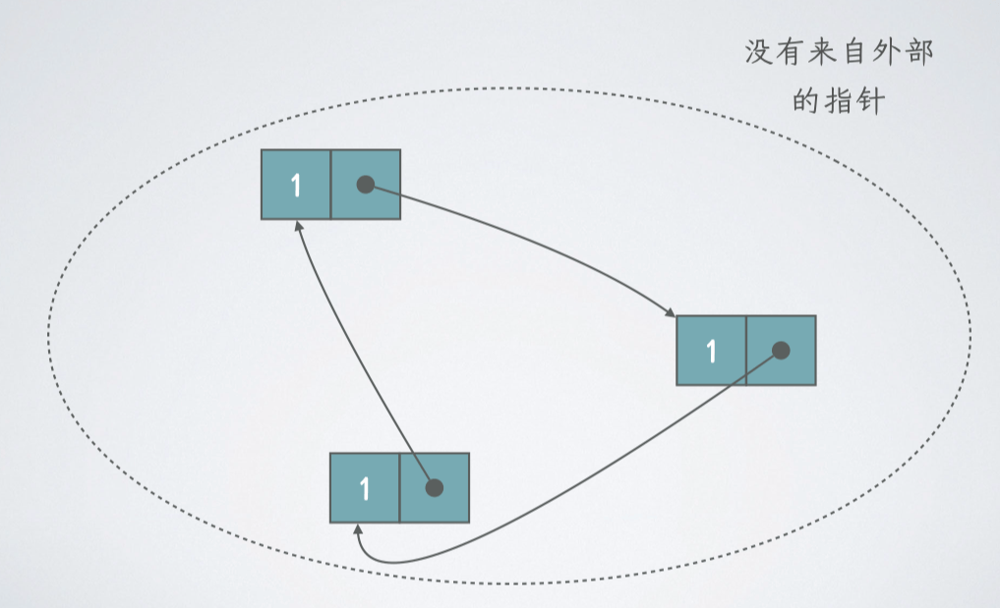
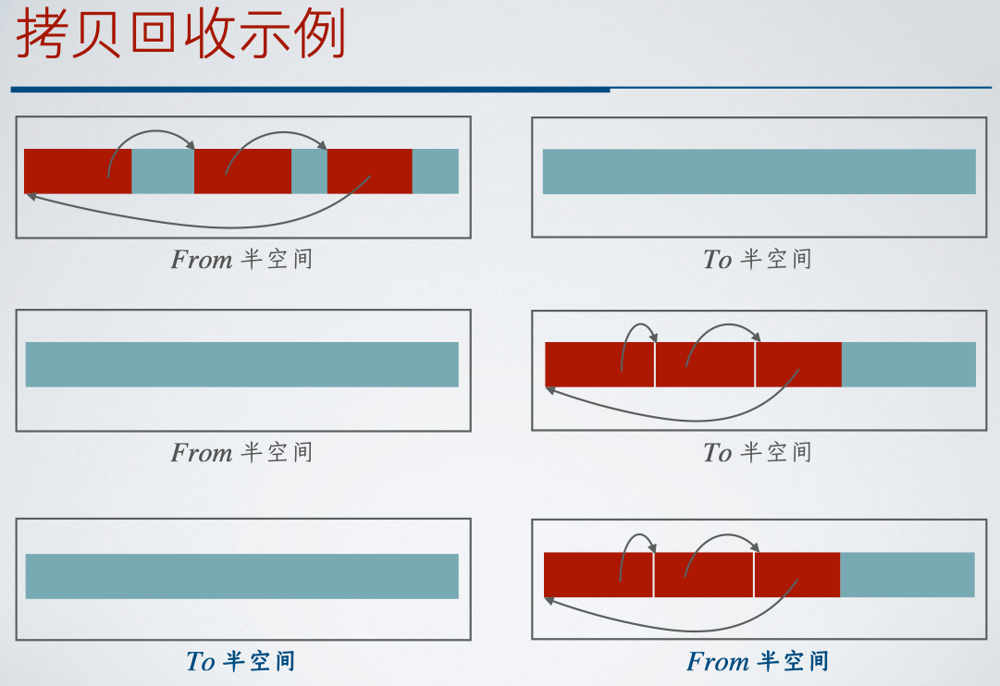

# 13 运行时环境

<center>
  by <a href="https://github.com/zhuozhiyongde">Arthals</a>
  <br/>
  blog：<a href="https://arthals.ink">Arthals' ink</a>
</center>

## 运行时环境的作用

运行时环境的主要作用是实现 **存储组织** 和 **过程抽象**

问题：运行时环境需要考虑源语言本身的特性

可执行文件 = 源程序代表的计算 + 通过体系结构 / 操作系统接口实现的运行时环境

虚拟机实现的接口：

-   `vm_get(name)`
-   `vm_set(name, value)`
-   `vm_param(value)`
-   `vm_call(name, nargs)`
-   `vm_ret(value)`

其中，`vm` 是 Virtual Machine（虚拟机）的缩写，后缀是三地址代码的指令。

### 基础示例


其实就是 Lab 那个 Koopa IR 的作用，翻译成与具体运行环境无关的代码。

-   体系结构和操作系统提供了非常底层的操作
-   运行时环境用这些操作来实现数据存储和过程调用

主要要关注一下状态：

-   `pc`：程序计数器，指向当前执行的指令
-   `ra`：返回地址，return address
-   `a0`：返回值
-   `st`：参数栈，调用 `vm_param` 时，参数入栈

## 运行时环境的设计

**存储组织**：在代码生成前，编译器需要进行 **目标运行环境的设计** 和 **数据空间的分配**。

编译器在操作系统 / 虚拟机规定的区域中存储生成的目标代码与代码运行时的数据空间

> 比如 RISC-V 中：
>
> -   `.text` 段存储代码
> -   `.data` 段存储全局变量等

**区分程序的编译时刻和运行时刻**：

-   **编译时刻**：对应静态分配
    -   编译器通过程序文本即可做出分配决定
    -   例如：常量、全局变量、静态变量（C 中的 `static` 变量）
-   **运行时刻**：对应动态分配
    -   程序在运行过程中才能做出分配决定
    -   例如：局部变量、动态变量（C 中的 `malloc` 函数分配的数据）

注意：静态确定的存储空间大小并 **不意味** 静态分配（可以动态分配，回顾 ICS，其中有个 `.bss` 段节省空间）

很多时候空间大小可以由类型信息得出

### 纯静态存储分配

定义：所有分配决定都在编译时得到。

-   优点：不需要运行时的支持，可以做分时复用优化
-   缺点：不支持递归调用过程（过程调用次数不能静态确定），不能动态建立数据结构

实例：Fortran 语言。

### 动态存储分配

-   栈式存储管理：随着过程调用分配，值与过程的生命周期相同，局部栈上自动变量
-   堆式存储管理：不完全随过程调用分配，值的生命周期可能比过程更长， `malloc` 完不 `free`

### 栈式存储管理

活动树：表示程序运行的所有过程

-   一个节点：一个过程活动
-   根节点：主过程／入口过程
-   前序遍历：得到过程调用的顺序
-   后序遍历：得到过程返回的顺序

#### 活动记录

活动记录 / 栈帧：地址连续的一个存储块。

一次活动：子程序 / 过程 / 函数的一次执行。

结构：

-   实际参数：通常放在寄存器里，但有时放不下
-   返回值：通常放在寄存器里，但是不绝对
-   控制链：指向调用者的活动记录
-   访问链：用于定位别处（非本活动记录）的某个数据
-   保存的机器状态：此次调用前的信息，如返回地址
-   局部数据：该过程的局部变量
-   临时变量：中间代码 / 目标代码生成产生的临时值

注意，这里与 Linux 栈帧不太一样，压栈的参数是被调用者活动记录的一部分，而不是调用者的。

布局：


#### 访问链与控制链

-   **访问链**：指向过程中要访问的 **非局部数据** 所在的活动记录，用于查找符号 / 过程定义
-   **控制链**：指向调用者的活动记录，用于找到当前活动的调用者，是活动树的一条有效路径

**注意区分定义和调用**：

-   访问链：管的是定义，是某变量 / 函数在源代码中出现的顺序 / 层级组织
-   控制链：管的是调用，是活动的调用顺序

再重复一遍：

-   沿访问链找定义
-   沿控制链找上级活动（过程）

#### 活动记录指针


-   `ARP` 在活动记录开始位置的高地址下定长，存 **固定长度** 信息，类比 `rbp`
-   `TOP` 就是栈顶指针，**可变长度**，类比 `rsp`

恢复：

-   `ARP`：控制链存在 ARP，恢复的时候从这里找到调用者的指针，恢复 ARP。
-   `TOP`：以 ARP + 活动记录起始的固定长度赋值即可。

注意，这里 `ARP` 指针以上虽然属于被调用者栈帧，但是是由调用者创建的。

### 静态作用域

**静态作用域**：也称词法（lexical）作用域，非局部名字的绑定在过程被 **定义时决定**。典型实例如 PASCAL 语言。

#### 访问链法

人话：沿着 **访问链** 找到定义所在位置

假设嵌套深度为 $m$ 的过程 $q$ 调用嵌套深度为 $n$ 的过程 $p$：

-   情况 $m < n$：

    -   $p$ 直接声明在 $q$ 中，也就是说 $m + 1 = n$
    -   将 $p$ 的访问链指向 $q$ 的活动记录

-   情况 $m \ge n$：
    -   $q$ 和 $p$ 的嵌套深度从 1 到 $n-1$ 的外围过程是相同的
    -   追踪 $q$ 的访问链 $m - n + 1$ 步，到达直接包含 $p$ 的过程 $r$ 的最近的活动记录
    -   将 $p$ 的访问链指向这个 $r$ 的活动记录

#### 显示表法

人话：访问链法太慢了，还要挨个找链表，但是我们知道活动调用自然形成了一个递增的深度顺序，所以我们利用这个，做一个指针表。

**显示表（display）**：运行时环境维护一个数组 $d$，为每个嵌套深度记录一个指针。

-   指针 $d[i]$ 指向最近的嵌套深度为 $i$ 的活动记录
-   如果过程 $p$ 在运行中访问嵌套深度为 $i$（静态可确定）的过程 $q$ 的数据，则可以通过 $d[i]$ 找到 $q$ 的活动记录
-   使用显示表可以提高效率，访问开销是常数


#### 过程作为参数传递

当一个过程 $p$ 作为参数传递给另一个过程 $q$，并且 $q$ 随后调用了这个参数时，有可能 $q$ 并不知道 $p$ 的上下文。

方法：调用者把 $p$ 作为参数传递时，**同时传递其访问链。**

问题：栈式管理下，访问链指向的活动记录有可能不在栈中，如下例。

```python
def M(x):
    def R(y):
        i, j, k = 0, 0, 0
        def P(z):
            return i + j + k + z
        return P
    f = R(1)
    return f(2)
print(M(3))
```

发生 `return P` 时，`R` 就从活动记录的栈中扔掉了，再以其结果 `f` 调用的时候，就找不到定义 `P` 的记录 `R` 了。


解决办法：

1. 完全在堆中分配和管理活动记录，从而延长生命周期
2. 闭包

##### 闭包

发生上述情况的 “逃逸” 时，运行时在堆上分配空间，存储需要的外层函数的局部数据。


这样，在 `R` 没了的时候，调用 `P` 依旧能找到 `R` 的东西。

### 动态作用域

**动态作用域**：非局部名字的绑定在过程被 **调用时决定**。

被调用者的非局部名字 `a` 和其调用者中使用 **相同** 的存储单元，此时静态无法确定，只能在运行时确定。

用得少，**运行时环境为每个名字维护一个全局的作用域栈。**

### 比较


-   动态作用域：
    -   调用 `dynamic->small->show`，在 `show` 里要找 `r` 的时候，沿着控制流往上找，在 `small` 里找到，输出 `0.125`
    -   若直接调用 `dynamic->show`，则在 `dynamic` 里找到，输出 `0.250`
-   静态作用域：只要是调用 `show`，就沿着访问链往上找（这是静态的过程），所以无论在哪里调用 `show`，都输出 `0.250`

## 运行时环境实现

过程抽象主要需要考虑如何创建和维护活动记录，**生成目标代码需要与操作系统和体系结构一致。**

总体策略：

-   调用代码序列：precall（预调用）和 prologue（序言）
-   返回代码序列：epilogue（尾声）和 postreturn（后返回）

### 过程链接

-   调用代码序列：分配空间，填写记录信息

    分为 precall 和 prologue

-   返回代码序列：释放记录，恢复状态，继续执行

    分为 epilogue 和 postreturn

分割方案的权衡：

-   调用者工作多：代码较长，因为每次调用都需要重复生成
-   被调用者工作多：冗余存储操作，如考虑被调用者保存寄存器

#### 调用代码序列设计

调用者 precall

-   计算实际参数值，存入记录
-   保存状态信息（caller-saved）
-   更新 `ARP` 指针

被调用者 prologue

-   保存状态信息（如 callee-saved 寄存器）
-   初始化局部数据并执行

#### 返回代码序列设计

被调用者 epilogue

-   设置返回值
-   恢复 `ARP` 和状态（callee-saved）
-   转移到调用者代码

调用者 postreturn

-   获取返回值
-   恢复状态（caller-saved）

### 堆式存储管理

基本上就是 Malloclab 那一套，需要合理分配 / 回收堆区空间。

要注意的问题包括：

-   内存泄漏
-   悬空指针解引用

### 垃圾回收

类型不安全的语言（比如 C 和 C++）不适合使用垃圾回收

主要依赖于可达性分析。

### 可达性分析

**根集（rootset）**：不需要指针解引用就可以直接访问的数据，如静态字段成员

**可达性（reachability）**：

-   根集中的成员指向的对象都是可达的
-   对于任意一个对象，如果指向它的一个指针被保存在可达对象的某字段中，那么这个对象也是可达的

性质：**一个对象一旦变得不可达，它就不会再变成可达的**

#### 改变可达对象集合的操作

1. **对象分配**：返回一个指向新存储块的指针。
2. **参数传递 / 返回值**：对象指针从实在参数传递到形式参数 / 从返回值传递给调用者。
3. **引用赋值**：对于指针 $u$ 和 $v$，赋值 $u = v$ 将 $u$ 指向 $v$ 指向的对象，可能使得 $u$ 原来指向的对象变得不可达，并递归使得更多对象不可达。
4. **过程返回**：活动记录出栈，局部变量从根集中移除，可能使得一些对象变得不可达。

### 垃圾回收算法

基本思想：寻找不可达的对象。

两种基本方法：

1. 跟踪相关操作，捕获对象变得不可达的时刻，回收对象占用的空间。

    典型例子：基于引用计数的垃圾回收。

2. 在需要时，标记出所有可达对象，然后回收其他对象。

    典型例子：基于跟踪的垃圾回收。

#### 基于引用计数的垃圾回收器

每个对象有一个用于存放 **引用计数** （reference counting）的字段，并按照如下方式维护：

1. **对象分配**：引用计数设为 1。
2. **参数传递**：引用计数加 1。
3. **引用赋值**：对于 $u = v$，$u$ 指向的对象引用计数减 1，$v$ 指向的对象引用计数加 1。
4. **过程返回**：每个局部变量指向对象的引用计数减 1。


问题是会导致循环垃圾：



循环垃圾的解决方法：**弱引用**，程序员手动声明一些指针不影响引用计数。

##### 基于引用计数的垃圾回收器总结

优点：

-   **以增量方式完成**，可以避免长时间停顿
-   垃圾可以被及时回收
-   易于实现
-   可以与其它存储管理机制结合

缺点：

-   空间代价：每个对象都要保存引用计数
-   时间代价：每次指针更新都要做多次检查和修改
-   循环数据结构会造成内存泄漏

#### 标记 - 清扫式垃圾回收

以周期性的方式运行，在空闲空间耗尽或者低于某个阈值时启动，寻找不可达对象并回收其空间。

分成两个阶段：

1. **标记**：从根集开始，跟踪并标记出所有可达对象
2. **清扫**：遍历整个堆区，释放不可达对象

如果我们把数据对象看作顶点，指向关系看作有向边，那么标记的过程实际上是从根集开始的图遍历的过程


##### 算法优化

当前问题：基本算法需要扫描整个堆区

优化：用一个列表记录所有已经分配的对象不可达对象等于已分配对象去掉可达对象

-   优点：只需要扫描这个列表就可以完成清扫
-   缺点：需要维护这个额外的列表

##### 标记 - 压缩式垃圾回收

对可达对象进行重定位（relocating）可以消除存储碎片

把可达对象移动到堆区的一端，另一端则是空闲空间空闲空间接合成单一块，更容易存储较大的对象提高应用程序的时间局部性和空间局部性

整个过程分成三个步骤：

1. **标记**：从根集开始，跟踪并标记出所有可达对象
2. **计算新地址**：计算可达对象的新地址
3. **移动对象并更新其中的指针**：移动可达对象并更新其中的指针

因为对象的位置发生改变，所以所有的指针都可能需要更新。


##### 标记 - 清扫式垃圾回收小结

优点

-   基本没有空间代价（一个内存块只需要若干个二进制位）
-   可以正确处理循环数据结构

缺点

-   应用程序必须全面停顿，不适用于实时系统
-   可能会造成堆区的碎片化

改善措施

-   可以采用 **增量式回收** 或 **部分回收** 来改善
-   可以用 **标记并压缩** 来解决

实际中可以同时使用 **引用计数** 和 **标记 - 清扫**

#### 拷贝回收器

标记并压缩的问题：压缩时需要扫描整个堆区

**拷贝回收器**：堆区空间被分为两个 **半空间** （semispace）

-   From 半空间：在这里分配内存
-   To 半空间：拷贝可达对象到这里

策略：

-   在 From 半空间里分配内存，当其填满后，开始垃圾回收
-   回收时，把可达对象拷贝到 To 半空间
-   回收完成后，把两个半空间的角色对换，应用程序继续



#### 世代垃圾回收器

设计原因：大多数对象生命周期都很短

策略：

-   把堆区分成 **不同的年龄区域** （代表不同的世代），对比较年轻的区域进行更加频繁的垃圾回收
-   在一个回收周期内不用跟踪所有的内存单元
-   周期性地对 “较老” 的区域进行回收
