# 14 目标代码生成

<center>
  by <a href="https://github.com/zhuozhiyongde">Arthals</a>
  <br/>
  blog：<a href="https://arthals.ink">Arthals' ink</a>
</center>

## 目标机模型

-   类 RISC 计算机，按字节寻址，以 4 个字节为 1 个字（word）
-   通用寄存器 $R_1, R_2, ⋯, R_n$
-   使用如下机器指令，每条指令的长度为 8 字节：

    -   $\text{LD} \; \text{dst}, \text{addr}$：把位置 $\text{addr}$ 上的值加载到位置 $\text{dst}$（load）

        $\text{LD} \; r_1, r_2$：寄存器到寄存器的拷贝

    -   $\text{ST} \; x, r$：把寄存器 $r$ 中的值保存到位置 $x$（store）
    -   $\text{OP} \; \text{dst}, \text{src}_1, \text{src}_2$：把位置 $\text{src}_1$ 和 $\text{src}_2$ 中的值运算后将结果放到位置 $\text{dst}$ 中（operation）

        $\text{OP}$ 是诸如 $\text{ADD}$ 或 $\text{SUB}$ 的运算符

    -   $\text{BR} \; L$：控制流转向标号为 $L$ 的指令（branch）
    -   $\text{Bcond} \; r, L$：对寄存器 $r$ 中的值进行测试，如果为真则转向标号 $L$（branch condition）

        $\text{cond}$ 是诸如 LTZ（判断是否小于 0）或 NEZ（判断是否不等于 0）的常见测试

### 目标机的寻址模式

-   `contents(addr)` 表示 `addr` 所代表的位置中的内容
-   `lvalue(x)` 表示分配给变量 `x` 的内存位置

| 位置形式       | 汇编表示 | 地址                        |
| -------------- | -------- | --------------------------- |
| 变量名         | `x`      | `lvalue(x)`                 |
| 数组索引       | `a(r)`   | `lvalue(a) + contents(r)`   |
| 直接常数       | `#M`     | `M`                         |
| 寄存器         | `r`      | `r`                         |
| 间接寄存器     | `*r`     | `contents(r)`               |
| 索引           | `M(r)`   | `M + contents(r)`           |
| 间接寄存器索引 | `*M(r)`  | `contents(M + contents(r))` |

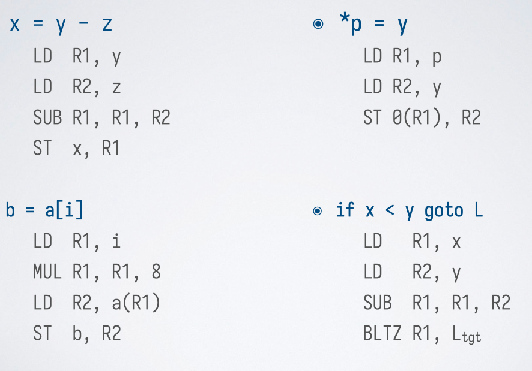

### 进行栈式管理的目标代码

生成支持栈式存储管理的目标代码：

-   生成过程调用和返回的目标代码序列
-   将 IR 中的名字转换成为目标代码中的地址

简化调用 / 返回的三地址代码：

-   `call callee`
-   `return`

过程 `callee` （被调用者）的属性（编译时确定）：

-   `callee.codeArea`：运行时代码区中 `callee` 的第一条指令的地址
-   `callee.recordSize`：`callee` 的一个活动记录的大小

### 过程的调用和返回

简化场景下的活动记录：

-   只需考虑在活动记录中保存返回地址
-   假设寄存器 `SP` 中维持一个指向栈顶的指针

#### 调用指令序列

调用者

-   `ST -4(SP), #here + 16`：计算返回地址，当前指令地址加上 16（偏移掉 2 条指令，即当前 ST 和下一条 BR），地址是 4 字节的（32 位）
-   `BR callee.codeArea`：跳转到被调用者的代码

被调用者

-   `SUB SP, SP, #callee.recordSize`：为活动记录分配空间

#### 返回指令序列

被调用者

-   `ADD SP, SP, #callee.recordSize`：释放活动记录
-   `BR *-4(SP)`：跳转到返回地址

## 指令选择

### 控制流图

基础定义：

1. **基本块（Basic Block）**：一个基本块是一段没有分支和跳转的连续代码。换句话说，它是一个入口和一个出口之间的代码段，只有在入口处进入，并且在出口处离开。

    具有线性结构，**其中最后一条语句为跳转或者过程 / 函数返回** （br /jump/ret）。

2. **控制流图（Control Flow Graph, CFG）**：控制流图是由基本块作为节点，控制流作为边构成的有向图。它展示了程序执行的所有可能路径。

    有向图，图中结点为基本块，边为控制流跳转。控制流只能从基本块的第一条指令进入。

示例代码：

```c
n = 10; a = 1; b = 1;
while (!(n == 0)) {
    t = a + b; a = b; b = t;
    n = n - 1;
}
return a;
```

对应的控制流图：

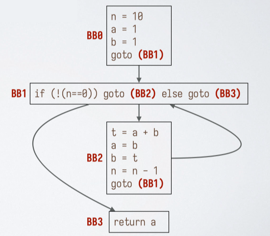

### 控制流图 + 三地址代码

**三地址代码**：控制流图的每个基本块内部为三地址代码。

-   跳转指令的目标为基本块（而不是指令标号）。
-   一种常见的 **混合 IR**。
-   上图 BB1 的指令并不完全是三地址形式，因为（BB2）和（BB3）都不是真实指令标号。

### 控制流图中的循环

**循环的定义**：

-   一个 **结点集合** $L$
-   存在一个 **循环入口** （loop entry）结点，唯一的前驱可以在 $L$ 之外的结点
-   每个结点都有到达入口结点的非空路径，且该路径都在 $L$ 中

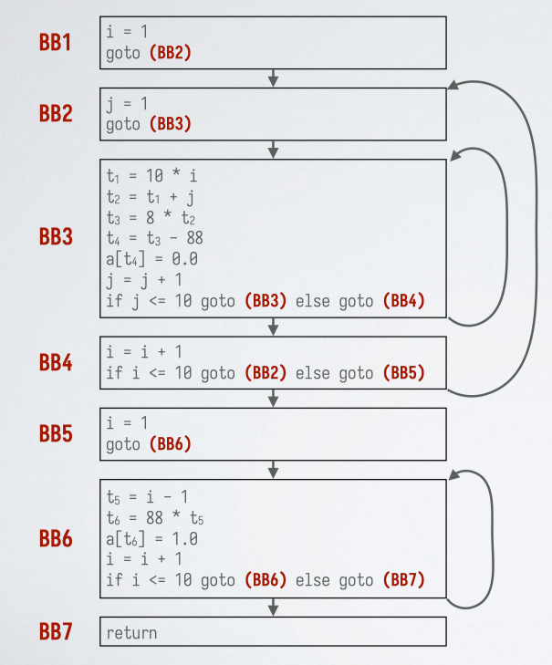

对应的控制流图中的循环：

-   循环 1：$\{BB3\}$
-   循环 2：$\{BB6\}$
-   循环 3：$\{BB2, BB3, BB4\}$（BB2 为入口结点）

### 划分基本块的算法

输入：三地址指令序列。

输出：基本块的列表。

方法：

1. 确定 **首指令** （leader，基本块的第一条指令）：
    - 第一条三地址指令。
    - 任何一个条件或无条件跳转指令的 **目标指令**。
    - 紧跟在一个条件或无条件跳转指令 **之后的指令**。
2. 确定基本块：每条首指令对应一个基本块：从首指令开始到下一个首指令。

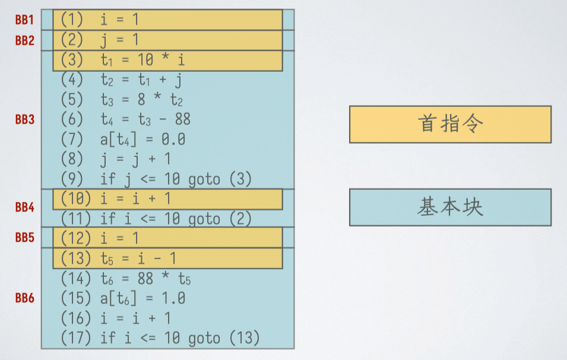

基于三地址跳转指令的流图：两个基本块 $B$ 和 $C$ 之间存在一条有向边当且仅当基本块 $C$ 的第一条指令可能在 $B$ 的最后一条指令之后执行。

-   情况 1：$B$ 的结尾跳转到 $C$ 的开头。
-   情况 2：$B$ 的结尾不是无条件跳转，且 $C$ 在原来的序列中紧跟 $B$ 之后。

可以额外添加 **入口（entry）和出口（exit）结点**，这些结点不包含指令。

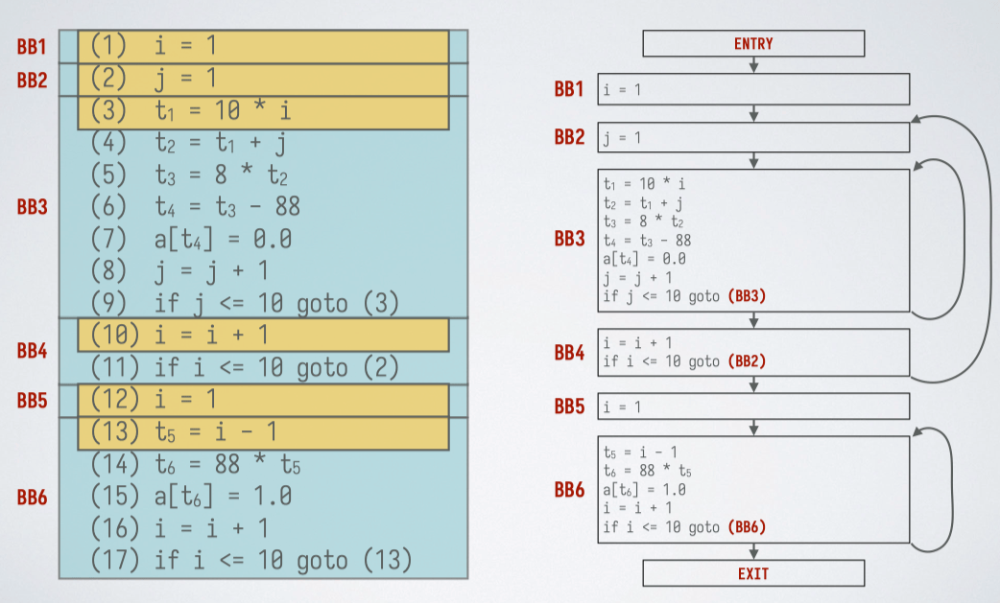

## 指令选择

**主要问题：最大限度地利用寄存器**，减少与内存交互的加载与保存。

代码生成算法的基本思想：

**生成机器指令的规则**：

-   只有当运算分量（参与计算的变量或常数）不在寄存器中，才从内存载入
-   尽量保证只有当寄存器中的值不被使用时，才把它覆盖掉（延迟到最后一刻）

记录各个值对应的位置的数据结构：

-   寄存器描述符（register descriptor）
    -   **为每个寄存器维护**，key 为寄存器名 $R_n$，value 为变量名
    -   跟踪哪些变量的当前值放在该寄存器内
-   地址描述符（address descriptor）
    -   **为每个程序变量维护**，key 为变量名 $a,b,\cdots$，value 为变量名或寄存器名
    -   跟踪哪些位置（寄存器、栈中位置等）可以找到该变量的当前值

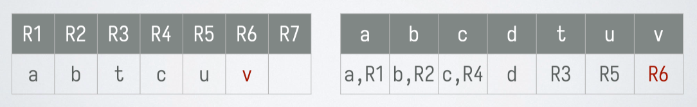

### 三地址指令生成

#### 代码语句

$x = y \; \text{op} \; z$

1. 调用 $\text{getReg}(x = y \; \text{op} \; z)$，给 $x, y, z$ 选择寄存器 $R_x, R_y, R_z$。
2. 查 $R_y$ 的寄存器描述符，如果 $y$ 不在 $R_y$ 中则生成指令 $\text{LD} \; R_y, y'$，其中 $y'$ 是某个存放了 $y$ 的值的内存位置。
3. 对 $z$ 做与上述类似的处理。
4. 生成指令 $\text{OP} \; R_x, R_y, R_z$，其中 $\text{OP}$ 对应 $\text{op}$（比如 $\text{ADD}$ 对应 `+`）。
5. 更新寄存器和地址描述符。

$x = y$

1. 调用 $\text{getReg}(x = y)$ 总是为 $x$ 和 $y$ 选择相同的寄存器。
2. 如果 $y$ 不在 $R_y$ 中，那么生成指令 $\text{LD} \; R_y, y'$，其中 $y'$ 是存放 $y$ 的位置。
3. 更新寄存器和地址描述符。
    1. 如果生成了 $\text{LD}$ 指令，则先按照 $\text{LD}$ 的规则处理。
    2. $R_y$ 的寄存器描述符：把 $x$ 加入变量集合。
    3. $x$ 的地址描述符：只包含 $R_y$。

#### 三地址指令

$\text{LD} \; R, x$

1. $R$ 的寄存器描述符：只包含 $x$。
2. $x$ 的地址描述符：$R$ 作为新位置加入 $x$ 的位置集合。
3. 任何不同于 $x$ 的变量的地址描述符中删除 $R$。

$\text{OP} \; R_x, R_y, R_z$

1. $R_x$ 的寄存器描述符：只包含 $x$。
2. $x$ 的地址描述符：只包含 $R_x$。
3. 任何不同于 $x$ 的变量的地址描述符中删除 $R_x$。

$\text{ST} \; x, R$

1. 生成这种指令时 $R$ 一定存放了 $x$ 的当前值。
2. $x$ 的地址描述符：把 $x$ 自己的内存位置加入位置集合。

#### 三地址指令的活跃变量分析

活跃变量分析：基本块的结尾

1. 如果变量 $x$ 在出口处活跃（其值在后续的控制流中会被用到），且查 $x$ 的地址描述符发现其不在自己的内存位置上，则生成指令 $\text{ST} \; x, R_x$。
2. 更新寄存器和地址描述符。

如果不想维护这些描述符，可以在任何一条语句结束后都立即把值都写回内存位置

### 活跃变量分析

目的：研究哪些变量 “接下来马上会用到”。如果用不到，可以从寄存器里踢出。

**活跃变量**：如果对于两条语句 $i,j$，满足 $\text{def}(i, x)$ 且 $\text{use}(j, x)$，并且 $i\to j$ 存在一条路径没有其他的对变量 $x$ 的赋值，那么 $j$ 使用了 $i$ 处计算的 $x$，称为 $x$ 在语句 $i$ 处活跃，记作 $\text{live}_{out}(i, x)$。

-   **定值** $\text{def}(i, x)$：语句 $i$ 给变量 $x$ 进行了赋值
-   **使用** $\text{use}(i, x)$：语句 $i$ 使用了变量 $x$ 的值
-   **活跃变量** $\text{live}_{out}(i, x)$：变量 $x$ 在语句 $i$ 后的程序点上活跃（live）

活跃变量信息的用途：实现寄存器选择函数 $\text{getReg}()$。

-   如果一个寄存器只存放了 $x$ 的值，且 $x$ 在 $i$ 处不活跃，那么这个寄存器在 $i$ 处可以用于其它目的。

#### 分析算法

基本原则：设 $i$ 的下一条语句为 $j$：

1. 若 $\text{use}(j, x)$，则 $\text{live}(i, x)$：
   若在语句 $j$ 处使用了变量 $x$，则在语句 $i$ 处（$i$ 是 $j$ 的前一个语句）$x$ 是活跃的。
2. 若 $\text{live}(j, x)$ 且 $\neg \text{def}(j, x)$，则 $\text{live}(i, x)$：
   若在语句 $j$ 处 $x$ 是活跃的，并且 $x$ 不是在语句 $j$ 处定义的，则在语句 $i$ 处 $x$ 也是活跃的。

活跃变量分析通常通过反向扫描程序的语句来进行，具体步骤如下：

1. **初始化**：假设在基本块出口处，所有非临时变量均活跃。
2. **反向扫描**：

    - 从最后一个语句开始反向扫描基本块中的每个语句。
    - 对于形如 $x = y \ \text{op} \ z$ 的语句 $i$：
        - 将 $x, y, z$ 到目前为止更新过的活跃信息关联到 $i$。
        - 设置 $x$ 为 “不活跃”（因为它刚刚被定义）。
        - 设置 $y$ 和 $z$ 为 “活跃”（因为它们在这里用了）。

    **注意**：上述步骤中，设置 $x$ 为不活跃和设置 $y$、$z$ 为活跃的顺序（即后两步顺序）非常重要，因为 $x, y, z$ 可能会重复出现，如 $x=x+y$。

实际上为了跨基本块进行活跃变量分析，应当使用下节课的数据流分析去递归调用。

## 寄存器分配

### getReg 函数

目标：减少 LD 和 ST 的指令数目。

任务：对一条指令 $x = y \; \text{op} \; z$ ，为运算分量 $y$ 和 $z$ 以及结果 $x$ 选择寄存器。

给运算分量选择寄存器：

1. 如果已经在寄存器中，则选择该寄存器。
2. 否则，如果有空闲寄存器，则选择一个空闲寄存器。
3. 否则，设 $R$ 是一个候选寄存器，其存放了 $v$ 的值：
    - 如果 $v$ 的地址描述符包含其它位置，则可以用 $R$（还有别的地方存了，可以覆盖）。
    - 如果 $v$ 就是 $x$ 且不为运算分量，则可以用 $R$（$x$ 是结果，本就要覆盖）。
    - 如果 $v$ 在该语句后不是活跃变量，则可以用 $R$（$v$ 不会再用到，可以覆盖）。
4. 否则，进行溢出操作（spill）。

#### 溢出操作（spill）

设 $R$ 是候选寄存器，它存放了变量 $v$ 的值：

1. 生成指令 $\text{ST} \; v, R$，并更新 $v$ 的地址描述符（把寄存器的值驱逐到内存中去）。
2. 如果 $R$ 中还存放了别的变量的值，则可能要生成多条 ST 指令。
3. 然后，我们就可以使用 $R$ 了。

### 寄存器的分配与指派

分配：哪些值应该放在寄存器中

指派：各个值应该存放在哪个寄存器

**两个不同时活跃的变量可以使用同一个寄存器。**

### 寄存器冲突图

构造寄存器冲突图（register-interference graph）

-   **结点**：在第一趟代码生成中使用的符号寄存器
-   **边**：两个符号寄存器不能指派同一个物理寄存器（相互冲突）则用边连起来

构造方法：

1. 先假设寄存器无限，构造一次
2. 然后写出汇编代码，列出每步的活跃寄存器
3. 将同时活跃的寄存器连线，构造出图染色问题，进行图着色后，相同颜色的结点可以分配同一个物理寄存器
4. 如果最小能进行 n - 染色，则 n 个寄存器即可
5. 如果不能进行 n - 染色，则需要增加寄存器或者进行溢出操作

**冲突**：$R_1$ 在 $R_2$ 被定值的地方是活跃的，也就是说如果存在在一个指令 $i$，使得 $\text{def}(i, R_2)$ 且 $\text{live}_\text{out}(i, R_1)$，这个时候我们不能将他们合并为一个寄存器，因为这两个值后续都要用。

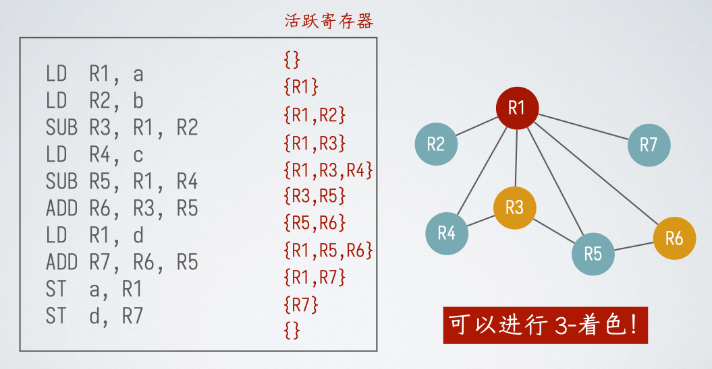

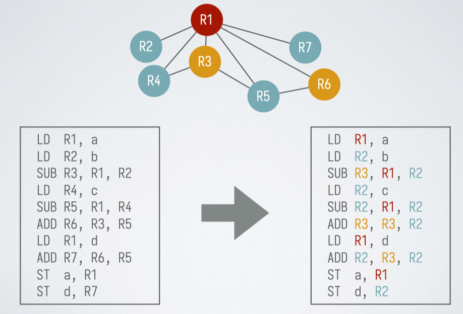

### 图着色算法的启发式技术

**定理**：如果冲突图中每个结点的度数都 $< m$，则总是可以 $m$- 着色。

原因：每个结点邻居的颜色最多 $m - 1$ 种，总能对其着色。

#### 算法

1. 寻找度数 $< m$ 的结点，从图中删除，并把该结点压到一个栈中
2. 如果所有结点的度数都 $\geq m$：
    - **找到一个溢出结点，不对它着色**。
    - 删除该结点。
3. 当图为空的时候：
    - 从栈顶依次弹出结点。
    - 选择该结点的邻居没有使用的颜色进行着色。

如果有溢出：

1. 为溢出结点生成代码，使用时加载到新的符号寄存器中
2. 然后对新的代码重新进行活跃性分析和寄存器分配（反正大不了退化到一用一存，肯定能搞定）

溢出节点选择：降低溢出代价，即降低引入的额外指令的运行时开销，尤其是避免在循环中引入新代码。

### 拆分

定义：对一个节点的 **活跃范围** 进行拆分，从而降低其在冲突图中的度数

-   把某个结点对应寄存器的值保存到内存中（故意加一句 $\text{ST} \; x, R_1$）
-   在拆分的地方把值再加载回来

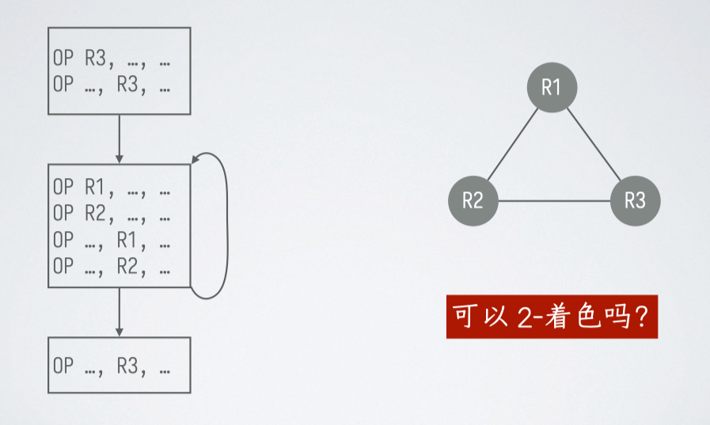

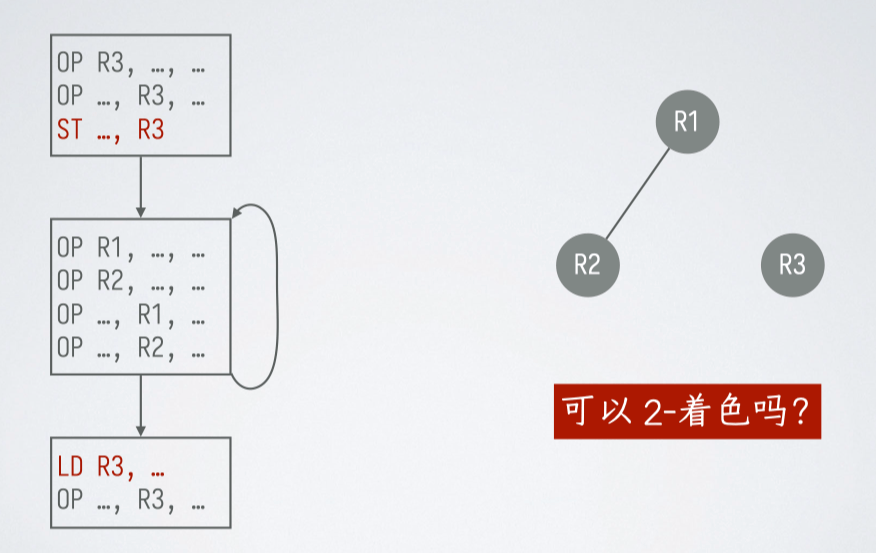

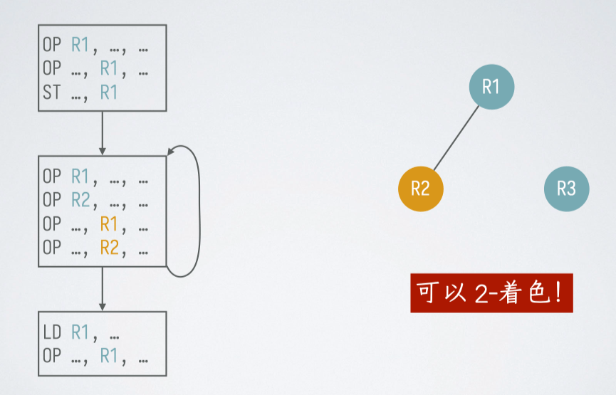

### 合并

定义：如果 $R_1$ 和 $R_2$ 在冲突图中不相邻的话，那么就可以把它们合并（coalesce）成一个符号寄存器

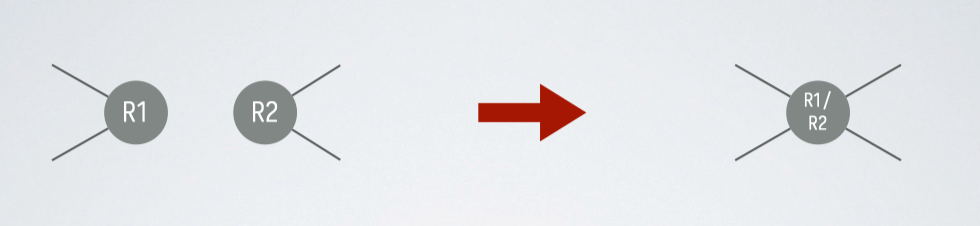

-   生成代码时，有大量的寄存器之间的拷贝，如 $\text{LD} \; R_1, R_2$
-   如果把 $R_1$ 和 $R_2$ 分配到同一个物理寄存器，就不需要执行该拷贝

问题：可能增加冲突边的数目，从而无法着色

-   解决方案 1：合并时不要创建高度数（$\geq m$）的结点
-   解决方案 2：如果 $a$ 的每个邻居 $r$ 都满足下面的条件之一，才可以把 $a$ 与 $b$ 合并：
    -   $r$ 与 $b$ 之间有冲突
    -   $r$ 的度数比较低（$< m$）

### 预着色

-   有些指令有默认寄存器，不可更改
-   当成特殊符号寄存器，在着色前就加入图中并染色
-   不要在这些节点溢出
