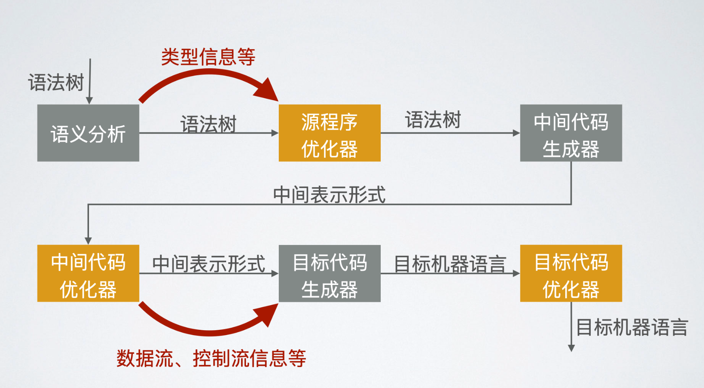
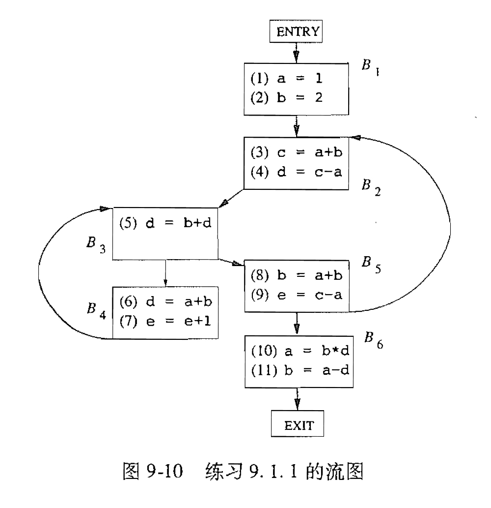
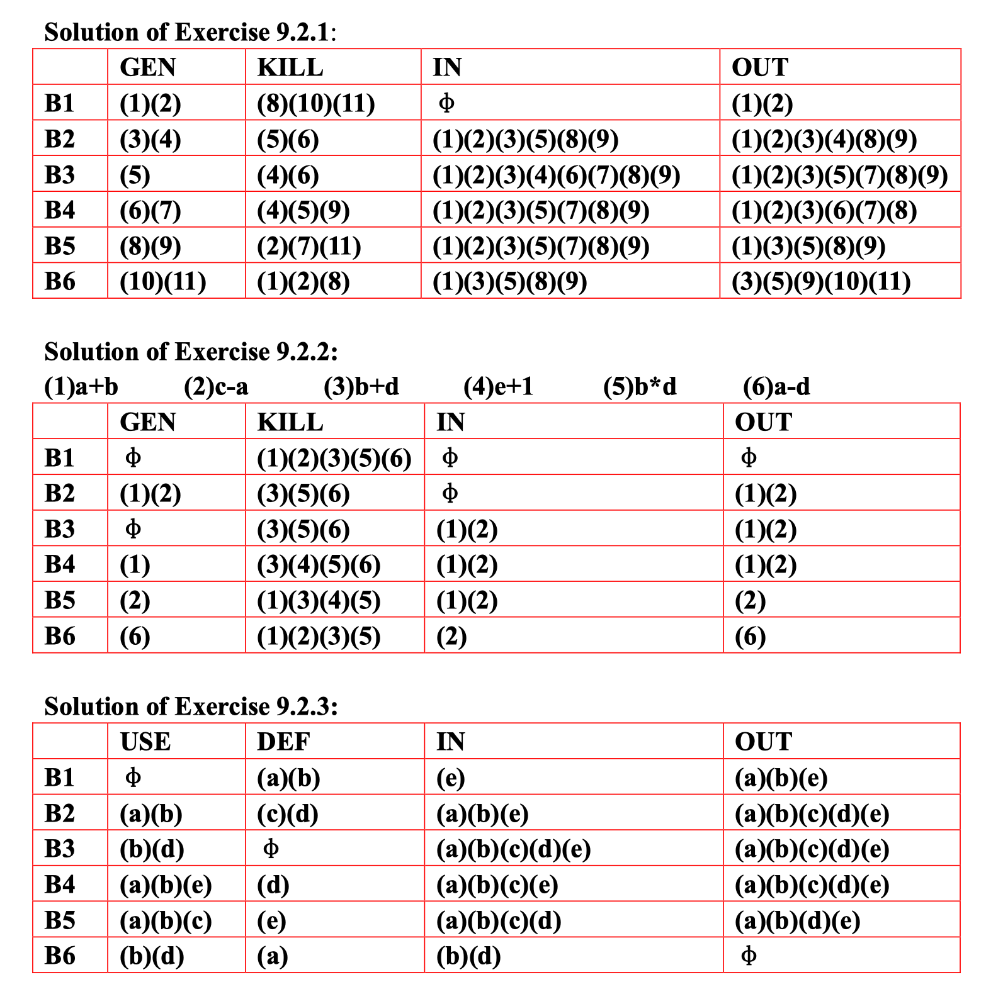
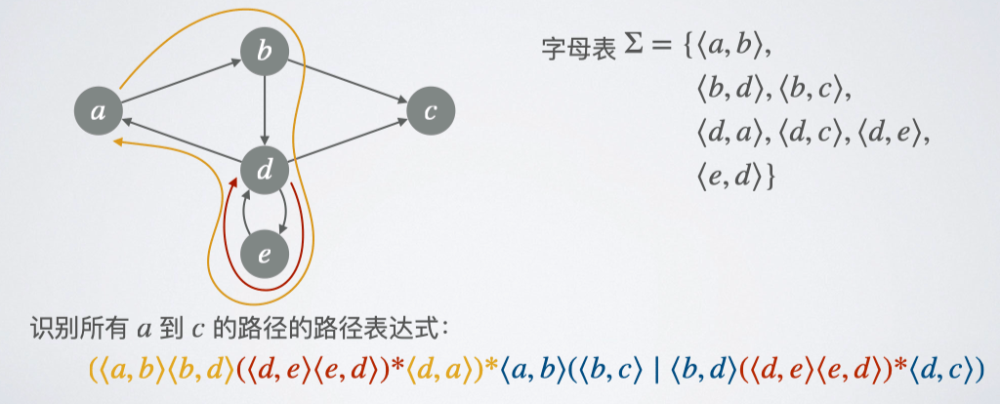

# 15 程序优化

  by <a href="https://github.com/zhuozhiyongde">Arthals</a>
   
  blog：<a href="https://arthals.ink">Arthals' ink</a>

## 代码优化概述

代码优化的原则：

-   保证安全（确保语义 / 可观察行为不变）
-   提高效率（二八法则：80% 时间在 20% 代码上，主要优化这 20% 代码）

优化方式：

-   算法设计阶段
-   编译阶段
-   语义分析：根据静态检查，优化 **源程序**
-   中间代码生成：**机器无关优化**
-   目标代码生成：**机器有关优化**
-   链接时刻优化

### 代码优化器的结构

### 代码优化的范围

-   局部优化：基本块内（即标号分割的块）
-   区域性优化：若干个基本块构成的区域
-   全局优化：一个过程内所有基本块
-   过程间优化：一个程序所有过程及其基本块

## 代码优化的常用方法

-   公共子表达式消除
-   复写传播（消除 a=b）
-   死代码消除
-   常量折叠 / 常量传播：直接推导出表达式的值是否为常量，若为常量则直接用其替换该表达式
-   代码外提（循环中不变量外提）
    -   循环不变式：不管循环执⾏多少次都得到相同结果的表达式
-   强度消减：减少操作次数、操作强度（如将二的幂次乘除法转换为移位操作）
    -   归纳变量：每次循环都增加恒定常数的变量
    -   如果一组归纳变量变化步调一致，考虑消除一些
-   数据流分析

## 数据流分析

数据流分析是一种静态代码分析技术，用于在程序编译时推导出程序各部分可能的行为。它通过分析变量和表达式在程序中的流动情况，帮助我们理解程序在不同点上的状态。

一些基本概念：

1. **基本块（Basic Block）**：一个基本块是一段没有分支和跳转的连续代码。换句话说，它是一个入口和一个出口之间的代码段，只有在入口处进入，并且在出口处离开。
2. **控制流图（Control Flow Graph, CFG）**：控制流图是由基本块作为节点，控制流作为边构成的有向图。它展示了程序执行的所有可能路径。

通过数据流方程，计算每个基本块的入口和出口状态。常见的数据流方程包括：

-   **到达定义（Reaching Definitions）**：哪些变量定义可以到达这个基本块。
-   **活跃变量（Live Variables）**：哪些变量在基本块之后仍然需要使用。
-   **可用表达式（Available Expressions）**：哪些表达式在基本块入口处已经计算过且没有被修改。

### 数据流抽象

基本概念：

-   **程序点（program point）**：每条语句对应其前、后两个程序点
    -   基本块内两条语句 $s_1, s_2$，$s_1$ 后的程序点与 $s_2$ 前的程序点相同
-   **路径（path）**：程序点 $p_1, p_2, \ldots, p_n$ 构成的序列，对于任意 $1 \leq i < n$，必然有二者之一（人话就是他们连着）：
    -   点 $p_i$ 和点 $p_{i+1}$ 是一条语句前、后的两个程序点
    -   点 $p_i$ 指向基本块的结尾，点 $p_{i+1}$ 指向该基本块后继的开头（连接不同基本块）

### 数据流分析推导

对于每个程序点 $p$:

-   **前向（forward）分析**：以 $p$ 为终点的所有路径的集合的性质（人话就是顺着逻辑流走）
-   **后向（backward）分析**：以 $p$ 为起点的所有路径的集合的性质（人话就是逆着逻辑流走）

### 前向分析模式

-   数据流分析的域 $V$，交汇运算 $\wedge: V \times V \rightarrow V$，顶值 $T \in V$
-   每个基本块 $B$ 的传递函数 $f_B: V \rightarrow V$ **（从入口到出口）**
-   边界条件：$\text{OUT}[\text{ENTRY}] = \nu_{\text{ENTRY}}$
-   初始值：$\text{OUT}[B] = T \quad (B \neq \text{ENTRY})$
-   方程组：对任意 $B \neq \text{ENTRY}$，有
    $$
    \begin{aligned}
    &\text{IN}[B] = \bigwedge_{P \text{是} B \text{的前驱}} \text{OUT}[P] \\
    &\text{OUT}[B] = f_B(\text{IN}[B])
    \end{aligned}
    $$

### 后向分析模式

-   数据流分析的域 $V$，交汇运算 $\wedge: V \times V \rightarrow V$，顶值 $T \in V$（即不清楚值时的默认输入）
-   每个基本块 $B$ 的传递函数 $f_B: V \rightarrow V$ **（从出口到入口）**
-   边界条件：$\text{IN}[\text{EXIT}] = \nu_{\text{EXIT}}$
-   初始值：$\text{IN}[B] = T \quad (B \neq \text{EXIT})$
-   方程组：对任意 $B \neq \text{EXIT}$，有
    $$
    \begin{aligned}
    &\text{OUT}[B] = \bigwedge_{S \text{是} B \text{的后继}} \text{IN}[S] \\
    &\text{IN}[B] = f_B(\text{OUT}[B])
    \end{aligned}
    $$

### 活跃变量分析

活跃变量：在程序点 $p$ 之后仍然需要使用的变量

-   分析模式：**后向分析模式**
-   基础定义：
    -   $\text{def}_B$：基本块 $B$ 中定义的变量
    -   $\text{use}_B$：基本块 $B$ 中使用的变量
-   分析域 $V$：变量集
-   交汇运算 $\land$：
    $$
    O_1 \land O_2 = O_1 \cup O_2
    $$
    即：在任意后继中活跃则认为是活跃的。
-   顶值 $T$：$\varnothing$
-   传递函数 $f_B$：$f_B(O) = (O - \text{def}_B) \cup \text{use}_B$
-   方程组：
    $$
    \begin{aligned}
    &\text{OUT[B]} = \bigcup_{\text{s是B的后继}} \text{IN[S]} \\
    &\text{IN}[B] = \text{OUT}[B] \cup \text{use}_B
    \end{aligned}
    $$

注意传递函数实际上是指令级一条套一条推得的：

$$
f_B(O) = f_{s_1}(f_{s_2}(f_{s_3}(O)))
$$

**所以如果你是直接根据块级别去做题的话，需要额外注意各条指令之间的依赖关系，判断到底是先用还是先定义。**

比如说：

$$
\begin{aligned}
&s_1: a = b * d \\
&s_2: b = a - d \\
\end{aligned}
$$

这个基本块中，我们不仅定义了 $a$，还使用了 $a$，但是由于我们是先定义的，所以 $a$ 不在这个块最终输出的活跃变量中。

又比如：

$$
\begin{aligned}
&s_1: a = a + 1 \\
\end{aligned}
$$

这个基本块中，我们也是既定义了 $a$，又使用了 $a$，但是仔细观察会发现我们是先使用的 $a$，再定义的 $a$，所以 $a$ 在这个块最终输出的活跃变量中。

后续分析同，不再赘述。

### 到达定值分析

到达定值（可达定义）：在程序点 $p$ 处，变量 $v$ 的定值（即赋值语句，$v = \text{exp}$）可以到达 $p$

-   分析模式：**前向分析模式**
-   基础定义：
    -   $\text{gen}_B$：基本块 $B$ 中生成定值的集合
    -   $\text{kill}_B$：基本块 $B$ 中杀死定值的集合，即对于基本块中定值的 $v$，杀死所有其他对 $v$ 的定值
-   分析域 $V$：变量集
-   交汇运算 $\land$：
    $$
    I_1 \land I_2 = I_1 \cup I_2
    $$
    即：在任意前驱可达则认为是可达的。
-   顶值 $T$：$\varnothing$
-   传递函数 $f_B$：$f_B(I) = (I - \text{kill}_B) \cup \text{gen}_B$
-   方程组：
    $$
    \begin{aligned}
    &\text{IN}[B] = \bigwedge_{P \text{是} B \text{的前驱}} \text{OUT}[P] \\
    &\text{OUT}[B] = f_B(\text{IN}[B])
    \end{aligned}
    $$

### 可用表达式分析

可用表达式：到达一个程序点的每条路径都对表达式 $E$ 求值，并且该表达式最近一次求值后其使用的变量没有被修改。

-   分析模式：**前向分析模式**
-   基础定义：
    -   $\text{e\_gen}_B$：基本块 $B$ 中生成的表达式的集合
    -   $\text{e\_kill}_B$：基本块 $B$ 中杀死的表达式的集合，若基本块中有语句 $s$ 对 $x$ 赋值，则杀死所有使用 $x$ 的表达式，如 $z = x + y$ 会杀死 $z + 1$，又如 $x = x + y$ 会杀死 $x + y$
-   分析域 $V$：表达式集
-   交汇运算 $\land$：
    $$
    I_1 \land I_2 = I_1 \cap I_2
    $$
    即：要求任意前驱中都要可用才认为可用
-   顶值 $T$：全集
-   传递函数 $f_B$：$f_B(I) = (I - \text{e\_kill}_B) \cup \text{e\_gen}_B$
-   方程组：
    $$
    \begin{aligned}
    &\text{IN}[B] = \bigwedge_{P \text{是} B \text{的前驱}} \text{OUT}[P] \\
    &\text{OUT}[B] = f_B(\text{IN}[B])
    \end{aligned}
    $$

注意：

$$
\begin{aligned}
&s_1: a = a + 1 \\
\end{aligned}
$$

这个基本块中，我们也是既计算了 $a + b$，又定值了 $a$，后来的定值杀死了前面的计算，所以 $\text{e\_gen}_B$ 不包括 $a+1$，但是 $\text{e\_kill}_B$ 包括 $a+1$（这样做能满足传递函数定义）。

### 总结

| 域       | 活跃变量                              | 到达定值                              | 可用表达式                            |
| -------- | ------------------------------------- | ------------------------------------- | ------------------------------------- |
| 方向     | 后向                                  | 前向                                  | 前向                                  |
| 传递函数 | $(O - \text{def}_B) \cup \text{use}_B$ | $(I - \text{kill}_B) \cup \text{gen}_B$ | $(I - \text{e\_kill}_B) \cup \text{e\_gen}_B$ |
| 边界条件 | $\text{IN}[\text{EXIT}] = \varnothing$         | $\text{OUT}[\text{ENTRY}] = \varnothing$       | $\text{OUT}[\text{ENTRY}] = \varnothing$       |
| 交汇运算 | $\cup$                                | $\cup$                                | $\cap$                                |
| 方程组   | $\text{OUT}[B] = \bigcup_{S, succ(B)} \text{IN}[S] \quad$ | $\text{IN}[B] = \bigcup_{P, pred(B)} \text{OUT}[P] \quad$ | $\text{IN}[B] = \bigcap_{P, pred(B)} \text{OUT}[P] \quad$ |
|          | $\text{IN}[B] = f_B(\text{OUT}[B])\quad$                 | $\text{OUT}[B] = f_B(\text{IN}[B])\quad$                 | $\text{OUT}[B] = f_B(\text{IN}[B])\quad$                 |
| 初始值 / 顶集 | $\text{IN}[B] = \varnothing$                   | $\text{OUT}[B] = \varnothing$                  | $\text{OUT}[B] = \text{全集}$                |

其中：

-   $B$ 表示基本块，$S$ 表示后继块，$P$ 表示前驱块
-   $\text{def}_B$ 表示在块 $B$ 中定义的变量集合
-   $\text{use}_B$ 表示在块 $B$ 中使用的变量集合
-   $\text{kill}_B$ 表示在块 $B$ 中被覆盖的定义集合
-   $\text{gen}_B$ 表示在块 $B$ 中生成的定义集合
-   $\text{e\_kill}_B$ 表示在块 $B$ 中被覆盖的表达式集合
-   $\text{e\_gen}_B$ 表示在块 $B$ 中生成的表达式集合

### 习题

做数据流分析的结果：

## 路径表达式

-   **有向图** $G = (V, E)$：其中 $V$ 是顶点集合，$E$ 是边的集合。
-   **路径表达式** （path expression）：一个以 $E$ 为字母表的正则表达式 $R$，且 $R$ 识别的每个符号串都是图 $G$ 中的一条路径。

### 基于路径表达式的数据流分析

-   数据流分析的域 $V$，交汇运算 $\wedge : V \times V \to V$
-   每个基本块 $B$ 的传递函数 $f_B : V \to V$
-   用 $F(R) : V \to V$ 表示 $R$ 能识别的路径的数据流抽象

#### 以前向分析为例

-   $F(\varepsilon)$ = 恒等函数
-   $F(e) = f_{h(e)}$，其中 $h(e)$ 是边 $e$ 的起点基本块
-   $F(R_1 \mid R_2) = F(R_1) \wedge F(R_2)$
-   $F(R_1 R_2) = F(R_2) \cdot F(R_1)$
-   $F(R_1^*) = \bigwedge_{i \geq 0} F(R_1)^i$，不过有时能找到更高效的算法
